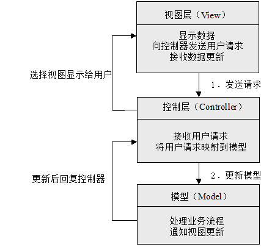
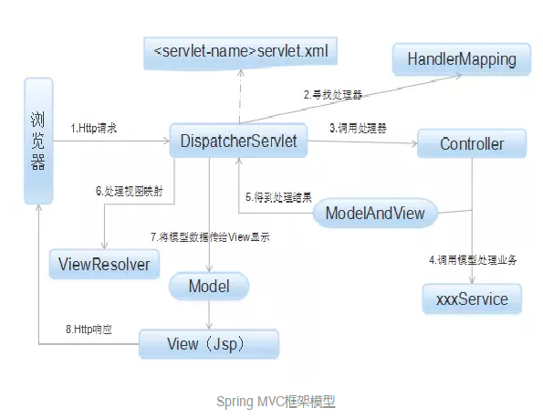

## 考试需知

### 分值分布

1、名词解释（20分） 5分一个

2、选择题（20分）	2分一个

3、填空题（30分）	2分一个

4、论述题（30分）	10分一个

### 考试范围：

1、Web概念知识点

2、前端（Html、Css 少量js）

3、后端（JSP、Servlet、JDBC、Spring MVC封装的内容、SSM）

4、SQL（JDBC的步骤、语句）

5、论述题：讲解优缺点、体系结构、原理

分数大头：**JSP、Servlet**


***


## Web概念

### 体系结构

**1、C/S体系结构**

**概念（名词解释）**：C/S即**客户端/服务器**结构，服务器常采用**高性能的PC或工作站**，并采用**大型数据库系统**（Oracle或SQL Server）。

客户端需要安装**专用的客户端软件**。（在**2000年前**，C/S结构占据网络程序开放领域的主流）


**2、B/S体系结构**

**概念（名词解释）**：B/S即**浏览器/服务器**结构，客户端**不需要**开发任何用户界面，而**统一采用浏览器**，通过**Web浏览器向Web服务器发送请求**。

由**Web服务器进行处理**，并将处理结果逐级传回客户端。这种结构**利用不断成熟和普及的浏览器技术**实现原来需要复杂专用软件才能实现的强大功能，

从而**节约了开发成本**，是一种全新的软件体系结构。这种体系结构已经成为当今应用软件的**首选**体系结构。


**3、体系结构的比较（优缺点）**

1. 开发和维护成本方面

   - **C/S结构**的开发和维护成本都**比B/S高**。
   - 采用C/S结构对于不同客户端需要开发不同的程序，而且软件的安装、调试和升级均要在**所有的客户机上进行**。
   - B/S结构则不必在客户端进行安装及维护，系统维护员只需要**将服务器的软件升级到最新版本**，对于其他客户端，只需要重新登录系统就可以使用最新版本的软件了。

2. 客户端负载

   - C/S的客户端不仅负责与用于**交互、收集用户信息**，而且还需要完成**通过网络向服务器请求**对数据库信息进行处理工作。
   - C/S的应用程序功能**越复杂**，客户端程序也就**越庞大**，对软件维护工作带来**很大的困难**。
   - B/S结构的客户端把事务处理逻辑部分交给服务器，由**服务器进行处理**，**客户端**只需要进行**显示**。
   - 但应用程序**服务器**的运行数据**负荷较重**，一旦服务器**发生”崩溃“**等问题，后果就**不堪设想**。（为此单位都有数据库存储服务器）

3. 安全性

   - C/S结构适用于**专人使用**的系统，可以通过严格的管理派发软件，达到保证系统安全的目的。为此**安全性比较高**
   - B/S结构使用的**人数较多**，且不固定，相对**安全性低**一些。

   ***

   

### Web应用程序工作原理

**1、概念（名词解释）**

Web在计算机网页开发设计中就是网页的意思。网页是网站中的一个页面，通常是HTML格式，展示文字、图片、媒体等，且需要通过浏览器阅读。

**2、Web工作原理**

Web应用程序分为两种，静态网站和动态网站。

- 静态网站主要用HTML编写，用户使用浏览器通过HTTP请求服务器上的Web页面，服务器接收请求处理后，再发送给客户端浏览器显示给用户。
- 动态网站**为满足线上业务**，更多的内容需要根据用户的请求动态生成页面信息。
- 动态网站通常使用HTML和动态脚本语言（JSP、ASP或PHP）编写，并将编写后的程序部署到Web服务器上，由Web服务器对动态脚本代码进行处理，并转化为浏览器可以解析的HTML代码，返回给客户端浏览器。

***


## 前端

### HTML

**1、概念（名词解释）**

HTML是一种**超文本语言**，在因特网上常见的网页制作**标注性语言**，HTML是通过**浏览器翻译**，将网页中的内容呈现给用户。

**2、HTML文档结构**

- \<html\>\</html\>标记：是html文件的开头，html页面的所有标记都要放置在\<html\>\</html\>标记中，此标记没有实质性的功能。但是HTML文件不可缺少的部分。
- \<head\>\</head\>标记：是HTML文件的**头标记**，作用是**放置HTML文件的信息**。如：标题、css样式代码等
- \<title\>\</title\>标记：网页标题，放置在head内
- \<body\>\</body\>标记：是HTML页面的主体标记。页面的所有内容都定义在body标记内。
- \<br\>换行标记
- \<p\>\</p\>段落标记
- \<h1\> \</h1\> 到 \<h6\>\</h6\>：总共1级到6级标题标记
- \<center\>\</center\>居中标记
- 列表
  - \<ol\>\</ol\>有序列表标记
  - \<ul\>\</ul\>无序列表标记
  - \<li\>代表列表某一项
- 表格\<table\>\</table\>标记
  - \<caption\>\</caption\> 标题
  - \<th\>\</th\> 表头
  - \<tr\>\</tr\> 行标记
  - \<td\>\</td\> 单元格标记
- 表单\<form\>\</form\>标记
  - action属性：用来指定处理表单数据程序的url地址
  - method属性：指定数据传输到服务器的方式。（get/post）
  - name属性：指定表单名称
  - onSubmit属性：指定点击触发事件
  - target属性：指定输入数据结构显示到哪个窗口。
    - \_blank 新窗口；\_self 当前窗口；
- \<input\>表单输入标记 [输入元素)](https://developer.mozilla.org/zh-CN/docs/Web/HTML/Element/Input)
  - type属性：指定类型。（button按钮、checkbox复选框、password密码域、text文本域、submit按钮）
  - checkbox通过id指定一起，name指定选项
- \<select\>\</select\>下拉菜单标记
  - \<option\>\</option\> 选项
  - name属性：名称
- \<textarea\>\</textarea\>多行文本标记
  - cols属性：列数（宽度）
  - rows属性：行数（高度）
  - wrap属性：是否自动换行
- \<a\>\</a\> 超链接标记
  - href属性：指定连接页面
  - target属性：指定如何打开链接（\_blank新页面，\_self当前页面
- \\ 图片标记
  - src属性：指定图片链接
  - alt属性：指定图片无法显示时的文字

**3、HTML5新特性（书上无）**

1. 语义化标签

2. 增强型表单包括属性以及元素

3. 新增视频\<video\>和音频\<audio\>标签

4. Canvas 图形

5. 地理定位

6. 拖放API

7. SVG绘图

8. Web Worker

9. Web Storage

10. Web Socket

***

### CSS

**1、概念（名词解释）**

CSS（**层叠样式表**）是W3C协会为**弥补HTML**在**显示属性**设定上的**不足**而制定的一套**扩展样式标准**。

**2、选择器**

1. 标记选择器
   - 标签名 {}
2. 类选择器
   - .类名{}
3. ID选择器
   - #ID{}
4. 伪类选择器
   - 选择器:伪类
   - active：激活的元素（鼠标点击时
   - hover：鼠标移入
   - visited：链接地址已被访问
   - link：有链接属性时
   - 鼠标未移入a标签链接时：link
   - 鼠标移入a标签链接时：link、hover 
   - 点击a标签链接时：link、hover、active 
   - 点击后未移入a标签连接时：link、visited 
   - 点击后移入a标签连接时：link、visited、hover 
   - 点击后再次点击a标签连接时：link、visited、hover、active 


***

### JavaScript

**1、概念（名词解释）**

JavaScript是一种**基于对象和事件驱动**并具有**安全和性能**的**解释性脚本语言**，在Web应用中得到了非常广泛的应用。

他不需要进行编译，而是直接嵌入在http页面中。js常用来进行数据验证、控制浏览器以及生成时钟、日历和时间戳文档等。


**2、特点（论述题）**

1. **解释性**

   js是一种脚本语言，采用小程序段的方式实现编程，不需要编译。

2. **基于对象**

   js是一种基于对象的语言，它可以应用创建的对象，有许多功能可以来自脚本环境中的对象方法与脚本的相互作用。

3. **事件驱动**

   js可以以事件驱动的方式直接对客户端的输入做出响应，无须经过服务器端程序。

4. **安全性**

   js具有安全性，它不允许访问本地硬盘、不能将数据写入服务器中、不允许对网络文档进行修改和删除，只能通过浏览器实现信息浏览或动态交互，能有效地防止数据丢失。

5. **跨平台**

   js依赖于浏览器本身，与操作系统无关，只需要浏览器支持js，js的程序就能正常运行。

   

**3、JavaScript和Java的区别（论述题）**

JavaScript与Java除了语法有一些相似之外，两者毫不相关。

1. **基于对象和面向对象**

   js是一种基于对象和事件驱动的脚本语言，它本身提供了非常丰富的内部对象供设计人员使用；

   java是一种真正的面向对象的语言，即使是开发简单的程序，也必须设计对象。

2. **解释和编译**

   js是一种解释型编程语言，其源代码不需要经过编译，而是将文本格式的字符代码发送到客户端由浏览器解释运行；

   java的源代码在传递到客户端执行之前，必须经过编译才可以执行。

3. **弱变量和强变量**

   js采用弱变量，变量在使用前无须声明，解释器在运行时将自动检查其数据类型；

   java使用强变量检查，即编译之前必须声明。


### Ajax技术

**1、概念（名词解释）**

Ajax的意思是**异步的JavaScript和xml**，它是js、xml、css、dom等多种已有技术的组合，可以实现**客户端的异步请求**操作，进而**不需要刷新页面的情况下与服务器进行通信**，**减少**用户的**等待时间**，**减轻服务器和带宽的负担**，提供更好的服务响应。

核心技术就是 XMLHttpRequest

**2、Ajax的开发模式**

传统：传统的web应用模式，每次触发http请求服务器都会进行响应的处理后，**返回**一个**html页面**给客户端。


Ajax应用：页面的操作由**ajax引擎**与服务器进行**通信**，然后将返回结果提交给客户端页面的ajax应用，再由**ajax引擎**决定将这些**数据插入**页面的指定位置。


**3、Ajax的优点**

1. 减轻服务器的负担。
2. 把部分服务器的负担和工作转移到客户端。
3. 无刷新更新页面。
4. 可以调用XML等外部数据，促进页面显示和数据的分离。
5. 基于标准化并被广泛支持，不需要下载其他程序。


***


## 后端

### JSP

**1、JSP概述（名词解释）**

JSP是由**Sun公司倡导**、许多公司参与而建立的**动态网页技术标准**。

它是在**HTML代码**中**嵌入Java代码片段和JSP标签**，构成了JSP网页。

**2、JSP技术特征（论述题）**

1. 跨平台
2. 业务代码分离
3. 组件重用
4. 继承Java Servlet功能
5. 预编译

**3、JSP的基本构成**

JSP主要由**指令标签、HTML语句、注释、嵌入Java代码、JSP动作标签**等5个元素组成。

- 指令标签
  - **page**指令：定义整个JSP页面的相关属性，这些属性会在解析成Servlet时转换为对应的Java程序代码。
    - 格式： <%@ page  attr1 = "value1" attr2 = "value2"  %>
    - 属性： import 导包，pageEncoding 文件编码，contentType 设置页面文件类型（如"text/html")，

  - **include**指令：用于文件包含，该指令可以在JSP页面中包含另一个文件的内容。(和CPP的include基本一致)
    - 格式：<%@ include file="filename" %>
    - 属性：file指定被包含文件路径
    
  - **taglib**指令：用于加载用户自定义标签。
    - 格式：<%@ taglib perfix="fix" uri="tagUriorDir" %>
    - 属性：perfix用于设置加载自定义标签的前缀，uri属性用于指定自定义标签的描述符文件位置。

- 嵌入Java代码
  - 格式 <%  JavaCode %>
- 声明
  - 格式 <%! JavaCode %>
  - 声明全局变量： <%! long startTime = System.nanoTime(); %>
  - 声明全局方法： <%! int Max(int a,int b){return a > b ? a : b ;} %>
- JSP表达式
  - 格式  <%= 表达式 %>
  - 例如： <%= 2*Math.PI %>会把2Pi的结果直接输出在页面上，类型为字符串
- 注释
  - HTML注释： \<!-- 注释内容 --\>
  - JSP注释： <%-- 注释内容 --%>
  - 动态注释： 把JSP代码嵌入到HTML注释内，如 \<!--  <%= new Date() %> --\>
  - JSP内部注释和Java注释一致。 // 和 /* */
- JSP动作标签（可能不怎么考，主要前两个）

  - **\<jsp:include /\>**：页面被请求时插入文件

    - page属性：导入文件的URL
    - flush属性：导入资源前是否刷新

  - **\<jsp:forward /\>**：将请求转发到另外一个页面

    - page属性：转发至页面的URL

  - [其他动作标签](https://www.runoob.com/jsp/jsp-actions.html)


**4、JSP对象（重点）**

1. **request**对象
   - 作用域大小：一次请求
   - 解释：每次请求更新一次，下一次请求上一次的信息就消失。
   - 功能：接收HTTP传送到服务器端的数据（Header、请求方法、Params等）
   - 解释：就相当于把请求给到jsp，让jsp处理这个请求。
   - 方法
     - **获取参数值**：String str = request.getParameter("参数名")
     - **获取数组参数值**： String[] strs = request.getParameterValues("参数名")
     - **获取参数列表**：Enumeration names = request.getParameterNames()
     - 获取请求使用的协议：String protocol = request.getProtocol()
     - 获取报头： String header = request.getHeader("User-Agent")
     - 获取请求方法：String method = request.getMethod()
     - 获取请求源路径：String path = request.getContextPath()
     - 获取请求URL： StringBuffer url = request.getRequestURL() //还有一种是String但是是简写
     - 获取客户端IP地址：String addr = request.getRemoteAddr()
     - 获取客户端发出请求的端口：Int port = request.getRemotePort()
     - **获取cookie**：Cookie[] cooks = request.getCookies()
       - cookie主要存在本地的数据：一般存账密，token什么的
2. **response**对象
   - 作用：代表对客户端的响应，将JSP容器处理过的对象传回客户端
   - 解释：相当于后端处理完，把数据传到前端的对象数据。
   - 作用域：只在JSP页面内有效
   - 方法：
     - 添加HTTP文件头：response.addHeader(name,value)
     - 设置HTTP文件头：response.setHeader(name,value)
     - 返回一个cookie：response.addCookie(cookie)
     - 返回一个错误信息：response.sendError(code,msg)
     - 重定向（向另外一个站点发请求）：response.sendRedirect(url)
     - 设置缓冲区大小：response.setBufferSize(size)
3. **session**对象
   - 作用：服务器自动创建的与用户请求相关的对象，用于保存用户的信息、跟踪用户的操作状态。
   - 解释：就是服务器用来存储每一个用户的操作记录。（？对象日志
   - 生命周期：用户创建到手动销毁或超过会话时间
   - 方法：
     - 获取指定属性信息：session.getAttribute(name)
     - 获取session中所有属性对象：(枚举类型)Enumeration attributes = session.getAttributeNames()  // 相当于就是把json的value全部拿了
     - 获取session对象的创建时间：session.getCreationTime()
     - 获取session对象的ID：session.getId()
     - 设置session对象信息：session.setAttribute(key,value)
     - 消除session对象信息：session.removeAttribute(key)
     - 销毁session对象：session.invalidate() // 把session内存释放了
     - 返回最后一次会话的时间：session.getLastAccessedTime()
     - 设置session的有效时间：session.setMaxInactiveInterval() //单位：秒
       - 感觉一般用来设置登录最长延迟
4. **application**对象
   - 作用：将信息保存在服务器中，直到服务器关闭。
   - 解释：emm，变相内存和共享数据
   - 生命周期：服务器开启到结束
   - 方法：
     - 获取保存的关键字信息：obj = application.getAttribute(name)
     - 获取所有属性名：(枚举类型)Enumeration attributes = application.getAttributeNames()
     - 保存一条信息：application.setAttribute(key,value)
     - 删除一条信息：application.removeAttribute(name)
     - 获取某条信息的初始值（设置的值）：String str = application.getInitParameter(name)
5. 四者区别：
   1. 作用域：
      - request作为请求接收者，每次接受一条请求以后到下一次请求之前信息都存在。为此作用域为一次请求
      - response作为请求返回信息，返回的信息给请求的jsp页面，为此该信息的作用域则是发起请求的jsp页面
      - session作为记录每一个用户与服务器会话的对象，作用域为超过预设的会话时间就会被销毁。为此作用域为一次会话。
      - application作为服务器整体配置的对象，作用域则设置为从服务器开始运行到结束运行。
   2. 方法：
      - request、response以协议为基础，为此他们面向的是参数Parameter、头信息Header
      - sesession、application以Attribute属性为基础，为此属性的增删改查基本都一致。


***

###  Servlet

**1、Servlet概念（名词解释）**

Servlet是使用Java Servlet接口运行在Web应用服务器上的Java程序。可以对Web浏览器或其他HTTP客户端发送的请求进行 处理。


**2、Servlet容器**


Servlet容器（如Tomcat）主要对servlet进行控制

首先，拦截请求，容器加载servlet类并把servlet实例加入实例池。

然后，servlet实例化，调用init()方法，完成初始化操作。

紧接着，容器调用servlet的service()方法处理客户端请求。

最后，调用destroy()方法，释放servlet资源。

不难发现，Servlet的生命周期就是从**接收一个请求到完成请求的整个过程**。**（重点）**

**3、Servlet特点（论述题 优缺点）**

1. 方便、实用的API方法。
   - 封装了针对HTTP请求的方法，用来处理表单数据、会话跟踪、设置HTTP头信息等。
2. 高效的处理方式
   - 表现在Servlet对象具有多线程功能，当多个客户端请求一个servlet时，servlet为每一个请求分配一个线程处理。
3. 跨平台
   - Servlet用java编写，继承了Java的跨平台的特点。
4. 更加灵活、扩展
   - Servlet与Java关系密切，Servlet可以使用Java平台丰富的类库、同时能对Servlet进行面向对象操作，使得Servlet可以编写更多接口进行扩展。
5. 安全性
   - Servlet采用Java的安全框架，同时Servlet容器对Servlet提供了额外的功能，保证了Servlet的安全性非常高。

**4、Servlet配置（重点）**

Servlet需要配置**web.xml**文件，向Web容器声明Servlet处理对象。

1. **声明Servlet对象**
   1. 通过\<servlet\>\</servlet\>标签声明一个Servlet对象
   2. 通过\<servlet-name\>\</servlet-name\>标签声明servlet的名称。
   3. 通过\<servlet-class\>\</servlet-class\>标签声明servlet对象的完整位置（包名+类名  如：com.lyq.SimpleServlet)
2. **映射Servlet**
   1. 通过\<servlet-mapping\>\</servlet-mapping\>标签配置映射至对应的Servlet
   2. 通过\<servlet-name\>\</servlet-name\>标签指定映射的servlet名称。
   3. 通过\<url-pattern\>\</url-pattern\>标签指定映射访问的URL

```xml
<servlet>  
    <servlet-name>MyServlet</servlet-name>  
    <servlet-class>com.Servlet.MyServlet</servlet-class>  
</servlet>  
  
<servlet-mapping>  
    <servlet-name>MyServlet</servlet-name>  
    <url-pattern>/Servlet</url-pattern>  
</servlet-mapping>  
```

**5、filter配置（不是特别重要）**

filter是servlet过滤器用于拦截客户端请求并对数据信息进行处理。主要用于：字符串编码过滤器、身份验证过滤器等

1. 接口方法：

   1. init(FilterConfig filterConfig) : 初始化
   2. doFilter(ServletRequest request,ServletResponse response,FilterChain chain) : 过滤处理。
   3. destroy() ：销毁

2. 在web.xml中的配置：

   ```xml
   <filter>  //声明filter
       <filter-name>MyFilter</filter-name> // 指定过滤器名称
       <filter-class>myPackage.FilterClass</filter-class>  // 指定过滤器对象的完整位置
       <init-param> // 设置过滤器的初始化参数
       	<param-name>encoding</param-name> // 参数的名称
           <param-value>GBK</param-value>  // 参数的值
       </init-param>
       
   	<filter-mapping>
       	<filter-name>MyFilter</filter-name> // 绑定过滤器名称
           <url-pattern>/*</url-pattern> 	// 绑定匹配的URL
           <dispatcher>PEQUEST</dispatcher>  // 指定过滤器对应的请求方式
           <dispatcher>FORWARD</dispatcher>
       </filter-mapping>
   </filter>  
   ```

   

**6、Servlet的系列接口及方法**

1. Servlet接口
   - 作用：Servlet容器，调用继承Servlet接口的对象进行处理，为此任意一个Servlet对象都要直接、间接实现javax.servlet.Servlet接口
   - 方法：
     - public void init(ServletConfig config) : Servlet实例化后，servlet容器调用此方法进行初始化。
     - public void service(ServletRequest request,ServletResponse response)：Servlet容器调用此方法处理请求（request接收请求信息，response返回处理数据）
     - public void destroy() ：当Servlet处理完请求后，容器调用改方法释放资源。
     - public ServletConfig getServletConfig() : 获取servlet的配置信息
2. ServletConfig接口
   - 作用：封装了Servlet的配置信息、在Servlet初始化期间被传递使用，每个Servlet有且仅有一个。
   - 方法：基本和Application一致（因为功能相似）
3. HttpServletRequest接口
   - 作用：和上文的Request对象一致。
4. HttpServletResponse接口
   - 作用：和上文的Response对象一致。
5. GenericServlet类
   - 抽象类继承了实现了Servlet接口和ServletConfig接口，只需要完成service()方法
6. HttpServlet类
   - 抽象类实现了service()方法，同时针对http协议开放了doGet()方法、doPost()方法、doPut()方法、doDelete()方法、doHead()方法、doTrace()方法、doOptions()方法，并且简单完成了doTrace()、doOptions()方法，应对http不同请求，使用其他方法。

***


### JDBC

**1、概念（名词解释）**

 JDBC（Java Database Connectivity) 是一套**面向对象**的应用程序接口(**API**)，制定了统一的访问各类关系数据库的标准接口，为各个数据库厂商提供了标准接口的实现。

JDBC是一种底层API，在访问数据库时需要在业务逻辑中直接嵌入SQL语句。

**2、JDBC的优缺点**

- 优点
  1. JDBC与ODBC十分相似，便于软件开发人员理解。（理解简单）
  2. JDBC使软件开发人员从复杂的驱动程序编写工作中解脱出来，可以完全专注于业务逻辑的开发（有统一驱动可以用）
  3. JDBC支持多种关系型数据库，大大增加了软件的可移植性。（支持多种关系型数据库）
  4. JDBC API是面向对象的，软件开发人员可以将常用的方法进行二次封装，从而提高代码的重用性。（面向对象可以二次封装）
- 缺点
  1. 通过JDBC访问数据库时**速度**将受到一定影响
  2. 虽然JDBC API是面向对象的，但通过JDBC访问数据库依然是**面向关系**的。
  3. JDBC提供了对不同厂家的产品的支持，这将对**数据源**带来影响。

**3、JDBC连接数据库五大步骤**

过程会用到的对象有：Connection connection，Statement statement。

1. **加载JDBC驱动程序**

   - 连接数据库之前，首先要加载数据库的驱动至JVM，通过java.lang.Class类的静态方法forName(String className)实现。

   ```java
   try{
       Class.forName("com.mysql.jdbc.Driver"); //8.0版本是com.mysql.cj.jdbc.Driver类
   }catch(ClassNotFoundException e){
       e.printfStackTrace();
   }
   ```

2. **创建数据库连接**

   - java.sql.DriverManager(驱动程序管理器)负责建立和管理数据库连接，
     通过DriverManager类的静态方法getConnection(String url,String user,String password)可以建立数据库连接。

   ```java
   try {
       connection = DriverManager.getConnection("jdbc:mysql://127.0.0.1:3306/dataBase", user, password);
   } catch (SQLException e) {
       System.out.println("密码错误！");
   }
   ```

3. **执行SQL语句**

   - 建立连接后返回Connection实例对象用conn接收后，使用conn创建Statement实例对象。用于执行sql语句
   - Statement类型包括：
     1. Statement实例：用来执行静态SQL语句
     2. PreparedStatement实例：增加执行动态SQL语句的功能 （感觉不考
     3. CallableStatement实例：增加执行数据库存储过程的功能 （感觉不考
     4. PreparedStatement继承了Statement，CallableStatement继承了PreparedStatement

   ```java
   statement = connection.createStatement();
   ```

4. **获取查询结果**

   - 通过Statement接口的executeUpdate(String sql)或executeQuery(String sql)方法可以执行SQL语句，并返回执行结果。
   - 方法：
     - ResultSet result = stmt.executeQuery(String sql) ：执行静态select语句，返回一个永远不为null的ResultSet实例。
     - int number = stmt.executeUpdate(String sql) : 执行一个静态的insert、update或delete语句，并返回更新记录的条数。

   ```java
   String sql = "select * from message";
   ArrayList<Mail> list = new ArrayList<>();
   ResultSet resultSet;
   try {
       resultSet = stmt.executeQuery(sql);
       while (rs.next()) {
           Mail m = new Mail(rs.getString("username"), rs.getString("phoneNumber"), rs.getString("type"));
           list.add(m);
       }
   } catch (SQLException e) {
       e.printStackTrace();
   }
   ```

   

5. **关闭连接**

   - 在建立Connection、Statement和ResultSet实例时均需占用一定的数据库和JDBC资源，所以在每次访问数据库结束后，应该及时销毁这些实例。
   - 顺序：一个栈结构
     1. ResultSet
     2. Statement
     3. Connection

   ```java
   resultSet.close();
   statement.close();
   connection.close();
   ```

   

***

### MCV设计模式

**1、概念**

MVC（Model-View-Controller，模型-视图-控制器）是一个存在**服务器表达层**的模型。

1. **模型**
   - 模型代表了Web应用中的核心功能，包括业务逻辑层和数据库访问层。
   - 业务逻辑层一般由Java Bean或EJB构建。
   - 数据访问层（数据持久层）则通常应用JDBC来构建，主要负责数据库操作。
2. **视图**
   - 视图主要是指用户看到并与之交互的界面，即Java Web应用程序的外观。
   - 视图部分一般由JSP和HTML构建。
   - 视图接收用户的输入，将数据转交给控制器。
   - 视图会根据模型的改变，根据之间的协议改变并修改自己的显示。
3. **控制器**
   - 控制器负责交互和将用户输入的数据导入模型。
   - 控制器负责接收请求并调用相应的模型组件去处理请求，之后调用相应的视图来显示模型返回的数据。



**2、模型特点对比Struts2**

1. 框架机制：
   - MVC：采用Servlet实现
   - Struts2：采用Filter实现
2. 拦截机制：
   - MVC：
     1. 采用方法级拦截，一个方法对应一个request上下文。方法基本独立，独享request和response数据。每一个方法同时又和一个url对应，参数的传递是直接注入到方法中，是方法所独有的。
     2. 默认对所有的请求，只会创建一个Controller，同时没有共享的属性 保证了线程安全。
   - Struts2：
     1. 采用类级别拦截，每次请求就会创建一个Action。
     2. 一个Action对应一个request和response上下文，参数是多个方法共享的。
     3. Action一个方法可以对应一个url，其类属性被所有方法共享。无法使用注解或其他方式标识其属性方法。
3. 性能方面：
   - Spring MVC实现了零配置。
   - Struts2每次需要实例化一个Action，性能和效率不如MVC
4. 配置方面：Spring MVC和Spring是无缝的，项目的管理和安全比Struts2更高。
5. 设计思想：Spring MVC比较谨慎，是在Servlet上进行扩展的。Struts2更加符合OOP的编程思想。
6. 集成方面：
   - String MVC继承了Ajax，使用非常方便，只需要一个注解@ResponseBody就可以实现
   - Struts2拦截器继承了Ajax，在Action中处理时一般需要安装插件或者自己写代码继承进去。

**3、体系结构（论述题+究极重点）**

**步骤：**

1. **HTTP请求**

   客户端发出一个HTTP请求，Web应用服务器接收这个请求。如果请求匹配DispatcherServlet的请求映射路径，就将之转发给DispatcherServlet处理。

2. **寻找处理器**

   DispatcherServlet接受到请求后，将根据请求的信息及HandlerMapping的配置找到处理请求的处理器（Controller）

3. **调用处理器**

   DispatcherServlet把请求交给处理器。

4. **调用模型处理业务**

   处理器调用服务层方法处理业务逻辑。

5. **得到处理结果**

   处理器的返回结果为ModelAndView

6. **处理视图映射**

   DispatcherServlet查询一个或多个ViewResoler视图解析器，找到ModelAndView指定的视图。

7. **将模型数据传给View显示**

8. **HTTP响应**

   将结果显示到客户端



**我的解释：**浏览器发送请求，若该请求能够接收。则去匹配mapping寻找指定的controller。

再用controller处理事务逻辑后返回ModelAndView给dispatcherServlet。

dispatcherServlet使用viewResoler解析视图，返回给View显示。最后将结果显示到客户端。


***

### Spring的DAO模式

数据访问对象（Data Access Object，DAO）描述了一个应用中的DAO的角色，它提供了读写数据库中数据的一种方法。

通过接口提供对外服务，程序的其他模块通过这些接口来访问数据库。

**好处：**

1. 服务对象不再和特定的接口实现绑定在一起，使其易于测试。
2. 因为他提供的是一种服务，在不需要连接数据库的条件下即可进行单元测试，极大地提高了开发效率。
3. 通过使用持久化技术无关的方法访问数据库，在应用程序的设计和使用上都有很大的灵活性，在系统性能和应用方面也是一个飞跃。

**概念：**

1. DAO属于O/R Mapping技术的一种，技术发布前开发人员需要直接借助JDBC和SQL来完成与数据库的通信。
2. 开发人员能够使用DAO或其他不同的DAO框架来实现与RDBMS（关系数据库管理系统）的交互。
3. O/R Mapping技术 使得开发人员能够将对象属性映射到数据表的字段，并将对象映射到RDBMS中，使得Mapping技术能够为应用自动创建高效的SQL语句。
4. O/R Mapping技术还提供了延迟加载和缓存等高级特征，而DAO是ORM的一种实现，因此DAO可以大量节省开发时间、减少代码量、开发成本。

**我的解释：**

DAO就属于ORM的一种框架，DAO拥有的优点基本就是ORM的优点。

ORM比如（golang的gorm）相当于就是封装sql操作的库，能够节省sql代码。

同时方便不会sql的人开发，以及绑定字段。将属性和字段绑定，对对象进行操作。


***

### SSM

**什么是SSM？**

SSM（Spring+SpringMVC+MyBatis）框架集由Spring、MyBatis两个开源框架整合而成（SpringMVC是Spring中的部分内容），常作为数据源较简单的web项目的框架。

**Spring**

Spring就像是整个项目中装配bean的大工厂，在配置文件中可以指定使用特定的参数去调用实体类的构造方法来实例化对象。也可以称之为项目中的粘合剂。

Spring的核心思想是IoC（控制反转），即不再需要程序员去显式地`new`一个对象，而是让Spring框架帮你来完成这一切。

**SpringMVC**

SpringMVC在项目中拦截用户请求，它的核心Servlet即DispatcherServlet承担中介或是前台这样的职责，将用户请求通过HandlerMapping去匹配Controller，Controller就是具体对应请求所执行的操作。SpringMVC相当于SSH框架中struts。

**mybatis**

mybatis是对jdbc的封装，它让数据库底层操作变的透明。mybatis的操作都是围绕一个sqlSessionFactory实例展开的。mybatis通过配置文件关联到各实体类的Mapper文件，Mapper文件中配置了每个类对数据库所需进行的sql语句映射。在每次与数据库交互时，通过sqlSessionFactory拿到一个sqlSession，再执行sql命令。


***

## 题目预测

### 一、名词解释

1. **HTML（重点）：**html是一种超文本语言，在因特网上常见的标注性语言。HTML是通过浏览器翻译，将网页中的内容呈现给用户。
2. **DOM：**dom是html和xml文档的编程接口。它提供了对文档的结构化表述，并定义了一种方式修改文档的结构、样式、内容。
3. **Java Servlet：**java servlet是运行在web服务器或应用服务器上的程序，它是作为来自Web浏览器或其他HTTP客户端的请求和HTTP服务器上的数据库或应用程序之间的中间层。
4. **Servlet（重点）：**Servlet是使用Java Servlet接口运行在Web应用服务器上的Java程序。可以对Web浏览器或其他HTTP客户端的请求进行处理。
5. **Web（重点）：**Web在计算机网页开发设计中就是网页的意思。网页是网站中的一个页面，通常是HTML格式的。网页可以展示文字、图片、媒体等，需要通过浏览器阅读。
6. **JavaScript：**javascript是一种基于对象和事件驱动并具有安全性能的解释型脚本语言，在Web应用中得到了非常广泛的应用。
7. **JSP：**jsp是由Sun公司倡导、许多公司参与而建立的动态网页技术标准，它是在HTML代码中嵌入Java代码片段和JSP标签组成。
8. **JDBC（重点）：**jdbc是一套用于执行SQL语句的API类包，由一组用Java语言编写的类和接口组成。JDBC提供了一种标准的应用程序设计接口，通过它可以访问各类关系型数据库。
9. **SSM（重点）：**ssm框架集由spring、mybatis两个开源框架整合而成（spring mvc是spring中的部分内容），常作为数据源较简单的Web项目的框架。
10. **CSS：**css（层叠样式表）是W3C协会为弥补HTML在显示属性设定上的不足而制定的一套扩展样式标准。
11. **Ajax（重点）**：ajax的意思是异步的javascript和xml，ajax并不是一门新的语言或技术，它是javascript、xml、css、dom等多种已有的技术的组合，可以实现客户端的异步请求操作，进而在不需要刷新页面的情况下与服务器进行通信，减少等待时间，减轻服务器和带宽的负担，提供更好的服务响应。
    - 简洁版：ajax是异步的javascript和xml，是由javascript、xml、css、dom等多种技术组合而成，使得不需要刷新页面的情况下与服务器交互，修改页面内容。可以减轻服务器负担、提升服务。
12. **MIME（往年考过）：**多用途互联网邮件扩展类型。是设定某种[扩展名](https://baike.baidu.com/item/扩展名/103577)的[文件](https://baike.baidu.com/item/文件/6270998)用一种[应用程序](https://baike.baidu.com/item/应用程序/5985445)来打开的方式类型，当该扩展名文件被访问的时候，[浏览器](https://baike.baidu.com/item/浏览器/213911)会自动使用指定应用程序来打开。多用于指定一些客户端自定义的文件名，以及一些媒体文件打开方式。


### 四、论述题

#### 1.什么是SSM？其三大框架的作用是什么？

**什么是SSM？**

SSM（Spring+SpringMVC+MyBatis）框架集由Spring、MyBatis两个开源框架整合而成（SpringMVC是Spring中的部分内容），常作为数据源较简单的web项目的框架。

**Spring**

Spring就像是整个项目中装配bean的大工厂，在配置文件中可以指定使用特定的参数去调用实体类的构造方法来实例化对象。也可以称之为项目中的粘合剂。

Spring的核心思想是IoC（控制反转），即不再需要程序员去显式地`new`一个对象，而是让Spring框架帮你来完成这一切。

**SpringMVC**

SpringMVC在项目中拦截用户请求，它的核心Servlet即DispatcherServlet承担中介或是前台这样的职责，将用户请求通过HandlerMapping去匹配Controller，Controller就是具体对应请求所执行的操作。SpringMVC相当于SSH框架中struts。

**mybatis**

mybatis是对jdbc的封装，它让数据库底层操作变的透明。mybatis的操作都是围绕一个sqlSessionFactory实例展开的。mybatis通过配置文件关联到各实体类的Mapper文件，Mapper文件中配置了每个类对数据库所需进行的sql语句映射。在每次与数据库交互时，通过sqlSessionFactory拿到一个sqlSession，再执行sql命令。

#### 2.解释MVC设计模式的系统结构？

**步骤：**

1. **HTTP请求**

   客户端发出一个HTTP请求，Web应用服务器接收这个请求。如果请求匹配DispatcherServlet的请求映射路径，就将之转发给DispatcherServlet处理。

2. **寻找处理器**

   DispatcherServlet接受到请求后，将根据请求的信息及HandlerMapping的配置找到处理请求的处理器（Controller）

3. **调用处理器**

   DispatcherServlet把请求交给处理器。

4. **调用模型处理业务**

   处理器调用服务层方法处理业务逻辑。

5. **得到处理结果**

   处理器的返回结果为ModelAndView

6. **处理视图映射**

   DispatcherServlet查询一个或多个ViewResoler视图解析器，找到ModelAndView指定的视图。

7. **将模型数据传给View显示**

8. **HTTP相应**

   将结果显示到客户端


#### 3.JDBC的步骤有哪些？它有哪些优缺点？

**JDBC的优缺点**

- 优点

  1. JDBC与ODBC十分相似，便于软件开发人员理解。（理解简单）
  2. JDBC使软件开发人员从复杂的驱动程序编写工作中解脱出来，可以完全专注于业务逻辑的开发（有统一驱动可以用）
  3. JDBC支持多种关系型数据库，大大增加了软件的可移植性。（支持多种关系型数据库）
  4. JDBC API是面向对象的，软件开发人员可以将常用的方法进行二次封装，从而提高代码的重用性。（面向对象可以二次封装）

- 缺点

  1. 通过JDBC访问数据库时**速度**将受到一定影响
  2. 虽然JDBC API是面向对象的，但通过JDBC访问数据库依然是**面向关系**的。
  3. JDBC提供了对不同厂家的产品的支持，这将对**数据源**带来影响。

  

**JDBC连接数据库五大步骤**

过程会用到的对象有：Connection connection，Statement statement。

1. **加载JDBC驱动程序**

   - 连接数据库之前，首先要加载数据库的驱动至JVM，通过java.lang.Class类的静态方法forName(String className)实现。

   ```java
   try{
       Class.forName("com.mysql.jdbc.Driver"); //8.0版本是com.mysql.cj.jdbc.Driver类
   }catch(ClassNotFoundException e){
       e.printfStackTrace();
   }
   ```

2. **创建数据库连接**

   - java.sql.DriverManager(驱动程序管理器)负责建立和管理数据库连接，
     通过DriverManager类的静态方法getConnection(String url,String user,String password)可以建立数据库连接。

   ```java
   try {
       connection = DriverManager.getConnection("jdbc:mysql://127.0.0.1:3306/dataBase", user, password);
   } catch (SQLException e) {
       System.out.println("密码错误！");
   }
   ```

3. **执行SQL语句**

   - 建立连接后返回Connection实例对象用conn接收后，使用conn创建Statement实例对象。用于执行sql语句
   - Statement类型包括：
     1. Statement实例：用来执行静态SQL语句
     2. PreparedStatement实例：增加执行动态SQL语句的功能 （感觉不考
     3. CallableStatement实例：增加执行数据库存储过程的功能 （感觉不考
     4. PreparedStatement继承了Statement，CallableStatement继承了PreparedStatement

   ```java
   statement = connection.createStatement();
   ```

4. **获取查询结果**

   - 通过Statement接口的executeUpdate(String sql)或executeQuery(String sql)方法可以执行SQL语句，并返回执行结果。
   - 方法：
     - ResultSet result = stmt.executeQuery(String sql) ：执行静态select语句，返回一个永远不为null的ResultSet实例。
     - int number = stmt.executeUpdate(String sql) : 执行一个静态的insert、update或delete语句，并返回更新记录的条数。

   ```java
   String sql = "select * from message";
   ArrayList<Mail> list = new ArrayList<>();
   ResultSet resultSet;
   try {
       resultSet = stmt.executeQuery(sql);
       while (rs.next()) {
           Mail m = new Mail(rs.getString("username"), rs.getString("phoneNumber"), rs.getString("type"));
           list.add(m);
       }
   } catch (SQLException e) {
       e.printStackTrace();
   }
   ```

   

5. **关闭连接**

   - 在建立Connection、Statement和ResultSet实例时均需占用一定的数据库和JDBC资源，所以在每次访问数据库结束后，应该及时销毁这些实例。
   - 顺序：一个栈结构
     1. ResultSet
     2. Statement
     3. Connection

   ```java
   resultSet.close();
   statement.close();
   connection.close();
   ```


#### 4.Web体系结构有哪些？他们的区别在哪些方面？

**1、C/S体系结构**

**概念（名词解释）**：C/S即**客户端/服务器**结构，服务器常采用**高性能的PC或工作站**，并采用**大型数据库系统**（Oracle或SQL Server）。

客户端需要安装**专用的客户端软件**。（在**2000年前**，C/S结构占据网络程序开放领域的主流）


**2、B/S体系结构**


**概念（名词解释）**：B/S即**浏览器/服务器**结构，客户端**不需要**开发任何用户界面，而**统一采用浏览器**，通过**Web浏览器向Web服务器发送请求**。

由**Web服务器进行处理**，并将处理结果逐级传回客户端。这种结构**利用不断成熟和普及的浏览器技术**实现原来需要复杂专用软件才能实现的强大功能，

从而**节约了开发成本**，是一种全新的软件体系结构。这种体系结构已经成为当今应用软件的**首选**体系结构。


**3、体系结构的比较（优缺点）**

1. 开发和维护成本方面

   - **C/S结构**的开发和维护成本都**比B/S高**。
   - 采用C/S结构对于不同客户端需要开发不同的程序，而且软件的安装、调试和升级均要在**所有的客户机上进行**。
   - B/S结构则不必在客户端进行安装及维护，系统维护员只需要**将服务器的软件升级到最新版本**，对于其他客户端，只需要重新登录系统就可以使用最新版本的软件了。

2. 客户端负载

   - C/S的客户端不仅负责与用于**交互、收集用户信息**，而且还需要完成**通过网络向服务器请求**对数据库信息进行处理工作。
   - C/S的应用程序功能**越复杂**，客户端程序也就**越庞大**，对软件维护工作带来**很大的困难**。
   - B/S结构的客户端把事务处理逻辑部分交给服务器，由**服务器进行处理**，**客户端**只需要进行**显示**。
   - 但应用程序**服务器**的运行数据**负荷较重**，一旦服务器**发生”崩溃“**等问题，后果就**不堪设想**。（为此单位都有数据库存储服务器）

3. 安全性

   - C/S结构适用于**专人使用**的系统，可以通过严格的管理派发软件，达到保证系统安全的目的。为此**安全性比较高**
   - B/S结构使用的**人数较多**，且不固定，相对**安全性低**一些。

#### 5.什么是Ajax?如何用Ajax实时更新前台页面的数据？

Ajax是Asynchronous JavaScript and XML的缩写，意思是异步的JavaScript与XML。Ajax并不是一门新的语言或技术，它是JavaScript、XML、CSS、DOM等多种已有技术的组合，可以实现客户端的异步请求操作，进而在不需要刷新页面的情况下与服务器进行通信，减少了用户的等待时间，减轻了服务器和带宽的负担，提供更好的服务响应。

Ajax可以通过XMLHttpRequest对象实现采用异步方式在后台发送请求。

（1）初始化XMLHttpRequest对象。为了提高程序的兼容性，需要创建一个跨浏览器的XMLHttpRequest对象，并且判断XMLHttpRequest对象的实例是否成功，如果不成功，则给予提示。

（2）为XMLHttpRequest对象指定一个回调函数，用于对返回结果进行处理。

（3）创建一个与服务器的连接。在创建时，需要指定发送请求的方式（即GET或POST），以及设置是否采用异步方式发送请求。

（4）向服务器发送请求。利用XMLHttpRequest对象的send()方法可以实现向服务器发送请求，该方法需要传递一个参数，如果发送的是GET请求，可以将该参数设置为null；如果发送的是POST请求，可以通过该参数指定要发送的请求参数。
