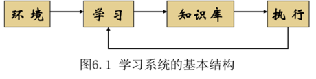
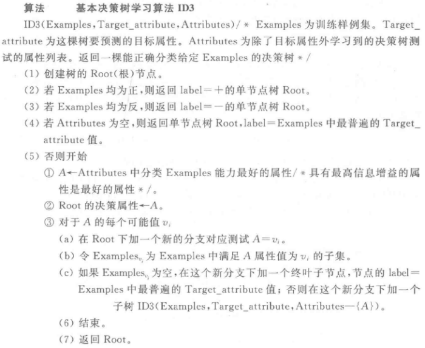

## 第一章

### 什么是人工智能？试从学科和能力两方面加以说明

> ☆☆☆

1. 学科：人工智能（学科）是计算机科学中涉及研究、设计和应用智能机器的一个分支。它的近期主要目标在于研究用机器来模仿和执行人脑的某些智力功能，并开发相关理论和技术。
2. 能力：人工智能（能力）是智能机器所执行的通常与人类智能有关的智能行为，这些智能行为涉及学习、感知、思考、理解、识别、判断、推理、证明、设计、规划和问题求解等活动。

### 为什么能够用机器（计算机）模仿人的智能？

> ☆

1. 既然人具有智能，那么他（她）就一定是个物理符号系统。人之所以能够表现出智能，就是基于他的信息处理过程。
2. 既然计算机是一个物理符号系统，它就一定能够表现出智能。这是人工智能的基本条件。
3. 既然人是一个物理符号系统，计算机也是一个物理符号系统，那么就能够用计算机来模拟人的活动。

### 现在人工智能有哪些学派？它们的认知观是什么？现在这些学派的关系如何？

> ☆☆☆

1. 符号主义：又称为逻辑主义、心理学派或计算机学派。
   其原理主要为物理符号系统假设和有限合理性原理。
   他们认为人的认知基元是符号，而且认知过程即符号操作过程。认为人是一个物理符号系统，计算机也是一个物理符号系统。因此，我们就能够用计算机来模拟人的智能行为。
2. 连接主义：又称为仿生学派或生理学派。
   其原理主要为神经网络及神经网络间的连接机制与学习算法。
   他们认为人的思维基元是神经元，而不是符号处理过程。认为人脑不同于电脑，并提出连接主义的大脑工作模式，用于取代符号操作的电脑工作模式。
3. 行为主义：又称为进化主义或控制论学派。
   其原理为控制论及感知-动作型控制系统
   它们认为智能取决于感知和行为，提出智能行为的“感知-动作”模式。行为主义者认为智能不需要知识、不需要表示、不需要推理；人工智能可以像人类智能一样逐步进化。

他们的关系是：长期共存与合作、取长补短，并走向融合和集成，为人工智能的发展做出贡献。

### 人工智能研究包括哪些内容？这些内容的重要性如何？

> ☆

1. 认知建模
2. 知识表示
3. 知识推理
4. 计算智能
5. 知识应用
6. 机器感知
7. 机器思维
8. 机器学习
9. 机器行为
10. 智能系统构建

### 人工智能的主要研究和应用领域是什么？其中，哪些是新的研究热点？

> ☆☆

 问题求解与博弈；逻辑推理与定理证明；计算智能；分布式人工智能与Agent；自动程序设计；专家系统；机器学习；自然语言理解；机器人学；模式识别；机器视觉；神经网络；智能控制；智能调度与指挥；智能检索；系统与语言工具。

新的研究热点：智能制造、智慧医疗、智慧农业、智能金融、智能交通与智能驾驶、智慧城市、智能家具、智能管理、智能经济

### 人工智能与人类社会发展的关系

> ☆☆☆ 可能是论述题 

人工智能和人类社会发展之间存在着密切的关系。在许多领域，人工智能技术都已经成为了推动社会进步和科技创新的重要力量。

1. 促进生产力发展：人工智能可以在生产、制造、物流等领域中完成机械化、自动化等任务，提高生产效率，降低成本，从而促进了生产力的发展。
2. 改善人类生活质量：人工智能可以应用于医疗、教育、娱乐等领域，提供更加智能的解决方案和服务，改善人类生活质量。
3. 推动科学研究：人工智能技术可以帮助科学家快速地处理海量数据，发现规律和趋势，并为科学研究提供新的思路和方法。
4. 优化社会管理：人工智能可以通过大数据分析、预测模型等手段，帮助政府和企业做出更加准确的决策，优化社会资源配置和管理。

然而，人工智能也带来了一些挑战和风险：

1. 就业问题：随着机器人和自动化技术的广泛应用，一些传统行业可能会受到冲击，导致就业机会减少。
2. 隐私和安全问题：人工智能需要大量的数据支持，因此如何保护用户隐私和数据安全已经成为一个重要的问题。
3. 伦理和道德问题：人工智能需要从人类行为中学习，并根据数据做出判断和决策，因此如何保证其不会出现歧视、偏见等问题也需要我们关注。

总之，人工智能与人类社会发展之间既是相辅相成的，又充满着挑战和风险。需要我们在不断推动人工智能技术发展的同时，积极探索其与人类社会的融合路径，共同推进人类社会的进步和发展。

## 第三章

### 什么是图搜索过程？其中，重排OPEN表意味着什么？重排的原则是什么？

> ☆

1. 建立一个只含有起始节点$S$的搜索图$G$，把$S$放到OPEN表中
2. 初始化CLOSED表为空表
3. LOOP;若OPEN表是空表，则失败退出
4. 选择OPEN表上的第一个节点，把它从OPEN表移出并放进CLOSED表中。称此节点为节点$n$
5. 若$n$为一目标节点，则有解并成功退出。
6. 扩展节点$n$，生成后继节点集合$M$
7. 对未在$G$中出现过的$M$成员，设置其父节点为$n$并加入OPEN表。对于已出现过的，确定是否修改父节点为$n$，若修改则加入到OPEN表中。
8. 按某一任意方式或按某个探试值，重排OPEN表
9. GO LOOP

意味着在第六步中将优先扩展哪个节点，不同的排序标准对应不同的搜索策略。

原则：因需求而定，如果想尽快找到一个解，则将最有可能达到目标节点的节点排在OPEN表前面，如果想找到代价最小的解，则按代价从小到大重排。

### 如何通过消解反演求取问题的答案？

> ☆☆

1. 把由目标公式的否定产生的每个子句添加到目标公式否定之否定的子句中去。
2. 按照反演树，执行和以前相同的消解，直至在根部得到某个子句为止。
3. 用根部的子句作为一个回答的语句。

实际是把根部为NIL变换为根部为回答语句

### 什么是不确定性推理？为什么需要采用不确定性推理？

> ☆☆

不确定性推理也称不精确推理，是一种建立在非经典逻辑基础上的基于不确定性知识的推理。

原因：

1. 所需知识不完备、不精确
2. 所需知识描述模糊
3. 多种原因导致同一结论
4. 解决方案不唯一

即知识带有模糊性、随机性、不可靠或不确定因素。不确定性推理是研究复杂系统不完全性和不确定性的有利工具

## 第四章

### 计算智能的含义是什么？它涉及哪些研究分支？

> ☆☆☆

计算智能是信息科学、生命科学、认知科学等不同学科相互交叉的产物。它主要借鉴仿生学的思想，基于人们对生物体智能机理的认识，采用数值计算的方法去模拟和实现人类的智能。计算智能取决于制造者提供的数值数据，而不依赖于知识。

计算智能涉及神经计算、模糊计算、进化计算、粒群计算、蚁群计算、自然计算、免疫计算和人工生命等领域。

### 简述生物神经元及人工神经网络的结构和主要学习算法

> ☆☆

生物神经元：胞体、突起（轴突和树突）

人工神经网络：许多神经元组成的信息处理网络具有并行分布结构。每个神经元具有单一输出，并且能够与其他神经元连接；存在许多输出连接方法，每种连接方法对应一个连接权系数。严格地说，人工神经网络是一种具有下列特性的有向图：

1. 对于每个节点$i$存在一个状态变量$x$；
2. 从节点$i$至节点$j$，存在一个连接权系数$w_{ji}$；
3. 对于每个节点$i$，存在一个阈值$\theta_{i}$；
4. 对于每个节点$i$，定义一个变换函数$f_i(x_i,\omega_{ji},\theta_{i}),i \neq j$；对于最一般的情况，此函数取$f_i(\sum_j\omega_{ji}x_j-\theta_i)$形式。

人工神经网络的结构基本上分为两类，即递归（反馈）网络和前馈网络。

主要学习算法：

1. 有师学习
2. 无师学习
3. 增强学习

### 试述遗传算法的基本原理，并说明遗传算法的求解步骤

> ☆☆☆

通过适当的编码方式把问题结构变为位串形式（染色体），在解空间中取一群体作为遗传开始的第一代，染色体的优劣程序用一个适应度函数来衡量，每一代在上一代的基础上随机地通过选择、交叉、变异来产生新的个体，不断迭代直至产生符合条件的个体为止。迭代结束时，一般将适应度最高的个体作为问题的解。

遗传算法的求解步骤：

1. 随机产生一个由确定长度的特征字符串组成的初始种群。

2. 对该字符串种群迭代地执行下面的步骤（a）和步骤（b），直到满足停止条件为止：

   （a）计算种群中每个个体字符串的适应值；

   （b）应用选择、交叉和变异等遗传算子产生下一代种群。

3. 把在后代中出现的最好的个体字符串指定为遗传算法的执行结果，这个结果可以表示问题的一个解。

## 第六章

### 什么是学习和机器学习？为什么要研究机器学习？

> ☆☆☆

按照人工智能大师西蒙的观点，学习就是系统在不断重复的工作中对本身能力的增强或者改进，使得系统在下一次执行同样任务或类似任务时，会比现在做的更好或效率更高。

机器学习是研究机器人模拟人类的学习活动、获取知识和技能的理论和方法，以改善系统性能的学科。

机器学习是实现人工智能的最重要的手段之一，也是目前最主流的人工智能实现方法，但现有的计算机系统和人工智能系统没有什么学习能力，至多也只有非常有限的学习能力，因而不能满足科技和生产提出的新要求。因此研究机器学习对人工智能的发展具有十分重要的意义。

### 试述机器学习系统的基本结构，并说明各部分的作用

> ☆☆

环境向系统的学习部分提供某些信息，学习部分利用这些信息修改知识库，以增进系统执行部分完成任务的效能，执行部分根据知识库完成任务，同时把获得的信息反馈给学习部分。

影响学习系统设计的最重要的因素是环境向系统提供的信息。更具体地说是信息的质量。

### 简介决策树学习的结构

> ☆☆

决策树在逻辑上表现为树的形式，包含有节点和有向边。一般情况下，一个决策树包含一个根节点、若干个内部节点和若干个叶节点。根节点包含样本全集，从根节点到每个叶节点的路径对应了一个判定测试序列。内部节点表示一个特征和属性，每个内部节点都是一个判断条件，并且包含数据集中，满足从根节点到该节点所有条件的数据的集合。根据内部节点的属性测试结果，内部节点对应的数据的集合分别分到两个或多个子节点中。叶节点表示一个类，对应于决策结果。叶节点为最终的类别，如果该数据被包含在该叶节点，则属于该类别。

### 决策树学习的主要学习算法为何？

> ☆☆☆

### 试比较说明符号系统和连接机制在机器学习中的主要思想

> ☆

符号系统的主要思想：

人类认知和思维的基本单元是符号，认知过程就是在符号表示上的一种运算。也就是说人是一个物理符号系统，计算机也是一个物理符号系统，因此我们可以用计算机来模拟人的智能行为，即用计算机的符号操作来模拟人的认知过程。

连接机制的主要思想：

模仿神经系统中的信息处理方式，通过构建一些简单的神经元模型来实现智能的学习和决策。通常使用人工神经网络来建模，其中ANN由许多神经元组成，每个神经元都具有输入、输出和激活函数。神经元之间通过权重连接，这些权重可以通过训练来调整。

### 什么是知识发现？知识发现与数据挖掘有何关系？

> ☆☆☆

根据费亚德的定义，数据库中的知识发现是从大量数据中辨识出有效的、新颖的、潜在有用的、并可被理解的模式的高级处理过程。

数据挖掘是知识发现的一个步骤，它主要是利用某些特定的知识发现算法，在一定的运算效率内，从数据中发现出有关的知识。

### 什么是深度学习？它有何特点？

> ☆☆☆ 例题没有，但是老师写了 希望老师是暗示

深度学习算法是一类基于生物学对人脑进一步认识，将神经-中枢-大脑的工作原理设计成一个不断迭代、不断抽象的过程，以便得到最优数据特征表示的机器学习算法。该算法从原始信号开始，先做低层抽象，然后逐渐向高层抽象迭代，由此组成深度学习算法的基本框架。

深度学习的特点：

1. 使用多重非线性变换对数据进行多层抽象。采用级联模式的多层非线性处理单元来组织特征提取及特征转换。

2. 以寻求更适合的概念表示方法为目标。通过建立更好的模型来学习数据表示方法。

3. 形成一类具有代表性的特征表示学习方法。深度学习一个很突出的前景是它使用无监督或半监督的特征学习方法，加上层次性的特征提取策略，来代替过去手工方式的特征提取

