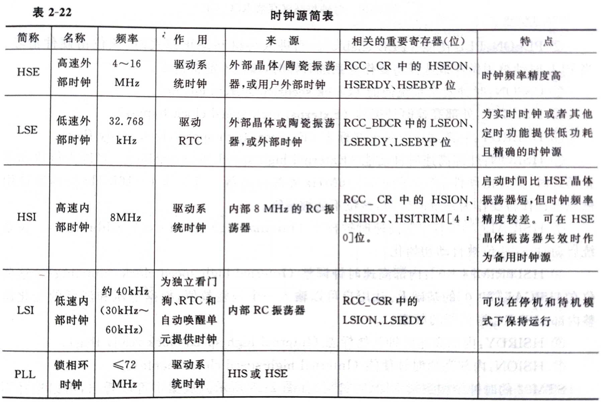

> 前言
>
> 嵌入式简答题就20分，只复习选择题加水题就能及格，这里只根据老师的“复习要点-阅读教材，突出重点”
>
> 我把老师在复习提供里“特别加粗”的内容单独提取出来，猜测老师出这些简答题。
>
> 实际上并无根据，只供参考。
>
> 作者：lyfive

## 选择题

参考群友@[rick](https://blog.rick.icu/archives/1153)blog

## 第一章

### 嵌入式的硬件

> 主要强调CPU

嵌入式系统硬件主要指嵌入式微处理器和外围设备。其中**嵌入式处理器**是嵌入式系统的核心，一般只保留与用户需求紧密相关的功能部件，因此体系小、重量轻、成本低、可靠性高等特点。

外围设备根据功能一般可分为以下三类：存储设备、通信设备和I/O设备。

**嵌入式处理器**

​	嵌入式系统的核心是各种类型的嵌入式处理器，嵌入式处理器与通用处理器最大的不同在于，嵌入式CPU大多工作在为特定用户群所专门设计的系统中，它将通用CPU中许多由板卡完成的任务集成到芯片内部，从而有利于嵌入式系统在设计时趋于小型化，同时还具有很高的效率和可靠性。

**嵌入式处理器的种类**

​	嵌入式处理器的体系结构经历了从CICS（复杂指令集）到RISC（精简指令集）和Compact RISC的转变，位数则由4位、8位、16位、32位逐步发展到64位。目前常用的嵌入式处理器可分为如下几种：

1. 嵌入式微控制器：即单片机
2. 嵌入式微处理器：一般基于通用微处理器，从8位、16位直到64位，目前以32位为主。
3. 嵌入式DSP处理器：专门用于高速实时信号处理，分为通用DSP和专用DSP两种。
4. 嵌入式片上系统：将微处理器、模拟IP核、数字IP核和存储器集成在单一芯片上，进一步降低了功耗，减少了开发成本。

### 嵌入式软件系统

> 主要强调嵌入式操作系统

​	大部分嵌入式操作系统都是实时系统，而且多是实时多任务系统。它们采用全抢占调度方案，相应时间很短；采用微内核技术，设计追求灵活性，可配置、可裁剪、可扩充、可移植；具备强实时和高可靠性，有适应各种主流CPU的版本，非常适合嵌入式应用。

**μC/OS-II实时操作系统**

​	μC/OS-II的前身是μC/OS。μC/OS-II是一个微型的实时操作系统，包括了一个操作系统最基本的一些特性，如任务调度、任务通信、内存管理、中断管理等，而且这是一个代码完全开放的实时操作系统，简单明了的结构和严谨的代码风格，非常适合初涉嵌入式操作系统的人士学习。

### 嵌入式系统的发展趋势

> 聊天的20分题，大概率

上已实现手写输入、语言输入、语言播报等，但一般的嵌入式设备距离这个要求还有很长的路要走。

## 第二章

### ARM处理器特点及应用

ARM微处理器采用RISC架构。采用RISC架构的ARM微处理器一般具有如下特点：

1. 体积小、低功耗、低成本、高性能
2. 支持Thumb（16位）/ARM或Thumb-2（32位）指令集，能很好地兼容8位/16位器件
3. 大量使用寄存器，指令执行速度更快
4. 大多数数据操作都在寄存器中完成
5. 寻址方式灵活简单，执行效率高
6. 指令长度固定

ARM微处理器及技术的应用已经深入到如下各个领域：

1. 工业控制领域
2. 无线通讯领域
3. 网络应用
4. 消费类电子产品
5. 成像和安全产品

除此以外，ARM微处理器及技术也应用到许多其他的领域，并会在将来取得更加广泛的应用。

### CM3嵌套向量中断控制器NVIC

ARM Cortex-M3的所有中断机制都有NVIC实现。NVIC除了支持240个外部中断之外，还支持11个内部异常源。ARM Cortex-M3处理器和嵌套向量中断控制器（NVIC）对所有异常按优先级进行排序并处理。所有异常都在处理模式中操作。出现异常时，自动将处理器状态保存到堆栈中（该状态在中断服务程序（ISP）结束时自动从堆栈中恢复），并且在状态保存的同时取出相应的异常向量快速地进入相应的异常处理。

**以下特性**使得ARM cortex-M3能够高效且低延迟地对异常进行处理：

1. 自动的状态保存和恢复
2. 优先级屏蔽支持临界区
3. 自动读取代码存储器或SRAM中包含ISR地址的向量表入口。
4. 支持末尾连锁
5. 中断优先级可动态重新设置
6. ARM Cortex-M3与NVIC之间采用紧耦合接口，通过该接口可以尽早地对中断和高优先级的迟来中断进行处理。
7. 中断数目可配置为1\~240
8. 中断优先级的数目可配置为1\~8位（1\~256级）
9. 处理模式和线程模式具有独立的堆栈和特权等级
10. 使用C/C++标准的调用规范。

### STM32时钟源与时钟树

> 时钟源可能还要看一眼特点，时钟树一眼顶针还是算了吧

处理器需要时钟才能工作，不同片内外设也工作在不同的频率。STM32支持多种内部和外部时钟源，如下所示。

1. HSE高速外部时钟，频率4~16MHz。用于驱动系统时钟，来源于外部晶体/陶瓷振荡器，或用户外部时钟
2. LSE低速外部时钟，频率32.768KHz。用于驱动RTC，来源于外部晶体或陶瓷振荡器，或外部时钟
3. HSI高速内部时钟，频率8MHz。用于驱动系统时钟，来源于内部8MHz的RC振荡器
4. LSI低速内部时钟，频率40KHz（30KHz~60KHz）。用于为独立看门狗、RTC和自动唤醒单元提供时钟，来源于内部RC振荡器。
5. PLL锁相环时钟，频率≤72MHz。用于驱动系统时钟

### STM32F10系统的GPIO

GPIO是一个灵活的由软件控制的数字信号，每个GPIO都代表一个连接到CPU特定引脚的一个位。STM32的GPIO端口的每一位都可以由软件配置成多种模式：浮空输入、上拉输入、下拉输入、模拟输入、开漏输出、推挽输出、推挽复用、开漏复用。

STM32的每个I/O可以自由编程，然而必须按照32位字访问I/O端口寄存器（不允许半字或字节访问）。每个I/O端口有两个32位配置寄存器（GPIOx_CRL、GPIOx_CRH），两个32位数据寄存器（GPIOx_IDR和GPIOx_ODR），一个32位置位/复位寄存器（GPIOx_BSRR），一个16位复位寄存器（GPIOx_BRR）和一个32位锁寄存器（GPIOx_LCKR）。

GPIO的一些特性：

1. STM32的I/O端口的输出模式有3种速度可选，分别为2MHz、10MHz和50MHz。
2. GPIO端口设为输入时，输出驱动电路与端口是断开，所以输出速度配置无意义
3. 在复位期间和刚复位后，复用功能未开启，I/O端口被配置成浮空输入模式
4. 所有I/O端口都有外部中断能力，可以作为外部中断的输入，便于系统灵活设计，为了使用外部中断线，端口必须配置成输入模式
5. GPIO端口的配置具有上锁功能 ，当配置好GPIO端口后，可以通过程序锁住配置组合，直到下次芯片复位才能解锁。
6. 所有I/O端口兼容CMOS和TTL，多数I/O端口兼容5V电平。
7. 很多I/O口的复用功能，可以重新映射。

## 第五章

### 嵌入式操作系统

> 老师很喜欢操作系统，因此就额外加一条

**概念**

​	μC/OS-II是一个实时操作系统内核，它只包括了任务调度、任务管理、时间管理、内存管理和任务间的通信与同步等基本功能，而没有提供输入输出管理、文件管理、网络之类的额外服务。但是，由于μC/OS-II的可移植性和开源性，用户可以自己添加所需的各种服务。

**特点**

1. 公开源代码
2. 可移植性
3. 可固化
4. 可裁剪
5. 占先式
6. 多任务
7. 可确定性
8. 任务栈
9. 系统服务
10. 中断管理
11. 稳定性与可靠性

**应用**

1. 任务管理
2. 时间管理
3. 任务之间的通信与同步
4. 内存管理
5. 中断处理

## Other

### 嵌入式系统发展的挑战与机遇

> 问chatgpt的

嵌入式系统作为一种专用计算机系统，具有高性能、低功耗、小体积、强实时性等特点，已经被广泛应用于诸如智能家居、工业自动化、医疗设备、交通运输等领域。但是，随着技术的不断进步和市场需求的不断变化，嵌入式系统发展也面临着一些挑战和机遇。

挑战：

1. 电源管理：由于嵌入式系统通常需要在电池供电或者其他能源受限的环境下工作，因此如何进行有效的电源管理，延长系统的使用寿命成为了一个重要的问题。
2. 安全性：随着互联网的普及和物联网的发展，许多嵌入式系统已经相互连接，并对外暴露网络接口，这就使得安全性变得更加重要。如何保护系统免受网络攻击、恶意软件、数据泄露等威胁，成为了一个亟待解决的问题。
3. 复杂性：随着嵌入式系统功能越来越丰富、应用场景越来越复杂，嵌入式系统的设计和开发也变得越来越复杂。如何降低开发成本、缩短开发周期，同时保证系统的性能和质量，也是一个重要的挑战。

机遇：

1. 物联网：随着物联网的不断发展，嵌入式系统将会更加广泛地应用于各个领域，特别是智能家居、智慧城市等场景中，其市场前景巨大。
2. 人工智能：随着人工智能技术的不断进步，嵌入式系统也将更好地支持现代人工智能算法，如深度学习、神经网络等，从而为实现智能感知和数据处理提供更好的平台和支持。
3. 硬件创新：随着半导体、传感器等硬件技术的不断进步，嵌入式系统的性能、功耗、可靠性等方面都得到了很大的提升，这也为嵌入式系统在更多领域的应用提供了更多机遇。

### 嵌入式处理器的选型原则

> 问chatgpt的

在进行嵌入式处理器选型时，可以考虑以下原则：

1. 需求：首先需要明确所需的功能和性能指标，如处理速度、存储空间、功耗等。根据实际需求，选择适合的处理器型号。
2. 性能：不同的处理器型号在处理性能上存在差异，一般来说，越高端的芯片性能越强，但同时价格也相对较高。因此，在保证需求满足的情况下，应尽量选择性价比更高的芯片。
3. 成本：成本是一个重要的考虑因素。在选择处理器时，需要综合考虑硬件开发费用、软件开发费用、生产成本等各方面的成本，以及长期运营成本等因素，寻求最佳平衡点。
4. 开发工具：不同的处理器类型可能需要使用不同的开发工具，如编译器、调试器、仿真器等。因此，在选择处理器时，需要确认是否有对应的开发工具，并确保开发工具能够支持所需的开发环境。
5. 已有资源：如果系统中已经存在其他类型的处理器，或者已经有相关的硬件、软件资源，则可以优先选择与其兼容的芯片，从而节省开发成本和时间。

综上所述，进行嵌入式处理器选型需要全面考虑实际需求、性能、成本、开发工具和已有资源等因素，以寻找最佳的平衡点，从而满足系统的要求。