## 分值分布

> 简答题（含画图、填表 12 \* 5分 = 60分
>
> 计算题 4题 35 分
>
> 论述题 5分
>
> 数据通信原理：
>
> > 第一章 概述：15分
> >
> > 第二章 数据信号的传输：30分
> >
> > 第三章 差错控制 20分
> >
> > 第四章 数据交换 + 第五章 数据通信网络体系结构 15分基本概念
> >
>
> 光纤通信：
>
> > 概念：20分
>
> 作者：20计算机科学与技术 李映飞

***

## 知识点

### 第一章（15分

#### 1.数据通信基本概念

1. 数据信号的基本传输方式：**基带传输**、**频带传输**和**数字数据传输**。
2. 常用的二进制代码有：**国际5号码（IA5）**、EBCDIC码和**国际电报2号码（ITA2）**。
3. **国际5号码**，以**7位**二进制码来代表字母、数组或符号。（**ASCII码**）

#### 2.数据通信系统的构成（5分

1. 数据通信系统的基本构成 
   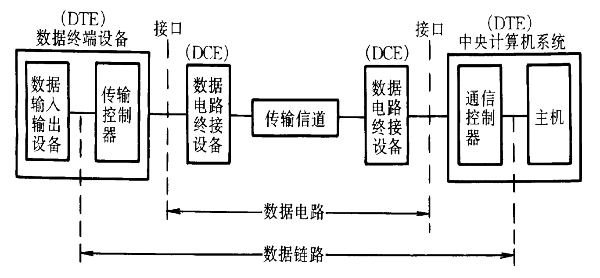
2. **数据电路**由传输信道及其两端的数据电路终接设备组成。
3. **数据链路**由数据电路加两边传输控制器组成。
4. **DCE是DTE与传输信道的接口设备**。
   1. **基带传输**：DCE是对来自**DTE的数据信号**进行某些**变换**，使信号功率谱与信道相适应，即 使**数据信号**适合在**电缆信道**中传输。
   2. **频带传输**：**DCE具体是调制解调器**，它是调制器和解调器的组合。（发送调制，将对应频带搬移到相应的频带中传输；接收解调，将模拟信号还原成数据信号。
   3. **数字数据传输**：**DCE是数据服务单元**，功能是**信号格式变换**，即 **消除**信号中的**直流**成分 和 **防止长串零**的编码、**信号再生**和**定时**等。

#### 3.数据通信传输信道

1. **数字数据传输信道**：采用**PCM数字信道**作为**数据信号传输信道**成为数字数据传输信道。
   - 目的：将**模拟信号** 转换成 **数字信号**
2. （了解）传输损耗：信号在传输介质中传播时将会有一部分能量转化成热能或者被传输介质吸收，从而造成信号强度不断减弱，这种现象成为传输损耗（或传输衰减）。

#### 4.数据传输方式（5分

1. 分类
   1. 按数据代码**传输的顺序**可以分为**并行传输**和**串行传输**。
   2. 按数据传输的**同步方式**可分为**同步传输**和**异步传输**。
   3. 按**数据**传输的**流向**和**时间关系**可分为**单工**、**半双工**和**全双工数据传输**。
2. **串行传输**：数据**码流**以串行方式在**一条信道**中**传输**。
   - 优点：易于实现。
   - 缺点：解决收、发双方字符同步，需外加同步措施。
   - 应用场景：**远距离**传输。
3. **并行传输**：将数据以**成组**的方式在**两条以上**的**并行信道**中**同时传输**。
   - 优点：不需要另外措施就实现了收发双发的字符同步。
   - 缺点：需要传输信道多、设备复杂、成本高。
   - 应用场景：计算机和其他**高速数字系统**、**短距离**传输。
4. **异步传输**：每次传送**一个字符**，各字符的**位置不固定**。
   - 优点：实现字符同步比较**简单**、收发双方的时钟信号**不需要精确的同步**。
   - 缺点：每个字符增加了起、止的比特位，**降低**了信息**传输效率**。
   - 应用场景：1200bit/s及以下的**低速**数据传输。
5. **同步传输**：以**固定时钟节拍**来发送数据信号，各字符之间的**相对位置固定**，只需在一串字符流前面加**一个起始**字符，后面加**一个终止**字符，表示字符流的开始和结束。
   - 同步传输一般采用**帧同步**。
   - 比较：相对于异步传输，**技术上要复杂**。但由于只加入了一个起始字符和一个终止字符，为此**传输效率较高**。
   - 应用场景：速率为**2400bit/s及以上**的数据传输。

#### 5.有效性指标（计算、定义）（对应第二章计算题 共8分

1. **调制速率**：即符号速率或码元速率，用$N_{Bd}或f_{s}$表示。定义为**每秒传输信号码元的个数**，又称波特率，单位为波特（Baud）
   - 设信号码元持续时间为$T(s)$，那么调制速率$N_{Baud} = \frac{1}{T(s)}(单位：Baud)$。
2. **数据传信速率**：（用$R或f_b$表示）定义是**每秒所传输的信息量**。
   - 当信号为M电平，即M进制时：$R = N_{Bd}log_{2}M(单位：bit/s)$
3. **频带利用率**：**单位频带内的传输速率**。
   - $\eta=\frac{符号速率}{频带宽度}(Baud/Hz)$
   - $\eta = \frac{数据传信速率}{频带宽度}(bit/(s\cdot Hz))$
   - 频带宽度用B表示（后面的信道带宽也是这个）
4. **可靠性指标**：使用差错率来衡量。
   - 差错率一般用**误码率**、误字符率、误码组率来表示。
   - $误码率=接收出现差错的比特数/总的发送比特数$
   - $误字符(码组)率=接收出现差错的字符(码组)数/总的发送字符(码组)数$
5. **信道容量**：信道在**单位时间**内所能传送的**最大信息量**，即 信道的**最大传信率**$(单位：bit/s)$。
   - 香农定律：B为信道带宽，S/N信号功率与噪声功率之比
   - $C=Blog_2(1+\frac{S}{N})$
   - 信噪比：$(S/N)_{db}=10lg(S/N)$ 如：20dB => $lg(S/N) = 2$ => $S/N = 10^2 = 100$
6. **数字信道的信道容量**：根据奈奎斯特准则，带宽为B的信道所能传送的信号**最高码元率**为2B。
   - $C=2Blog_2M$
   - M为电平，即M进制。B为信道带宽

#### 6.多路复用技术（5分

1. 目的：提高**通信信道的利用率**。
2. 方法：**频分复用**、**时分复用**、**波分复用**和**码分复用**。
3. **时分复用（重点：原理）**：时分复用包括一般的时分复用（简称时分复用）和统计时分复用。
   1. **时分复用**：利用各路信号在信道上**占有不同的时间间隔**的特性来**分开各路信号**。
   2. **统计时分复用**：根据用户实际需要**动态地分配线路资源**（逻辑子信道）的方法。

#### 7.数据通信网概述（了解）

1. **数据通信网的构成**：数据通信网是一个由分布在各地的**数据终端设备**、**数据交换设备**和**数据传输链路**所构成的**网络**。

***

### 第二章（30分

#### 1.数据信号及特性描述（画图题5分

1. **单极性不归零信号**：在**一个码元间隔T**内，脉冲的电位**保持不变**，用正电位表示‘1’码，零电位表示‘0’码，极性单一。不归零信号叫**NRZ**信号。
2. **单极性归零信号**：用宽度为$\tau(\tau<T)$的正脉冲表示‘1’码，用零电位表示‘0’码，极性单一。归零信号叫RZ信号
3. **双极性信号**：用**正**和**负**两个极性的脉冲来表示‘1’码和‘0’码。
   - 双极性信号相比于单极性信号的特点是：在‘1’和‘0’等概率出现的情况下，双极性信号中**不含有直流分量**，为此对**传输信道**的**直流特性没有要求**。
4. **差分信号**：单极性和双极性信号称为绝对码信号。差分信号是用前后码元电位**改变表示信号‘1’**，**电位不变代表信号‘0’**，设**初始状态为零电位**。（规则可相反）
5. **多电平信号**：**多个二进制**代码对应**一个脉冲码元**。如：00对应+3A，01对应+A，10对应-A，11对应-3A。
   - 采用多电平传输，可以在相同的码元速率下**提高信息传输速率**。
     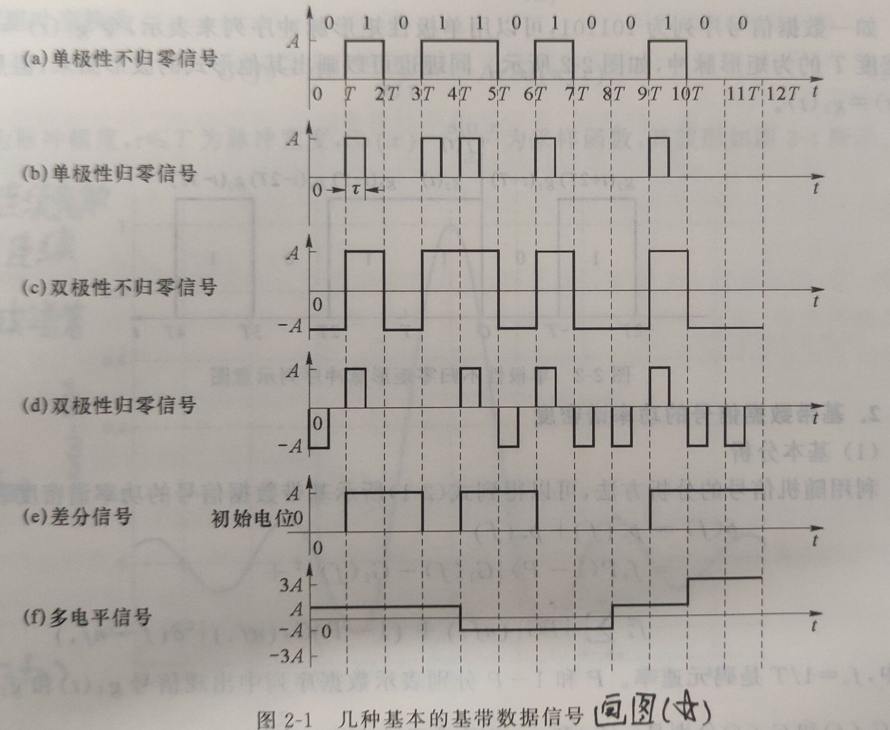
6. 基带数据信号的功率谱特性
   1. 单极性信号：既有连续谱 又有离散谱
   2. 双极性信号：只有连续谱
   3. 不归零信号：第一个零点$f_B = \frac{1}{\tau} 其中(\frac{1}{\tau}=\frac{1}{T}=f_B)$
   4. 归零信号：第一个零点$2f_B=\frac{1}{\tau}其中(\frac{1}{\tau}=\frac{2}{T}=2f_B)$

#### 2.数据信号的基带传输（画图5分+8分计算题

1. **基带传输系统的构成**：（记住每个组件的功能）
   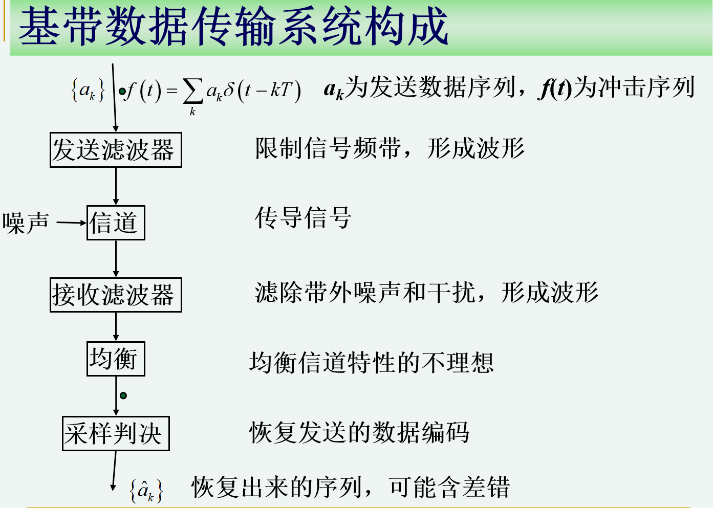
2. **奈奎斯特第一准则（必考大题）**：采样判决器按$T=\frac{1}{2f_N}$采样。如系统等效网络具有理想低通特性，且截止频率为$f_N$时，则该系统中允许的最高码元速率为$2f_N$，这时系统输出波形在峰值点上不产生前后符号干扰。
   - $f_N$称为奈奎斯特频带，$2f_N$称为奈奎斯特速率，$T=\frac{1}{2f_N}$称为奈奎斯特间隔
   - 所有数字传输系统的最高频带利用率为$2Baud/Hz$
   - 问题：①理想低通的传输特性无法物理实现。②理想低通的冲激响应波形具有波动幅度很大的前导和后尾
3. **具有升余弦频谱特性的形成网络（大题）**：频带利用率$\eta=\frac{2}{1+a}Baud/Hz$ （**a为滚降系数**）
   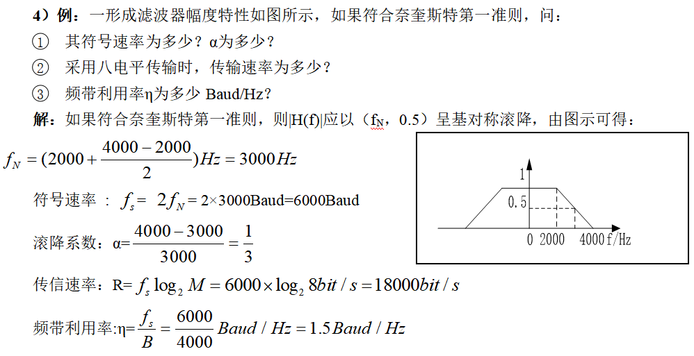
   - 计算方法：
     ①频带：$f_N$在开始下降和到0时的中间频率 ，因此$f_N=(2000+4000)\div2 = 3000Hz$
     ②符号速率：$f_s=2f_N$，因此$f_s=2\times3000=6000$
     ③滚降系数：$a$代表从$f_N$滚降到0时的频率长度与$f_N$的比例，因此$a = (4000-3000)\div3000=\frac{1}{3}$
     ④传输速率：$R=f_slog_2M$，因此$R = 6000\times log_28 = 18000bit/s$
     ⑤频带利用率：$\eta=\frac{2}{1+a}Baud/Hz$，因此$\eta=\frac{2}{1+\frac{1}{3}}=\frac{3}{2}Baud/Hz$
4. **部分响应系统**：奈奎斯特第二准则：有控制地在某些码元的采样时刻引入码间干扰，而在其余码元的采样时刻无码间打扰，就能使频带利用率达到理论上的最大值。而采用**奈奎斯特第二准则**的波形称为**部分响应波形**，利用**部分响应波形**进行传送的**基带传输**系统称为**部分响应系统**。分别有第一、二、三、四和五类部分响应系统，其中应用最广的是**第一类**和**第四类**部分响应系统。
   - 特点：
   - 有码间干扰，但是固定的，在接收端可以消除
   - 频带利用率能达到$2Baud/Hz$的极限
   - 形成波形的前导和后尾衰减较快，降低了对接收端定时的精度要求
   - 物理上可实现
   - 接收信号电平数大于发送信号电平数，抗干扰性能要差一些
5. **时域均衡的基本原理**：时域均衡的常用方法是在**基带传输系统**的**接收滤波器**之后，加入一个可变增益的**多抽头横截滤波器**。
6. **扰乱与解扰的作用**：数据序列是随机的，但会出现一段短时间的连'0'或连’1‘和一些短周期的确定性数据序列
   - 原因：
     - **可能产生交调串音**。短周期或长‘0’，‘1’序列具有很强的单频分量，这些单频可能与载波或已调信号产生交调，造成对相邻信道数据信号的干扰。
     - **可能造成传输系统失步**。长‘0’或长‘1’序列可能造成接收端提取定时信息困难，不能保证系统具有稳定的定时信号。
     - **可能造成均衡器调节信息丢失**：时域均衡器调节加权系数需要数据信号具有足够的随机性，否则可能导致均衡器中的滤波器发散而不能正常工作。
7. 数据传输系统中的时钟同步（了解）：接收端需要一个定时时钟信号与接收信号码元速率完全相同。
   1. 自同步法：直接从接收的基带信号序列中提取定时时钟信号的方法。
      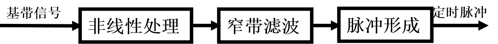
   2. 锁相环：遇见较长的连‘1’或连‘0’，影响准确性。加入锁相环电路维持有定时时钟信号输出功能、平滑或减少定时时钟信号的相位抖动，提高定时信号的精度。
      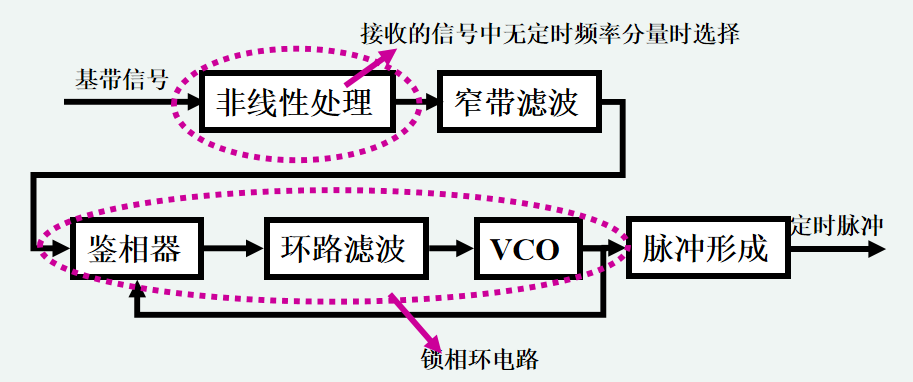

#### 3.数据信号的频带传输（画图5分+计算题8分

1. **频带传输系统的构成**：频带传输系统是在基带传输的基础上实现的，等效于一个基带传输系统。
   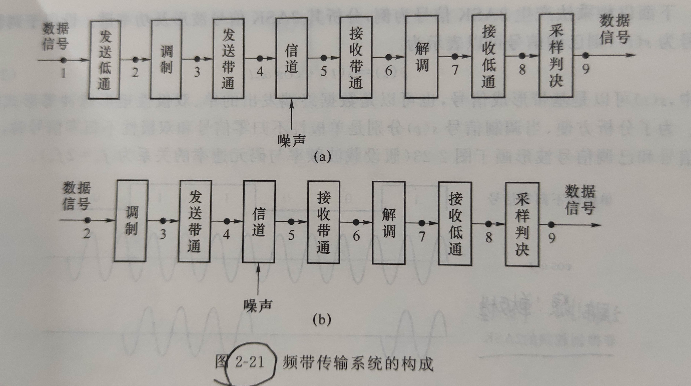
2. **数字调幅**：以基带数据信号控制一个载波的幅度，称为数字调幅，又称幅移键控（ASK）。
   - 方式：**相乘法**、键控法
   - 相乘法：$S_{2ASK}(t) = s(t)cosw_ct$
   - 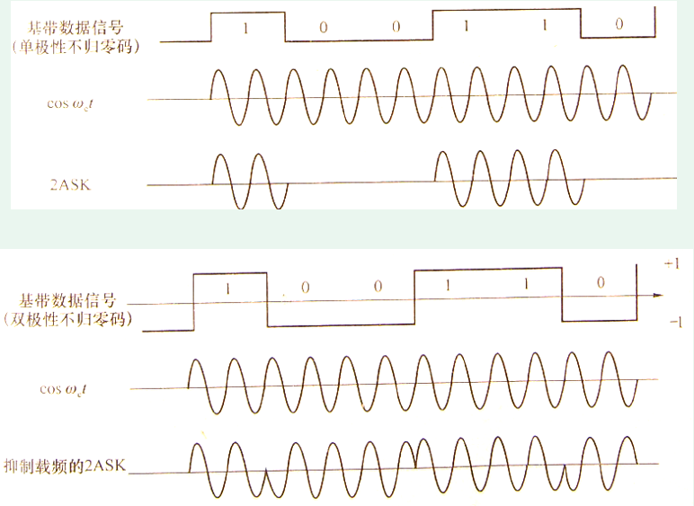
3. **数字调相（画图5分**：以基带数据信号控制载波的相位，称为数字调相，又称相移键控（PSK）。
   - 方式：绝对相移（PSK）和**相对相移**（DPSK）
   - 本质式子：$s(t)=Acos(\omega_ct+\phi )$通过调节$\phi$为**调相**
   - 绝对相移（PSK）：$\phi = 0,for \ 1;\phi = \pi ,for\ 0$；翻译一下就是，变化一次就倒转一次。因为2PSK信号无法载波频率分量，所以无法从接收的已调信号中直接提取相干载波。一般采用**倍频/分频法**。
     
     由于在2PSK信号的载波恢复过程中存在着180°的**相位模糊**，所以2PSK信号的相干解调存在随机的**“倒π”现象**，从而使得**2PSK**方式在实际中**很少采用**。(解决方案就是使用DPSK)
   - **相对相移**：2DPSK方式是用**前后相邻码元**的载波**相对初始相位变化**来表示数字信息。
     假设前后相邻码元的载波相位差为$\Delta \phi$，可定义$\Delta \phi =0,for\ 0;\Delta \phi \ =\pi,for\ 1(也可以定义相反)$ ；翻译一下就是，**信号0保持波形不变，信号1波形倒转**。**公式：**$D_n=a_n \bigoplus D_{n-1}$
     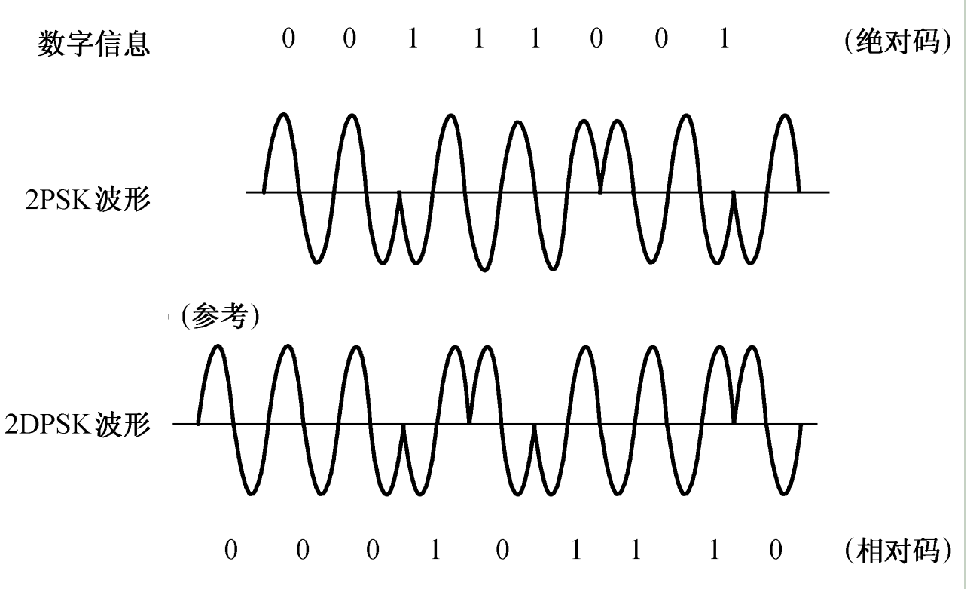
4. **多进制数字调相**：四进制数字调相（QPSK），在QPSK中，首先对输入的二进制数据进行分组，将二位编成一组，即构成双比特码组。$对于k=2，则M=2^2=4$，对应四种不同的相位或相位差。
   - 多进制数字调相的频带利用率：$\eta=\frac{k}{1+a}=\frac{log_2M}{1+a}$ （习题2-11）
     其中，k代表码组的元码个数；M代表相位个数（M进制），a代表滚降系数。
5. 数字调频（了解）：用基带数据信号控制载波的频率，称为数字调频，又称频移键控（FSK）
   2FSK信号先经过带同滤波器除信道中的噪声，限幅器用以消除接收信号的幅度变化。
6. **现代数字调制技术（计算题8分**：研究频谱调制技术在有限的带宽资源下获得更高的传输速率。
   - 方式：**正交幅度调制（QAM）**、偏移（交错）正交相移调制（OQPSK）
   - **QAM**：又称正交双边带调制。在多电平时，就构成了**多进制正交幅度调制（MQAM）**
   - 基本公式：
     - **M**：代表M星点数，M值越大，星点数越多、频带利用率就越高、星点的空间距离越小、系统的抗干扰能力下降、误码率越高。
     - **电平数**：$n = \sqrt{M}$（n电平代表n进制
     - **码元比特数**：$k=log_2n=log_2\sqrt{M}=\frac{1}{2}log_2M$
     - **码元速率（调制速率）**：$f_s$
     - **频带**：$f_N$
     - **带宽**：$B$
     - **码元速率-频带-带宽关系**：$f_s=2f_N;B=2(1+a)f_N$
     - **频带利用率**：$\eta=\frac{f_b}{B}=\frac{f_s\times log_2M}{(1+a)f_s}=\frac{log_2M}{1+a}$
   - 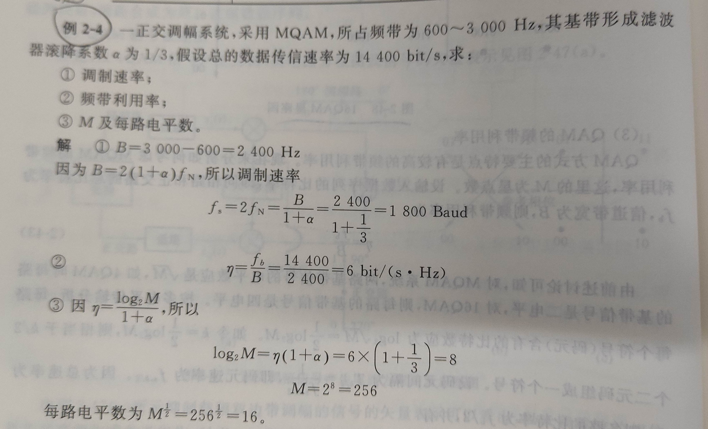

#### 4.数据信号的数字传输（可能的5分概念

1. **数据信号数字传输**的概念：在数字通信中**传输数据信号**称为**数据信号的数字传输**，简称**数字数据传输**。
2. **特点**：
   1. **传输质量高**。由于数据信号本身就是数字信号，直接或经过复用即可在数字信道上传输，无需调制和解调；传输距离较长时，数字数据传输的方式可以通过再生中继器使信道中引入的噪声和信号失真不再累积。
   2. **信道传输速率高**。PCM数字话路的数据传输速率为64kbits/s的数据，较低速率的数据可通过**时分复用**方式复用到64kbits/s；可以利用PCM30/32的几个**时隙**、整个**基群**等传输信号，达到更高的数据传输速度。

***

### 第三章（20分

#### 1.差错控制的基本概念及原理（和后面大题联系

1. **差错控制的基本思路**：在发送端被传送的信息码序列（本身无规律）的基础上，按照一定的规则**加入若干监督码元**后进行传输，这些加入的码元与原来的信息码序列之间**存在**着某种确定的**约束关系**。在接收数据时，**检验**信息码元与监督码元之间存在既定的**约束关系**，如该关系**遭到破坏**，则接收端可以**发现**传输中的**错误**，乃至**纠正错误**。(一般在**k位信息码**后加入**r位监督码**构成一个**码组**，码组位数为n)
   - 信息码(k) + 监督码(r) = 码组(n)
   - 编码效率$R=\frac{k}{n}$
2. **差错控制方式**：①检错重发（ARQ）②前向纠错（FEC）③混合纠错检错（HEC）④信息反馈（IRQ）
   1. **ARQ**：加入监督码具有一定的检错能力，成为能够发现错误码组。接收端接收码组，在判别后将结果通过反向信道送回发送端。如有**错误**，发送端把前面发出的信息**重新传送**一次，直到接收端认为正确接收。
      - **ARQ重发方式**：停发等候重发（发送端每**发一个**码组就停下来**等候**接收端的应答信号，正确ACK接着发 否则NAK重发刚发的码组）、返回重发（**无停顿**送出一个个连续码组，一旦接收端发现错误并发回NAK信号，则发送端从**错误码组开始重发**）、选择重发（**连续发送**，接收到错误**重发该错误码组**）。
      - **ARQ优缺点**：
        - 因为ARQ方式在接收端检测到错误后，要**通过反向信道**发回NAK信号，要求发送端重发，所以需要反向信道，**实时性差**。
        - ARQ方式在信息码后面所加的**监督码不多**，所以**信息传输效率较高**。
        - **译码设备较简单**。
   2. FEC：加入能够自动纠错的码，接收端的译码器根据编码规律检验出错误的位置并纠正。
      - FEC优缺点：
        - 纠错方式不需要反向通道，能自动纠错、不要求重发、延时小、实时性好
        - 纠错码必须与信道的错码特性密切配合，否则很难达到降低错码率的要求
        - 为了纠正错码，译码设备复杂，加入监督码多，传输效率低。
   3. HEC：ARQ+FEC，错误少于纠错能力则自动纠正；否则就要求重发。
      - HEC优缺点：复杂性是ARQ和HEC的折中，使用更广。
   4. IRQ：不加入纠错码，将信息返回给发送端进行检验。
      - IRQ优缺点：
        - 不需要纠错、检错的编译器，设备简单
        - 需要反向信道，实时性差
        - 发送端需要存储发送码组，环路时延大，数据速率越高，所需存储容量越大。
      - 应用：使用与传输速率较低、数据信道差错率低、具有双向传输线路及控制简单的系统中
3. **汉明距离与检错和纠错能力的关系**：
   1. 概念：
      - 码重：码组中非零码元的数目。
      - 码距：两个码组不同二进制码元的个数。
      - 汉明距离$d_{min}$：任意两个许用码组间距离的最小值
   2. **为检测$e$个错码，要求最小码距为$d_{min} \geq e+1$，若最小距离为$d_{min}$则它能检出$e \leq d_{min}-1$个错码**
   3. **为纠正$t$个错码，要求最小码距为$d_{min} \geq 2t+1$，若最小距离为$d_{min}$则它能纠正$t \leq \frac{d_{min} - 1}{2}$个错码**
   4. **为纠正$t$个错码，同时检测$e(e > t)$个错码，要求最小码距为$d_{min} \geq e+t+1$**

#### 2.简单的差错控制编码（填表5分

1. **奇偶监督码**：在分组信息码元后面**附加1位监督码**，使得该码组中**信息码和监督码**合起来**‘1’的个数**为**偶数（偶校验）**或**奇数（奇校验）**。最简单的检错码，得到广泛的应用。
   1. **偶校验**时：$a_0 \bigoplus a_1 \bigoplus ... \bigoplus a_{n-1} = 0$，其中$a_0=a_1 \bigoplus a_2 \bigoplus ... \bigoplus a_{n-1}$ 
   2. **奇校验**时：$a_0 \bigoplus a_1 \bigoplus ... \bigoplus a_{n-1} = 1$，其中$a_0=a_1 \bigoplus a_2 \bigoplus ... \bigoplus a_{n-1} \bigoplus 1$ 
   3. 局限性：这种奇偶检验**只能发现**单个或**奇数个错误**，而不能检测出偶数个错误，因而它的**检错能力不高**，但这并**不表明**它对随机奇数个错误的**检错率**和偶数个错率的**漏检率相同**。
   4. 奇偶校验码的最小码距为：$d_{min} = 2$
2. **水平奇偶监督码：**提高奇偶监督码的检错能力，特别是不能检测突发错误的缺点，引入了水平奇偶监督码。
   1. 构成思路：将信息码序列按行排成方阵，每行后面加一个奇或偶监督编码。
   2. 局限性：可以发现某一行上所有奇数个错误以及所有长度不大于方阵中行数的突发错误。
3. **二维奇偶监督码（重点 填表5分**：将水平奇偶监督码推广而得，又称水平垂直奇偶监督码、行列监督码和方阵码。
   1. 方法：在水平监督表的方阵基础上，每一列再进行奇偶校验。
   2. 优点：比水平奇偶监督码有**更强的检错能力**。能发现**某行**或**某列**上**奇数个错误**和长度不大于方阵中行数（或列数）的突发错误；**可**能检测出**一部分偶数**个错误；当某行某列均不满足监督关系而判定该行该列**交叉位置**的码元有错，从而**纠正**这一位上的**错误**。
   3. 缺陷：当偶数个错误恰好分布在矩阵的**四个顶点**上时，**检测不出来**。
   4. 二维奇偶监督码**检错能力强**、又具有一定的**纠错能力**、实现**容易** 故得到**广泛**的应用。

#### 3.汉明码及线性分组码（大题 8分

1. **汉明码**：汉明码是一种能够纠正一位错码且编码效率较高的线性分组码。
2. **(n,k)汉明码**：n位码长，k位信息位
   1. 校验式：$S=a_{n-1} \bigoplus a_{n-2} \bigoplus ... \bigoplus a_{1} \bigoplus a_0 $ 
   2. 若有r个校验位，则可以表示$2^r$种关系。则$1种代表无错，2^r-1种代表可能位置$
   3. 为此，码长为$n$，信息位为$k$，则监督位数为$r=n-k$
   4. 因此要求$2^r-1 \geq n \ or\ 2^r \geq k + r + 1，其中2^r-1代表可以表示的位置可能，n代表码长$ 
3. **(7,4)汉明码（了解看懂就行**：n=7，k=4，为此有3个校正子。
   1. 首先，分别令3个校正子为$S_1,S_2,S_3$
   2. 建立关系表：
      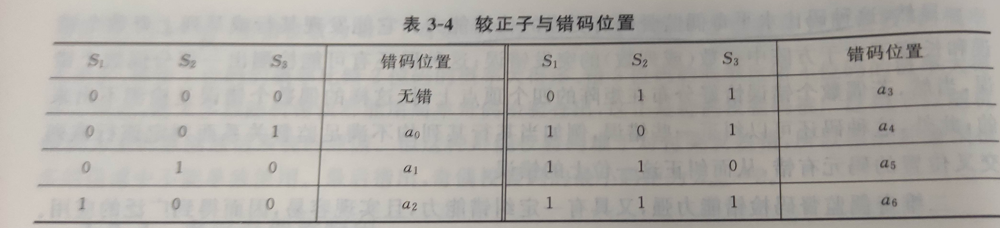
   3. 通过查表分别找到：$S_1$为1时分别有$a_2,a_4,a_5,a_6$出错，$S_2$为1时分别有$a_1,a_3,a_5,a_6$出错，$S_3$为1时分别有$a_0,a_3,a_4,a_6$出错。
   4. 通过3构建监督关系：
      - $S_1 = a_6 \bigoplus a_5 \bigoplus a_4 \bigoplus a_2 $  
      - $S_2 = a_6 \bigoplus a_5 \bigoplus a_3 \bigoplus a_1 $
      -  $S_3 = a_6 \bigoplus a_4 \bigoplus a_3 \bigoplus a_0 $
      -  $a_0,a_1,a_2$分别与对应监督式参考进行偶校验推导即可。（若令S为0表示错误则参考其他方式
4. **线性分组码（重点 大题8分**：
   1. **监督矩阵**：将上述表3-4改写成$S_i \times a_j$的形式，构造出对应的一个矩阵。
      - $H =\left [ \begin{matrix}1&1&1&0&1&0&0 \\ 1&1&0&1&0&1&0 \\1&0&1&1&0&0&1 \\ \end{matrix}  \right ]$ 
      - $A=\left[ \begin{matrix} a_6&a_5&a_4&a_3&a_2&a_1&a_0 \end{matrix} \right] $
      - $0=\left[ \begin{matrix} 0&0&0 \end{matrix} \right] $ 
      - 则可建立$H \cdot A^T = 0^T$ 或 $A \cdot H^T = 0$ 
      - 将$H$拆解为$P =\left [ \begin{matrix}1&1&1&0 \\ 1&1&0&1 \\1&0&1&1 \\ \end{matrix}  \right ]$，$I_r =\left [ \begin{matrix}1&0&0 \\ 0&1&0 \\0&0&1 \\ \end{matrix}  \right ]$ 构造出 $H = (P \cdot I_r)$的形式，$I_r$为单位方阵。此时我们称$H$矩阵为典型形式的监督矩阵。
      - 由(7,4)汉明码我们知道有：$[a_2\ a_1\ a_0] = [a_6\ a_5\ a_4\ a_3]P^T=[a_6\ a_5\ a_4\ a_3] Q;Q = p^T$
      - 为此我们还能得到$[监督码] = [信息码] \cdot Q$ 
   2. **生成矩阵**：将上述$Q$左边加入$k$ 阶单位方阵 $I_k$，得到$G=[I_kQ]$，此时称$G$为典型的生成矩阵。
      - 由$G$可以获得整个码组$A=[a_{n-1}\ a_{n-2}\ ...\ a_0]=[信息码] \cdot G(典型的)$
      - 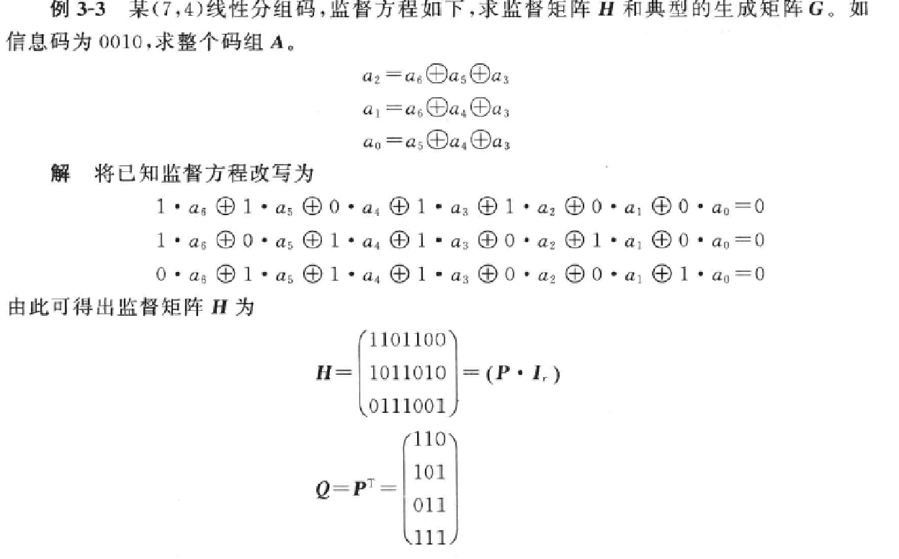
        
   3. **监督矩阵与生成矩阵的关系（如上述例题）**
   4. **线性分组码主要性质**
      1. 封闭性：一种线性分组码中的任意两个码组之逐位模2和仍为这种码中的另一个许用码组。
         即$A_1H^T=0,A_2H^T=0$则$A_1H^T+A_2H^T=(A_1+A_2)H^T=0$
      2. 码的最小距离等于非零码的最小重量

#### 4.循环码（计算题8分

1. **循环码的循环特性**
   1. **码的多项式（A->A(x))**：把长为n的码组与n-1次多项式建立一一对应的关系，$A=(a_{n-1},a_{n-2},...,a_0)$
      $A(x) = a_{n-1}x^{n-1}+a_{n-2}x^{n-2}+...+a_{0}x^{0}$
      如：$A=1011011,则A(x) =x^6+x^4+x^3+x+1$
   2. **循环码的循环特性**：指循环码中任一许用码组经过**循环移位**后（最右端码元移至最左 反之亦然），所得到的码组仍为它的一个许用码组。
      如：(0 0 1, 0 1 1 1) 可以得到(1 0 0, 1 0 1 1) // 右移一位
2. **循环码的生成多项式和生成矩阵(常见的是（7,3）循环码 记住一个001，0111**
   1. **生成多项式g(x)**：(n,k)循环码的$2^k$个码组中，有一个码组前k-1位码元均为0，第k位码元1，第n位(最后一位)码元为1，此码组对应的多项式即位生成多项式g(x)，其最高次幂为$x^{n-k}$。（理解也很简单，因为循环码的循环特性，可以循环移动使得最长连续的0为前缀）
      如：某个码组为0101110，则对应的$g(x)=x^4+x^2+x+1$
   2. **生成矩阵G：** $G=\left[ \begin{matrix} x^{k-1}g(x) \\ x^{k-2}g(x) \\ \vdots \\xg(x) \\ g(x)  \end{matrix} \right]$ 后，通过行变换变成典型生成矩阵$G = (I_kQ)；Q=P^T$可以获取$P$后继续获取典型监督矩阵$H=(PI_r)$
      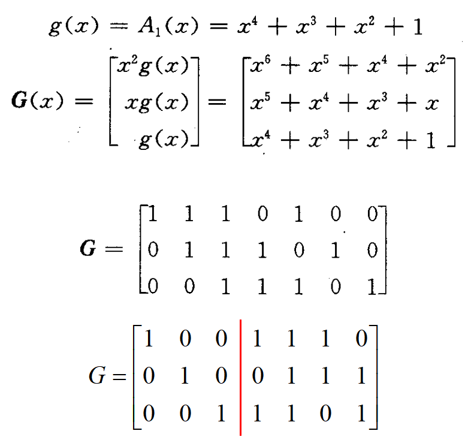

***

### 第四章

**常见的几种数据交换方式**：电路交换、报文交换、分组交换、帧中继及ATM交换。（重点：基本原理、优缺点、适用场合）

#### 1.报文交换方式

1. 概念：报文交换属于存储-转发交换方式，当用户的报文到达交换机时，先将报文存储在交换机的存储器中，当需要的输出电路有空闲时，再将该报文发向接收交换机或用户终端。
2. **报文成分**
   1. **报头或标题**。包括**发信站地址**、**终点收信地址**和**其他辅助控制信息**等。
   2. **报文正文**。传输用户信息。
   3. **报尾**。表示报文的结束标志，若报文长度有规定，则可省去。
3. **优点**
   1. 可使**不同类型**的**终端设备**之间**相互**进行**通信**。因为报文交换机具有存储和处理能力，可对输入输出电路上的速率、编码格式进行变换。
   2. 在报文交换的过程中**没有电路接续**过程，来自不同用户的报文可以在**同一条线路上**以报文为单位实现统计**时分多路复用**，线路可以以它的最高传输能力工作，大大**提高了线路利用率**。
   3. 用户**不需要叫通对方**就可以发送报文，所以**无呼损**。
   4. 可实现**同文报通信**，即**同一报文**可以由交换机**转发**到**不同的收信地点**。
4. **缺点**
   1. 信息的**传输时延大**，而且**时延的变化也大**。
   2. 要求报文交换机**有高速处理能力**，且**缓冲存储器容量大**，因此交换机的**设备费用高**。
5. 适用场景：不利于实时通信，适用于公众电报和电子信箱业务。

#### 2.分组的传输方式

**数据报方式、虚电路方式**

1. **数据报方式的特点** （计算机网络好像介绍过
   1. 用户之间的通信**不需要**经历**呼叫建立**和**呼叫清除**阶段，对于**数据量小的通信**，传输**效率比较高**。
   2. 数据分组的**传输时延较大**（与虚电路方式比），且**离散度大**（即同一终端的不同分组的传输时延差别较大）。因为**不同的分组可以沿不同的路径传输**，而**不同传输路径的延迟时间差别较大**。
   3. 同一终端送出的若干分组到达终端的**顺序**可能**不同于发送端**，需**重新排序**。
   4. **对网络拥塞或故障的适应能力较强**，一旦某个经由的节点出现故障或网络的一部分**形成拥塞**，数据分组可以**另外选择传输路径**。
2. **虚电路方式的特点**
   1. **一次**通信具有**呼叫建立、数据传输和呼叫清除3个阶段**。对于**数据量较大**的通信**传输效率高**。
   2. 终端之间的路由在**数据传送前已被决定**（建立虚电路时决定的）。不必像数据报那样节点要为每个分组做路由选择的决定，但分组**还是要在每个节点**上**存储、排队等待输出**。
   3. 数据分组**按已建立的路径顺序**通过网络，在网络终点**不需要对分组重新排序**，分组传输**时延较小**，而且**不容易**产生数据分组的**丢失**。
   4. 虚电路方式的缺点是当网络中由于线路或**设备故障**可能使虚电路中断时，**需要重新呼叫**建立新的连接，**但**现在许多采用虚电路方式的网络**已能提供重连接**的功能，当网络出现故障时将由网络**自动**选择并**建立**新的虚电路，**不需要用户重新呼叫**，并且**不丢失用户数据**。
3. **分组长度的选取**：**最佳分组长度**与**最高的正确**传输数据信息的**信道利用率成正比**。一般，选分组长度为**128**字节，不超过**256**字节（不包括分组头），分组头长度为**3~10**字节。

#### 3.帧中继

1. **帧中继发展的必要条件**
   1. **光纤传输线路的使用**：光纤传输线路的大量使用，数据传输质量大大提高。
   2. **用户终端的智能化**：用户终端的智能化，使终端的处理能力大大增强，从而可以把分组交换网中由交换机完成的一些功能比如：流量控制、纠错等能够交给终端完成。
2. 帧中继技术的功能
   1. 主要用于传递数据业务
   2. 帧中继交换机的功能简化
   3. 建立逻辑连接
   4. 提供带宽管理和防止阻塞的机制
   5. 可以提供SVC业务（交换虚电路）和PVC业务（永久虚电路）
3. 特点
   1. 高效性
   2. 经济性
   3. 可靠性
   4. 灵活性
   5. 长远性

#### 4.ATM交换

1. **ATM信元**：ATM信元实际上就是分组，为了区别X.25的分组。
   - **ATM信元长度为53字节。**
   - **组成：5个字节为信头（表示信元去向的逻辑地址，还有一些维护信息、优先级以及信头的纠错码，有利于软件实现），48字节是信息段（载荷来自各种不同业务的用户信息）。**
2. **ATM的特点**
   1. **ATM以面向连接的方式工作**
   2. **ATM采用异步时分复用**
   3. **ATM网中没有逐段链路的差错控制和流量控制**
   4. **信头的功能被简化**
   5. **ATM采用固定长度的信元，信息段的长度较小**
3. **ATM的虚连接**：ATM的虚连接建立在两个等级上：**虚通路VC**和**虚通道VP**，ATM信元的**复用、传输和交换过程**均在**VC和VP上**进行。
   1. **VC—虚通路（虚信道）**：**描述**ATM信元**单向传送能力**的概念，是传送ATM信元的**逻辑信道**（子信道）
   2. VCI—虚通路标识符：ATM复用线上具有相同VCI的信元是在同一逻辑信道（即虚通路）上传送。
   3. **VP—虚通道**：是在给定参考点上**具有同一**虚通道标识符（**VPI**）的一组虚通路（**VC**）。实际上VP也是传送ATM信元的一种**逻辑子信道**。
   4. VPI—虚通道标识符：它标识了具有相同VPI的一束VC。
4. **VP交换**：仅对信元的VPI进行处理和变换，或者说经过VP交换，只有**VPI值改变**，**VCI值不变**。
   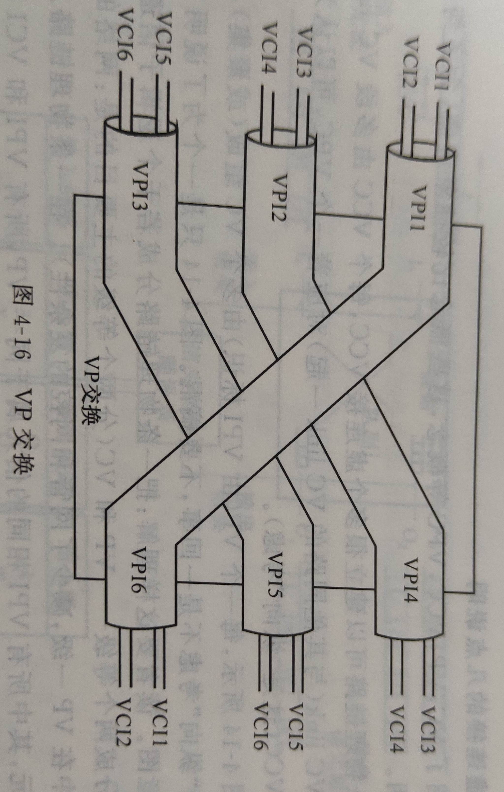
5. **VC交换**：同时对VPI，VCI进行处理和变换，也就是经过VC交换，**VPI、VCI值同时改变**。**VC交换必须和VP交换同时进行**。
   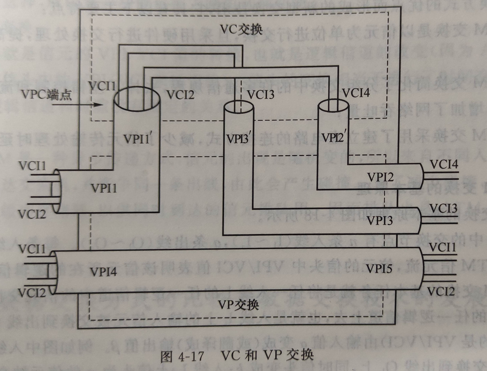

#### 5.几种交换方式的比较(重点)

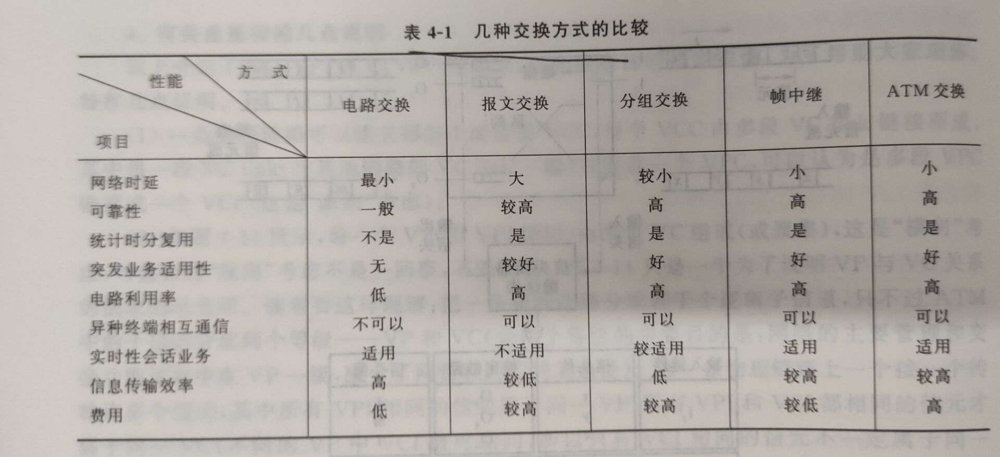

### 第五章

#### 1.开放系统互连参考模型（OSI-RM）

1. **OSI-RM的分层结构：**OSI参考模型**共分7层**，自下而上分别是：
   1. **物理层**：并不是物理媒体本身，它是**开放系统**利用物理媒体**实现物理连接**的功能描述和执行连接的**规程**。物理层**提供**用于**建立、保持和断开物理连接的机械的、电气的、功能的和规程**的手段。简而言之，物理层提供**有关同步和全双工比特流**在**物理媒体**上的**传输**手段。
      **基本单位：比特**
      典型协议有：RS232C，RS449/422/423，V.24，V.28，X.20，X.21等
   2. **数据链路层**：负责**数据链路的建立、维持和拆除**。
      **基本单位：帧**
      常见协议：基本型传输控制规程和高级数据链路控制规程（HDLC）
   3. **网络层**：负责将高层传送下来的**信息分组**，再进行必要的**路由选择、差错控制、流量控制**等处理
      **基本单位：分组**
      **协议：X.25分组级协议**
   4. **运输层**：实现用户的**端到端**的或**进程之间**数据的**透明传送**。功能包括**端到端的顺序控制、流量控制、差错控制及监督服务质量**。
      **基本单位：报文**
   5. **会话层**：进程之间建立一个逻辑上的连接称之为会话。它提供一种**经过组织**的方法在用户之间**交换数据**。
      **传送单位：报文（和运输层不一样）**
   6. **表示层**：提供**数据的表示方法**，主要功能有：**代码转换、数据格式转换、数据加密与解密、数据压缩与恢复**。
   7. **应用层**：最高层，**面向用户**以满足用户的不同需求。**负责**用户信息的**语义表示**，并在两个通信用户之间进行**语义匹配**。
      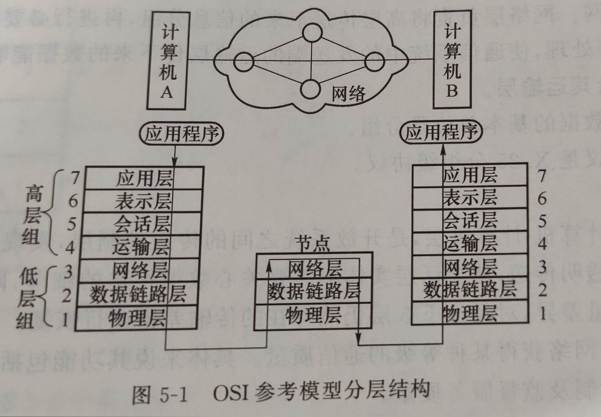
2. **物理层协议基本概念**：OSI参考模型中的最底层，建立在物理媒体的基础上，实现系统与物理媒体的接口。
3. **物理接口标准的基本特性**
   1. **机械特性**
   2. **电气特性**
   3. **功能特性**
   4. **规程特性**
4. 链路层数据通信过程
   1. 建立物理连接
   2. 建立数据链路
   3. 数据传送
   4. 传送结束，拆除数据链路
   5. 拆除物理连接
5. **数据链路控制规程的功能**
   1. **帧控制**
   2. **透明传送**
   3. **差错控制**
   4. **流量控制**
   5. **链路管理**
   6. **异常状态的恢复**
6. **HDLC帧结构**
   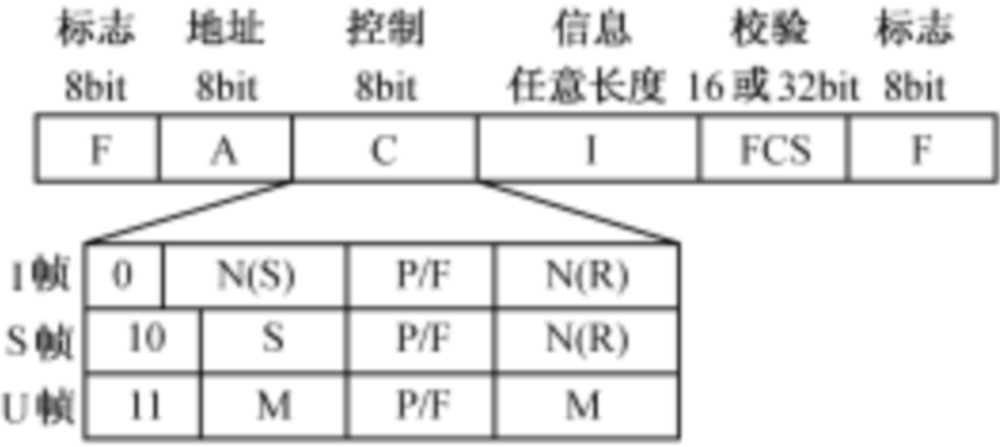
   1. **标志字段（F）**：用于**帧同步**，表示一帧的开始和结束。为防止提前结束引入**“0”插入和删除技术**
      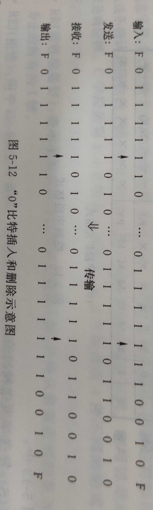
   2. 地址字段（A）
   3. 控制字段（C）
   4. 信息字段（I）
   5. **帧校验字段（FCS）**：校验的范围包括除**标志字段之外的所有字段**，但为了进行透明传输而**插入的‘0’不在校验范围**内。
7. **HDLC控制字段（C）的格式与3种类型的帧**
   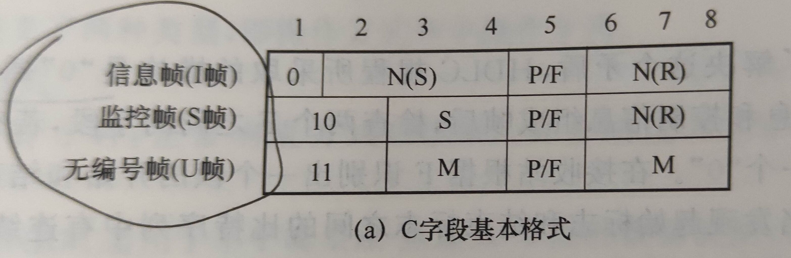
   1. **信息帧（I帧）：实现数据信息的传输**
   2. **监控帧（S帧）：实现对数据链路的监控。**
   3. **无编号帧（U帧）：提供链路的建立和拆除等多种附加的数据链路控制功能和无编号信息的传输功能。**
8. **X.25建议的层次结构：3个独立的层 物理层、链路层和分组层，分别对应于OSI参考模型的下3层。**
   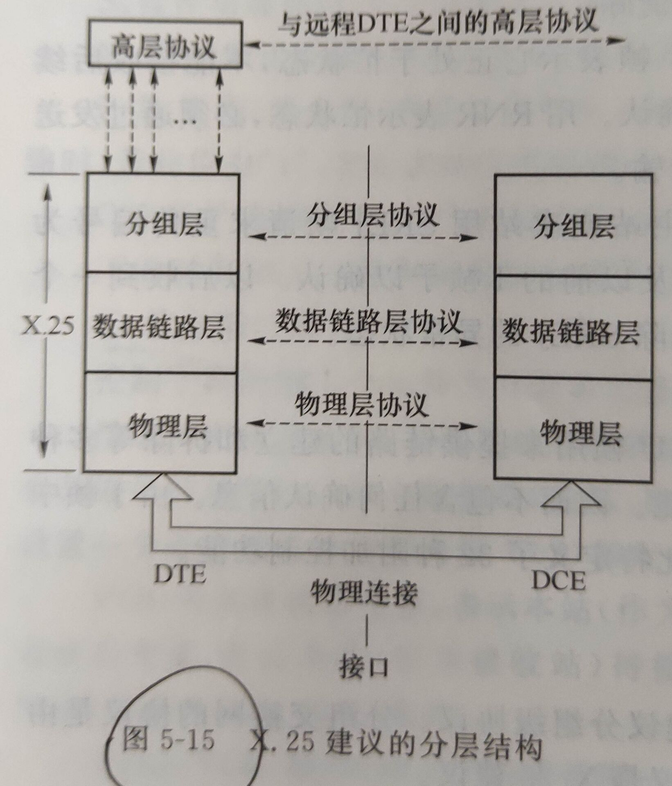

#### 2.TCP/IP参考模型的分层结构

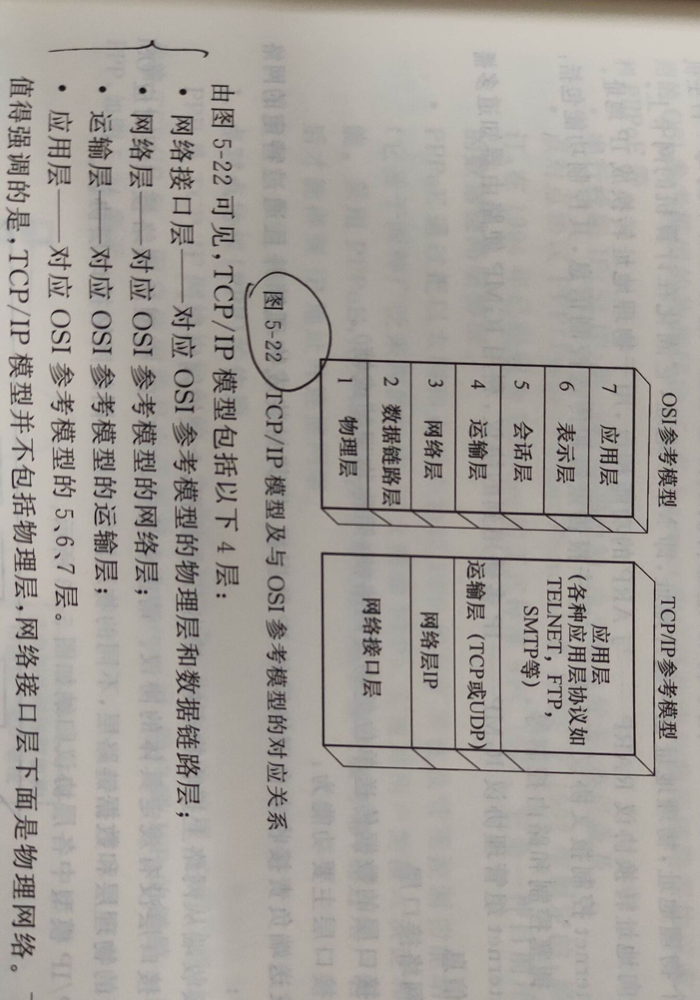

***

 ### 光纤通信（参考 光纤通信2022年.docx 

