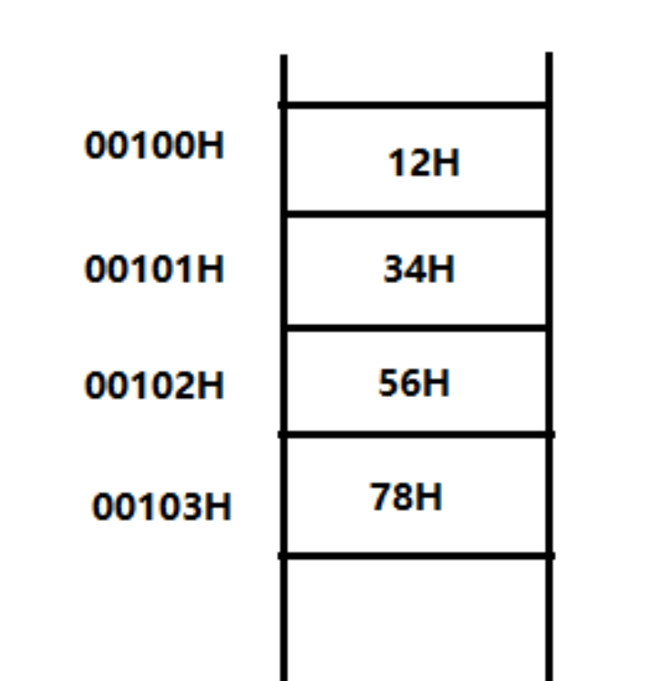
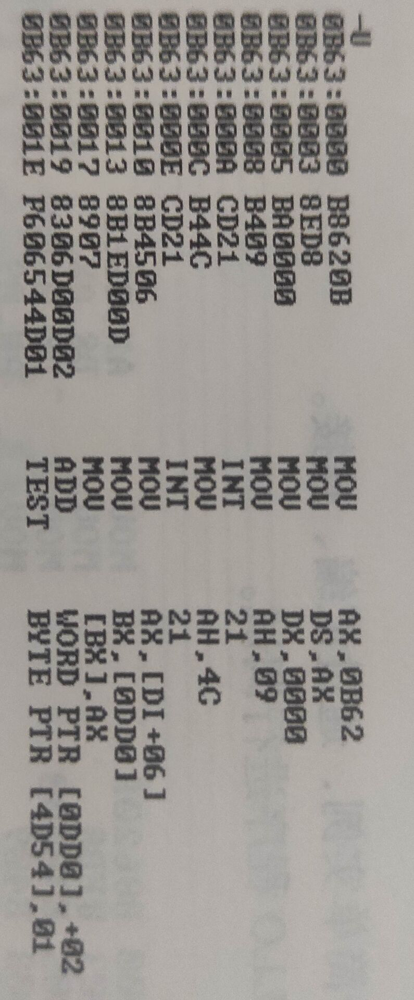

>标题：汇编语言程序设计 重点汇总
>
>作者：李映飞
>
>时间：2022-11-28

### 考试题型及范围

题型：

1. 简答题
2. 计算题
3. 填空题
4. 画图题
5. 编程题
6. 论述题

考试范围：1-7章，会写汇编程序即可。


### 第一章

>重点：机器语言与汇编语言的关系及其组成

#### 1. 机器语言与汇编语言

1. 计算机程序是由各种程序设计语言根据编程规则实现的，计算机程序设计语言经历了从低级到高级的发展，通常分为三类：**机器语言**（Machine Language）、**汇编语言**（Assembly Language）、**高级语言**（High Level Language）。
2. 汇编语言的组成：
   1. **汇编指令**：机器码的**助记符**，有对应的机器码，它是汇编语言的核心。
   2. **伪指令**：没有对应的机器码，由**编译器执行**，计算机并不执行。
   3. **其他符号**：如+、-、*、/等，由编译器识别，**没有对应的机器码**。
3. 为什么要学习汇编语言？（重点加粗）
   1. **学习汇编语言对于从事计算机应用开发有重要作用。**汇编语言程序是由符号指令写成的，本质上还是机器语言，与具体机型的硬件结构密切相关，**可直接、有效地控制计算机硬件，运行速度快，程序短小精悍，占用内存容量少**。在**某些特定应用场合更能发挥作用**，如实时控制系统，需要对硬件设置直接进行数据的输入/输出和控制，如在嵌入式系统和智能化仪器的开发中，需要更好地利用有限的硬软件资源，发挥硬件的功能。
   2. **学习汇编语言是从根本上认识和理解计算机工作过程的最好方法，通过汇编语言指令，可以清楚地看到程序在计算机中如何一步步执行，有利于更深入理解计算机的工作原理和特点**，单纯地介绍计算机的硬件知识或一门高级语言的程序设计是不可能做到的这点的。**汇编语言把软件和硬件紧密地结合在一起，起到连接硬件和软件的桥梁作用**，掌握汇编语言对今后学习其他计算机相关课程非常有利。

#### 2. 习题

1. 习题1：
   1. 什么是机器语言：**机器语言就是用二进制编码组成的机器指令的集合和一组使用机器指令的规则。**
   2. 什么是汇编语言：**汇编语言是对机器指令中的操作码用英文单词的缩写描述，对操作数用标号、变量、常量描述。**
   3. 汇编语言的特点：
      1. 与机器有关：移植性差，但可直接控制硬件。
      2. 程序效率高。
      3. 局限性：受指令的限制，如考虑存储单元等。
      4. 调试困难。
   4. 汇编程序与汇编源程序的区别是什么：**汇编源程序**是指**用汇编语言编写**的程序，而**汇编程序**特指将汇编源程序**汇编成目标文件**的编译程序。


### 第二章

>重点：计算机系统组成、寄存器组成

#### 1. 计算机系统组成

1. 计算机的基本工作原理是**存储程序**和**程序控制**，称为冯诺依曼原理。
   **冯诺依曼结构**：主要由微处理器芯片构成的**中央处理器**(CPU)、**存储器**(memory)和**输入/输出**(I/O)子系统三大部分组成，用**系统总线(bus)连接**在一起。
2. 中央处理器：主要包括运算器和控制器。运算器执行指令，控制器负责计算机的控制，负责从主存储器取指令，对指令进行译码，发出访问主存储器或I/O设备接口的控制信号，完成程序的要求。
3. 存储器：是计算机记忆部件，以二进制形式**存放程序和数据**。
4. 输入/输出：包括大容量存储器（硬盘）和其他外设，如显示器、键盘、打印机、鼠标等。
5. 系统总线：连接CPU、主存储器和I/O子系统三大部分，用以完成各部分的数据交换。系统总线包括数据总线、地址总线和控制总线。数据总线负责传送数据，地址总线负责指示主存地址或I/O接口地址，控制总线负责总线的动作，如时间、方向、状态。


#### 2. 寄存器

> 必须知道

**通用寄存器**

1. AX：累加器。16位可分为AH高8位和AL低8位。
2. BX：基址寄存器，存放数据和内存的起始偏移地址。BH、BL
3. CX：计数寄存器，存放数据和存放重复操作的次数。CH、CL
4. DX：数据寄存器，存放数据和存放32位数据的高16位。DH、DL

**地址寄存器**

1. SP：堆栈指针，存放堆栈栈顶的偏移地址。
2. BP：基址指针，存放内存中数据的偏移地址。
3. SI：源变址寄存器，存放内存中源数据区的偏移地址；指在某些指令作用下它可以自动地递增或递减其中的值。
4. DI：目的变址寄存器，存放内存中目的数据区的偏移地址，并在某些指令作用下自动地递增或递减其中的值。

**段寄存器**

1. CS：代码段寄存器，存放当前正在执行的程序段的段基址。
2. SS：堆栈段寄存器，存放堆栈段的段基址。
3. DS：数据段寄存器，存放数据段的段基址。
4. ES：附加段寄存器，存放另一个数据段的段基址。

**指令指针寄存器**

IP：指令指针寄存器，存放即将执行指令的偏移地址。

**标志寄存器**

1. FLAGS：存放CPU的两类状态。
2. 状态标志：CF（进位）、PF（奇偶）、AF（辅助进位）、ZF（零）、SF（符号）和OF（溢出）
3. 控制标志：TF、IF（中断）和DF（方向）

| 标志名（加粗重点）     | 标志为1 | 标志为0 |
| :--------------------- | :-----: | :-----: |
| **OF 溢出（是/否）**   |   OV    |   NV    |
| DF 方向（减/增）       |   DN    |   UP    |
| IF 中断（允许/不允许） |   EI    |   DI    |
| **SF 符号（负/正）**   |   NG    |   PL    |
| **ZF 零 （是/否）**    |   ZR    |   NZ    |
| AF 辅助进位（有/无）   |   AC    |   NA    |
| PF 奇偶（偶/奇）       |   PE    |   PO    |
| **CF 进位（有/无）**   |   CY    |   NC    |

**OF：溢出标志。**OF=1表示有两个有符号数的运算结果超出了可以表示的范围，结果是错误的；OF=0表示没有溢出，结果正确。进行无符号数运算时也会产生新的OF标志（CPU不知道处理对象是否为有符号数），此时程序员可以不关心OF标志。// 因为计算机只计算二进制，所谓的有符号和无符号运算都是看程序员自己觉得的，对于有符号数程序员会利用补码定义负数

**SF：符号标志。**SF=1表示**运算结果的最高位**为“1“。对于有符号数，在溢出标志OF=0时，SF=1表示运算结果为负，SF=0表示运算结果非负。OF=1时，由于结果是错误的，所以符号位也和正确值相反。例如：两个负数相加产生溢出，此时SF=0。对于无符号数运算，SF无意义（但是可以看出结果的大小规模）。

**ZF：零标志。**ZF=1表示运算结果为零，**减法运算后**结果为零意味着两个参加运算的数**大小相等**；ZF=0，表示运算结果非零。

**CF：进位/借位标志。**CF=1 表示两个无符号数的加法运算有进位，或者是减法运算有借位，需要对它们的高位进行补充处理；CF=0 表示没有产生进位或借位。同样，进行有符号数运算时也会产生新的CF标志，此时程序员可以不关心CF标志。

DF：方向标志。DF=0时，每次执行字符串指令后，源或目的地址指针用加法自动修改地址；DF=1时用减法来修改地址。它用来控制地址的变化方向。

IF：终端允许标志。IF=1表示允许处理器响应可屏蔽中断请求信号，称为开中断，IF=0表示不允许处理器响应可屏蔽中断请求信号，称为关中断。

AF：辅助进位标志。在进行字操作时，低字节向高字节进位时，AF=1，否则为0。一般用于两个BCD数运算后调整结果用，对其他数的运算没有意义。

PF：奇偶标志 。PF=1表示运算结果的低8位中偶数个”1“；PF=0表示有奇数个”1“。它可以用来进行奇偶校验。

**符号地址**

1. **DB,DW** 定义的存储单元名字，默认对应为数据段的偏移地址。
2. **EQU** 定义的符号地址没有默认的数据段，等价于一个数值变量。


#### 3. 32位80x86CPU的工作模式

> 了解即可

1. 实模式：实模式的特点是为了兼容16位机的工作模式，内存寻址位0~0FFFFFH的1MB空间，20位的物理地址由16位的段地址和16位的偏移地址组成，CPU地址线也只能低20位线有效。可以使用32为寄存器和32位操作数。MS DOS只能在实模式下运行。
2. 保护模式：是32位80x86CPU主要工作模式，其特点是全部地址线参与寻址。程序访问内存使用的是逻辑地址（虚拟地址）。该虚拟地址是由16位的段选择符和32位偏移地址得到，16位的段选择符存在段寄存器中，应用程序不得修改，由操作系统决定。而实际上的物理地址是用16位的段选择符所对应的32位段基址和32位偏移地址组成。32位偏移地址使得每段的长度为$2^{32}=4GB$，由于采用虚拟地址，使各程序之间有严格的内存保护和隔离，支持了多任务的运行。
3. 虚拟8086模式：就是生成多个虚拟的8086CPI，以便运行实模式下的8086程序。也支持内存保护和隔离，可同时运行多个程序。


#### 4. 习题

1. 简述计算机系统组成：计算机由中央处理器CPU、存储器、输入系统和输出系统组成，由系统总线连接在一起。CPU包括运算器和控制器，运算器执行指令、控制器负责计算机的控制。存储器是计算机的记忆部件，以二进制形式存放程序和数据。输入输出系统包括大容量存储器，如硬盘。以及其他外设，如鼠标、键盘、显示器等。

2. 简述16位机的各类寄存器的主要作用：参考本章**2. 寄存器**

3. 写出每条汇编指令执行后的相关寄存器的值：

   1. Mov ax, 1345H  ax = <u>1345H</u>
   2. Mov ah, 24H ax = <u>2445H</u>
   3. Mov al, 45H ax = <u>2445H</u>
   4. Mov bx, 3412H bx = <u>3412H</u>
   5. Mov al, bh ax = <u>2434H</u>
   6. Mov ah, bl ax = <u>1234H</u>

4. 实模式下，写出段地址和偏移地址为1234:2002、1430:0042、FF00:0FFF的物理地址。

   1. $1234:2002 => 12340H + 2002H = 14342H$
   2. $1430:0042 => 14300H + 0042H = 14342H$
   3. $FF00:0FFF => FF000H + 0FFFH = FFFFFH$

5. 下列各数均为十进制数，请采用8位二进制补码运算，并回答标志寄存器FLAGS中CF和OF的值，运算结果所代表的十进制数是多少？如果用16位二进制补码运算，其结果所代表的十进制数是多少？FLAGS中CF和OF的值呢？

   1. 86+69 // 题目是85+69 我直接将错就错
      $86=0101\ 0110_2,69=0100\ 0101_2$
      $86+69=0101\ 0110_2+0100\ 0101_2=1001\ 1011_2$

      补码转换$1001\ 1011_2\ => -0110\ 0101_2$此时十进制数为$-101$
      **因为溢出OF=1，没有进位CF=0，最高位为1故符号位SF=1，计算结果不为零ZF=0**
      16位下：$005BH$十进制数为$155$
      **没有溢出OF=0，没有进位CF=0，最高位为0故符号位SF=0，计算结果不为零ZF=0**

   2. 86+(-69)
      $86=0101\ 0110_2,-69=-0100\ 0101_2=1011\ 1011_2$
      $86+(-69)=0101\ 0110_2+1011\ 1011_2=1\ 0001\ 0001_2$
      补码转换$0001\ 0001_2=>0001\ 0001_2$此时十进制数为$17$
      **因为没溢出OF=0，有进位CF=1，最高位为0故符号位SF=0，计算结果不为零ZF=0**
      16位下：$0011H$十进制为$17$
      **因为没溢出OF=0，没进位CF=0，最高位为0故符号位SF=0，计算结果不为零ZF=0**

   3. 86-(-69) // 加法看进位，减法看借位

      $86=0101\ 0110_2,-69=-0100\ 0101_2=1011\ 1011_2$
      $86-(-69)=>（无符号） 86-187=0101\ 0110_2-1011\ 1011_2=0101\ 0110_2 + 0100\ 0101_2=1001\ 1011_2$
      补码转换$1001\ 1011_2\ => -0110\ 0101_2$此时十进制数为$-101$
      **因为溢出OF=1，有借位CF=1，最高位为1故符号位SF=1，计算结果不为零ZF=0**
      16位下：$005BH$十进制数为$155$
      **没有溢出OF=0，有借位CF=1，最高位为0故符号位SF=0，计算结果不为零ZF=0**

   4. 86-(69)
      $86=0101\ 0110_2,69=0100\ 0101_2$
      $86-69=0101\ 0110_2-0100\ 0101_2=0101\ 0110_2+1011\ 1011_2=1\ 0001\ 0001_2$

      补码转换$0001\ 0001_2=>0001\ 0001_2$此时十进制数为$17$
      **因为没溢出OF=0，无借位CF=0，最高位为0故符号位SF=0，计算结果不为零ZF=0**
      16位下：$0011H$十进制数为$17$
      **没有溢出OF=0，没有借位CF=0，最高位为0故符号位SF=0，计算结果不为零ZF=0**

6. 给定段地址为0001H，仅通过变化偏移地址寻址，CPU的寻址范围从\_\_到\_\_
   答：偏移地址16位从0000H~FFFFH
   **故寻址从00010H+0000H ~ 00010H+FFFFH 即00010H到1000FH**

7. 有一数据存放在内存20000H单元中，现给定段地址为SA，若想从偏移地址寻到此单元，则SA应满足的条件是：最小为\_\_，最大为\_\_。
   答：偏移地址16位从0000H~FFFFH
   寻址到20000H，最小为(20000H-FFFFH=10001H)除10H向上取整得到**1001H**，则最大为(20000H-0000H)除10H向下取整得到**2000H**。

8. 已知8086系统某存储单元物理地址为：52506H，你认为段基址的最大值、最小是分别是多少？8086微机最多可以有多少个不同的段基址？
   答：同上计算，最大：52506H/10H向下取整得到5250H，最小：(52506H-FFFFH)/10H向上取整得到4251H。
   段地址16位，故最多有$2^{16}=65536$个段基址。

9. 从物理地址为00100H开始到00103H单元中顺序存放的数据为：12H、34H、56H，78H。请画出数据存放示意图，并回答以下问题：
   

   1. 写出地址00101H字节单元的内容；
      答：34H
   2. 写出地址00102H字节单元的内容
      答：56H，若为字单元则7856H（小端：低字节低地址，高字节高地址）


### 第三章

> 程序实例的上机步骤、常用的DOS系统功能调用

#### 1. 程序实例的上机步骤

*xx为文件名*

1. 编辑-建立asm源程序文件：edit xx.asm
2. 汇编-产生obj二进制目标文件：masm xx.asm
3. 连接-产生exe可执行文件：link xx.asm
4. 列表文件生成：列表文件报告了汇编过程中产生的源程序和机器语言清单、指令和变量的偏移地址等。如果希望生成列表文件则使用MASM xx xx xx，即给出3个xx作为命令参数即可生成.LST文件，.LST文件是普通文本文件可使用edit直接编辑。
5. 程序运行：直接使用xx.exe 或 xx运行
6. 程序调试：debug xx.exe
   - 反汇编命令：U
   - 运行程序命令：G\[=起始地址\]\[中止地址\] 从起始地址运行到中止地址。如：G=0代表从0处执行，G=1:12代表执行1-12
   - 跟踪程序命令：T\[=起始地址\]\[指令条数] 从起始地址后运行n条指令。如：T代表当前地址继续运行一条指令，T=0代表从0处执行一条暂停。
   - 单步执行程序命令：P，一次执行完这个系统例行程序。如：P直接执行完int 21h调用。


#### 2. 常用的DOS系统功能调用(int 21h)

1. 调用方法

   1. 调用的功能号**存入AH**寄存器
   2. 如必要，设置该调用功能的入口参数（调用参数）
   3. **执行INT 21H**指令
   4. 如必要，按规定取得出口参数（返回参数）

2. 部分常用的DOS系统调用

   | AH   | 功能                   | 入口参数                                     | 出口参数                                         |
   | ---- | ---------------------- | -------------------------------------------- | ------------------------------------------------ |
   | 01   | 键盘输入一个字符并回显 | 无                                           | AL=输入字符                                      |
   | 02   | 显示输出一个字符       | DL=输出字符                                  | 无                                               |
   | 07   | 键盘输入（无回显）     | 无                                           | AL=输入字符                                      |
   | 09   | 显示字符串             | DS:DX=串地址<br />字符串以'\$'结束           | 无                                               |
   | 0A   | 键盘输入到缓冲区       | DS:DX=缓冲区首地址<br />(DS:DX)=缓冲区字节数 | (DS:DX+1)=实际字节数<br />(DS:DX+2)=输入的串地址 |
   | 4C   | 程序结束               | AL=返回码                                    | 无                                               |

   1. ```
      MOV AH, 1
      INT 21H
      ```

      功能：等待从键盘输入一个字符，并将该字符的ASCII码送入AL中，并送屏幕显示。

   2. ```
      MOV AH, 2
      MOV DL, 'A'
      INT 21H
      ```

      功能：在当前光标位置显示字符'A'
      注意：执行后AL寄存器的值被修改为DL的值。

   3. ```
      MOV AH, 9
      LEA DX, STR
      INT 21H
      ```

      功能：显示由DS:DX所指向的以'\$'结束的字符串str
      注意：执行后AL寄存器的值被修改为'\$'的ASCII码24H

   4. ```
      MOV AH, 0AH
      LEA DX, BUF
      INT 21H
      ```

      功能：从键盘输入一串ASCII码到缓冲区，用**“回车”**结束输入。DS:DX=BUF首地址即缓冲区首地址，BUF缓冲区第1个字节是缓冲区大小（含回车键），键盘输入缓冲区最大为255个字节。第2个字节是实际输入的字节数（不含回车键），当以回车键输入结束时系统自动存入的。从第3个字节开始存放输入的内容（含回车键）。数据段中的缓冲区按下述格式定义。
      ```
      data segment
      	buf db 9 ; 定义缓冲区大小为9个字节（含回车键）
      	real db ? ; 实际输入的字符个数
      	str db 9 dup(?) ; 输入的字符在这里（含回车键）
      data ends
      code segment
      	assume cs:code, ds:data
      start:
      	mov ax, data
      	mov ds, ax
      	lea dx, buf  ; 指向缓冲区
      	mov ah, 0ah
      	int 21h
      	mov ah, 4ch
      	int 21h
      code ends
      end start
      ```

      

   5. ```
      MOV AH, 4CH
      INT 21H
      ```

      功能：结束程序并返回操作系统。


#### 3. 习题

1. 写出从汇编语言源程序的建立到产生可执行文件的步骤和上级操作命令。
   答：（1）用编辑程序EDIT建立.ASM源文件
   （2）用汇编程序MASM把.ASM源文件汇编成.OBJ文件
   （3）用连接程序LINK把.OBJ文件转换成.EXE文件
   （4）在DOS下直接运行.EXE文件或在DEBUG下调试该.EXE文件

2. 列表文件.LST是在什么阶段产生的？列表文件.LST中有哪些内容？
   答：.LST在汇编得到.OBJ的同时得到，列表文件报告了汇编过程中产生的很多有价值的参考信息。主要包括源程序和机器语言清单、指令和变量的偏移地址等。

3. 写出定义一个代码段的语句，段名为MYPRG。
   ```
   MYPRG segment
   	assume cs:MYPRG
   start
   MYPRG ends
   end start
   ```

4. 程序中用什么语句来结束程序的执行？用什么语句来表示程序的结束和指出程序执行的开始？
   （1）结束程序：

   ```
   MOV AH, 4CH
   INT 21H
   ```

   （2）程序的结束和指出执行的起点： end start

5. 下图为Debug调入的可执行程序，回答以下问题
   

   1. 程序的起始物理地址是多少？结束地址是多少？
      答：起始物理地址是0B63:0000=B630H，结束地址是0B63:0010-1=B63FH（段大小一定是16的倍数）
   2. CS寄存器的值是什么？
      答：代码段基址，0B63H
   3. 程序的功能是什么？
      答：将一个提升字符串显示在屏幕上
   4. 写出查看DS:0处内容的Debug命令。
      答：dDS:0 或 d0
   5. 设置断点执行程序，两处的INT21指令执行后有什么结果？
      答：第一处是显示一个字符串，第二处是退回到OS
   6. 如果要运行这个程序应该用什么Debug命令？
      答：g 或 g = 0 （我觉得还有p）
   7. Debug命令T=0 4之后，寄存器AX、DS、DX的值是多少？
      答：AX：0962H，DS：0B62H，DX：0000H

6. 用Debug调入PROG.EXE后，若程序列出如下：
   ```
   1234:0100	MOV	BX,	[4000]
   1234:0104	MOV	AX,	[BP]
   1234:0106	MOV	AH,	1
   1234:0108	INT 21H
   1234:010A	MOV	DL,	AL
   1234:010C	MOV	AH,	02H
   1234:010E	MOV	INT 21H
   1234:0110	RET
   ```

   列出上面程序的Debug命令是（U）

   寄存器CS的值为（1234H），第一条指令的物理地址为（12340+0100=12440H）

   如果要修改寄存器BX为1200H，应键入Debug命令（r BX）


### 第四章

> 所有寻址方式

#### 1. 寻址方式

**MOV 目的数, 操作数**

1. **立即寻址方式**：直接指定一个常数送给寄存器

   ```
   MOV	AL,	06H
   MOV	BX,	12AFH
   ```

   执行后，AL为06H、BX为12AFH

2. **寄存器寻址方式**：操作数就是寄存器中的值。

   ```
   MOV AX, BX
   ```

   执行后，将BX的赋值给AX

3. **直接寻址方式**：操作数的有效地址EA就在指令中。

   ```
   MOV	AX,	DS:[4050H]
   ```

   操作数的有效地址EA直接写在指令中，CPU根据段地址DS和偏移地址EA计算得到物理地址：DS\*10H+EA后，把该地址的值传送给AX。
   **注意：** 对于直接寻址方式而言，必须使用前缀“DS:”指出该单元再数据段中，如：DS:[2000H]代表一个数据段的存储单元，其偏移地址为2000H。如果没写前缀"DS:"，则系统在用MASM汇编时就认为2000H**是立即数而不是偏移地址**。而在**Debug的A命令**输入指令，则**不需要加前缀**，系统默认为数据段。

4. **寄存器间接寻址方式**：操作数的有效地址EA就在寄存器中。
   寄存器间接寻址方式与寄存器寻址方式不同，它不是把寄存器的内容作为操作数，而是把**寄存器的内容作为操作数的地址**，而操作数还是在内存中，故称为间接寻址。
   **若有效地址用SI、DI或BX指定，则默认段寄存器为DS；若为BP，则默认段寄存器为SS**
   // 复习SI为源变址寄存器，DI为目的变址寄存器，BP为基址寄存器

   ```
   MOV AX, [BX] ; 默认为DS
   ```

   若(DS) = 1500H, (BX) = 4580H，则物理地址 = 1500H\*10H+4580H = 19580H，若(19580H) = 2364H，则执行指令后：(AX) = 2364H。

   ```
   MOV	AX,	[SI]	; 默认DS寄存器作为段地址
   MOV	DX,	[BP]	; 默认SS寄存器作为段地址
   MOV	ES:[DI],	AX	;	指定ES寄存器作为段地址
   ```

5. **寄存器相对寻址方式**：操作数的有效地址EA是一个寄存器和位移量之和。

   ```
   MOV	AX,	ARRAY[BX]
   MOV	AX,	[ARRAY][BX]
   MOV AX,	[BX].ARRAY
   MOV	AX,	[ARRAY+BX]	;四者等价，其中ARRAY为符号地址 即 位移量 因为和寄存器匹配故ARRAY常16位
   MOV	AX,	[BX+2623H]	;2623H也为位移量
   ```

   ```
   MOV	AX,	TOP[SI]	; SI 默认 DS段
   ```

   已知(DS) = 1500H, (SI) = 7310H, TOP=25H，则物理地址=DS\*10H+SI+TOP=1C335H，若(1C335H)=2428H，则执行指令后AX=2428H

6. **基址变址寻址方式**：操作数的有效地址是一个基址寄存器和一个变址寄存器的内容之和。
   允许的基址寄存器有：BX，BP。允许的变址寄存器有：SI，DI。默认段寄存器的规定与基址寄存器默认段寄存器一致。

   ```
   MOV	AX,	[BX][SI]	; BX默认为DS
   MOV	AX,	[BP][SI]	;	BP默认为SS
   MOV	AX,	ES:[BP][SI]	;	指定段寄存器为ES
   MOV	ES[BX][DI],	AX	;	指定段寄存器为ES
   ```

   ```
   MOV	AX,	[BX+SI]	;BX默认为DS
   ```

   若(DS)=2100H,(BX)=0158H,(SI)=10A5H,(221FD)=34H,(221FE)=95H,(AX)=0FFFH。
   则有效地址EA=BX+SI=11FDH，物理地址=DS\*10H+EA=221FDH。
   执行后，(AX)=9534H。

7. **相对基址变址寻址方式**：操作数的有效地址是一个基址寄存器和一个变址寄存器以及一个位移量之和。（寄存器相对寻址+基址变址寻址）
   同基址变址寻址规则一致。

   ```
   MOV	AX,	ARRAY[BX+SI]	;默认DS为数据段
   MOV	[BP+DI+ARRAY],	AX	;默认SS为数据段
   MOV	AX,	ES:[BX+SI].ARRAY	; 指定ES为数据段
   ```

   有效地址为EA=BX+SI+ARRAY；物理地址为(DS/SS)\*10H+EA


#### 2. 习题

1. 何为段地址？何为有效地址？何为逻辑地址？何为物理地址？用指令举例说明。
   答：如DS=6542H，指令MOV AX,DS:[1234H]; 1234H为有效地址和逻辑地址，6542H为段地址，65420H+01234H=6665A即物理地址。

2. 指出以下指令的寻址方式，array是变量。
   ```
   (1)MOV	AX,9	;	寄存器、立即
   (2)MOV	BYTE PTR[BX],9	;	寄存器间接、立即
   (3)MOV	BX,[DI]	;	寄存器、寄存器间接
   (4)MOV	AX,BX	;	寄存器、寄存器
   (5)MOV	[SI+BX],9	;	基址变址、立即
   (6)MOV	ARRAY[BX],CX	;	寄存器相对、寄存器
   (7)MOV	AX,ARRAY+9	;	寄存器、直接
   (8)MOV	AX,ARRAY[BX+DI]	;	寄存器、相对基址变址
   ```

3. 假定(DS)=1200H，(SS)=4400H，(BX)=463DH，(BP)=2006H，(SI)=6A00H，位移量D=4524H，以AX寄存器为目的操作数，试写出以下各种寻址方式下的传送指令，并确定源操作数的有效地址EA和物理地址。
   ```
   (1)立即寻址：MOV AX,D  => AX = 4524H
   (2)直接寻址：MOV	AX,DS:[D]	=> AX = 12000H+4524H = 16524H
   (3)使用BX的寄存器寻址：MOV	AX,BX	=> AX = 463DH
   (4)使用BX的间接寻址：MOV	AX,[BX]	=> AX = 12000H+463DH = 1663DH
   (5)使用BP的寄存器相对寻址：MOV	AX,[BP+D] => AX = 44000H+2006H+4524H = 4A52AH
   (6)基址变址寻址：MOV	AX,[BX+SI]	=> AX = 12000H+463DH+6A00H = 1D03DH
   (7)相对基址变址寻址：MOV	AX,[BX+SI+D]	=> AX = 12000H+463DH+6A00H+4524H=21561H
   ```


### 第五章

>所有常用指令

**常用指令**

指令格式：[标号:] 指令助记符 [操作数] [;注释]

```
START: MOV AX, DATA	; DATA 送 AX
```

**双指令操作数指令要求：**

1. 源操作数与目的操作数的长度必须明确且一致，即必须同时为8位或16位
2. 目的操作数与源操作数不能同为存储器，不允许在两个存储单元之间直接传送数据。
3. 目的操作数不能为CS或IP，因为CS:IP指向的是当前要执行的指令所在的地址。
4. 目的操作数不可以是立即数

#### 1. 通用数据传送指令

1. MOV (move) 传送指令

   - 格式：MOV DST, SRC

   - 操作：(DST) <- (SRC)，将源操作数传送到目的操作数

   - 其中DST表示目的操作数。SRC表示源操作数

   - MOV指令是双操作数指令。

   - ```
     内存访问
     MOV [BX],	AX	;	内存写入
     MOV	AX,	[BX]	;	读内存
     MOV	[BX],	0	;	不合法
     ```

   - ```
     段地址寄存器的传送
     MOV	AX,	DATA_SEG
     MOV	DS,	AX
     段地址寄存器须通过寄存器得到段地址，不能直接由符号地址、段地址、立即数得到
     以下指令不合法:
     MOV	DS,	DATA_SEG
     MOV	DS,	ES
     MOV	DS,	1234
     MOV	CS,	AX
     ```

   - ```
     传送变量
     MOV	BX,	TABLE	;	TABLE为16位变量
     以下指令不合法：
     MOV	BL,	TABLE	;	TABLE为16位变量，操作数长度不一致
     MOV	[BX],	TABLE	;	两个操作数不能同为内存单元
     ```

   - ```
     传送地址
     MOV	BX,	OFFSET	TABLE
     OFFSET	为偏移地址属性操作符，通常是把变量TABLE的偏移地址送给BX
     以下指令不合法：：
     MOV	BL,	OFFSET	TABLE	;	有效地址总是16位
     ```

2. PUSH    进栈指令

   - 格式：PUSH SRC
   - 操作：(SP) <- (SP) - 2，((SP)+1,(SP)) <- (SRC)
   - 该条指令表示将源操作数压入堆栈，目的操作数地址由SS:SP指定，指令无需给出。
   - SP总是指向栈顶，即大地址。每次操作先将栈顶指针SP减2，再存入16位源操作数。

3. POP    出栈指令

   - 格式：POP DST

   - 操作：(DST) <- ((SP)+1,(SP))，(SP) <- (SP) + 2

   - 将栈顶元素弹到16位目的操作数，同时栈顶指针加2

   - ```
     MOV	BX,	1234H
     PUSH	BX
     POP	AX	;	AX = 1234H
     
     主存的堆栈操作 ，单操作数 合法
     PUSH	[2016H]
     POP	[2016H]	
     ```

4. XCHG    交换指令

   - 格式：XCHG OPR1,  OPR2

   - 操作：交换OPR1，OPR2位置

   - ```
     XCHG	AX,	BX	;
     XCHG	AX,	[BX]
     XCHG	AX,	VAR
     以下不合法：
     XCHG	AX,	5	;	操作数不能为立即数
     XCHG	[BX],	VAR	;	操作数不能同为内存单元
     XCHG	AX,	BH	;	操作数长度要一致
     ```


#### 2. 累加器专用传送指令

输入/输出(I/O)端口是CPU与外设传送数据的接口，单独编制，不属于内存。端口地址范围为0000~FFFFH。这组指令只限于AX,AL（也称累加器），根据端口号的长度，有长格式和短格式两种。

1. IN(input)	输入

   - 长格式：IN AL, PORT(字节)，IN AX, PORT(字)

   - 短格式：IN AL, DX(字节)，IN AX, DX(字)

   - 功能：将端口的数据读入到AL/AX中

   - 当端口号为0100H~FFFFH时，必须使用短格式。

   - ```
     IN	AL,	61H
     IN	AX,	61H
     MOV	DX,	0110H
     IN	AL,	DX
     IN	AX,	DX
     以下不合法：
     IN	AL,	1010H	; 端口超出了FFH
     IN	AX,	[DX]	;	端口地址不能加[]
     ```

2. OUT(output)    输出

   - 长格式：OUT PORT, AL(字节)，OUT PORT, AX(字)

   - 短格式：OUT DX, AL(字节)，OUT DX, AX(字)

   - 功能：将数据传送到端口

   - 当端口号为0100H~FFFFH时，必须使用短格式

   - ```
     OUT	61H,	AL
     OUT	61H,	AX
     MOV	DX,	1234H
     OUT	DX,	AL
     OUT	DX,	AH
     ```

3. XLAT    换码指令

   - 格式：XLAT

   - 操作：AL <- (BX+AL)

   - 功能：把BX+AL的值作为有效地址，取出其中的一个字节送AL

   - ```
     DATA SEGMENT
     	ORG	0100H	; 初始地址
     	STRING	DB	'abcdefg'
     DATA ENDS
     
     CODE	SEGMENTS
     	ASSUME	CS:CODE,DS:DATA
     START:
     	MOV	AX,DATA
     	MOV	DS,AX
     	MOV	BX,100H
     	MOV	AL,4
     	XLAT
     	INT	21H
     	MOV	AH,4CH
     	INT	21H
     CODE ENDS
     END START
     ; 将段偏移地址BX+AL = 104的数据'e' ASCII码65H传输到了AL
     ```


#### 3. 地址传送指令

1. LEA（Load Effective Address） 有效地址送寄存器

   - 格式：LEA REG, SRC

   - 操作：REG <- SRC

   - 功能：把源操作数的有效地址EA送到指定的寄存器（有效地址差不多就就是段偏移地址）

   - ```
     LEA	BX,	TABLE
     MOV	BX,	OFFSET TABLE ; 二者等效
     
     LEA	BX,	[2016H]
     MOV	BX,	OFFSET [2016H]	;	执行后 BX为2016H，为此可以理解为LEA为C语言的取地址&
     ```

2. LDS 指针送寄存器和DS指令

   - 格式：LDS REG, SRC

   - 操作：REG <- (SRC)，DS <- (SRC+2)

   - 功能：把源操作数SRC所指向的内存单元中2个字送到指定的寄存器REG和DS

   - ```
     LES	DI,	[BX]
     若DS=2000H，BX=0400H，(2000:0400) = 1234H，(2000:0402) = 5678H
     则执行后，DI = 1234H，DS = 5678H
     ```

3. LES 指针松寄存器和ES指令（同上，把DS改成ES）


#### 4. 标志寄存器传送指令

1. LAHF（Load AH with Flags） 标志送AH寄存器
2. SAHF （Store AH into Flags） AH送标志寄存器
3. PUSHF（Push Flags） 标志入栈
4. POPF（Pop Flags） 标志出栈


#### 5. 算术运算指令

> 需要核心了解

1. 类型扩展

   目的是解决部分指令需要双操作数时，使得操作数的长度一致。

   - CBW 字节扩展成字 （将AL扩展到AX，AL为正数AH变为00，AL为负数，AH变为FF）
   - CWD 字扩展成双字（将AX扩展到DX,AX，AX为正数时DX变为0000，AX为负数时，DX变为FFFF）

2. 加法指令

   1. ADD

      - 格式：ADD DST, SRC

      - 操作：(DST) <- (DST)+(SRC)

      - 功能：DST加上SRC并赋给DST

      - ```
        MOV AX, 0100H
        MOV	BX, 1100H
        ADD	AX,	BX	;	执行后	AX变为1200H
        ```

      - ADD影响OF（溢出）,CF（进位）标志位。对于有符号数，两个正数相加变负数，两个负数相加变正数说明溢出。对于无符号数，加法产生进位。

   2. ADC  带进位加法

      - 格式：ADC DST, SRC

      - 操作：(DST) <- (DST) + (SRC) + CF

      - 功能：DST加上SRC并加上标志位CF后赋给DST

      - ```
        MOV DX, 2000H
        MOV	AX,	8000H
        MOV	BX,	4000H
        MOV	CX, 9000H
        ADD	AX,	CX	; AX = 1000H, CF = 1
        ADC	DX,	BX	;	DX = 6001H
        ```

   3. INC  加1指令

      - 格式：INC OPR
      - 操作：(OPR) <- (OPR) + 1
      - 功能：将OPR加1
      - 该指令不影响CF标志位

3. 减法指令

   1. SUB（同ADD了解）

      - SUB影响OF（溢出），CF（借位）。对于有符号数，正数减负数变为负数，负数减正数变为正数说明溢出。对于无符号数，小的减大的产生借位。

   2. SBB（同ADC了解）

      - ```
        MOV DX, 2001H
        MOV	AX,	8000H
        MOV	BX,	2000H
        MOV	CX, 9000H
        SUB AX,	CX	; AX = F000H,CF = 1
        SBB	DX,	BX	; DX = 0000H,CF = 0	 DX = DX - BX - CF
        ```

   3. DEC（同INC了解）

   4. NEG 求补码

      - 格式：NEG ORP

      - 操作：(ORP) <- 0 - (ORP)

      - 功能：将0减去ORP赋给ORP（相当于求相反数、补码）

      - ```
        MOV	AX,0003H
        NEG	AX	;	AX = FFFDH
        NEG AX	;	AX = 0003H
        ```

   5. CMP 比较大小（非常重要捏）

      - 格式：CMP DST, SRC
      - 功能：计算DST - SRC 但不影响DST结果，只影响借位CF标志（即DST < SRC 与 DST >= SRC两种情况）

4. 乘法指令

   1. MUL  无符号数乘法
      - 格式：MUL SRC
      - 操作：①当操作数为字节时，$(AX) <- (AL) \times (SRC)$②当操作数为字时，$(DX,AX)<-(AX)\times(SRC)$
   2. IMUL  有符号数乘法

5. 除法指令

   1. DIV   无符号数除法
      - 格式：DIV SRC
      - 操作：①当SRC为字节时，$(AL)<-(AX)/(SRC)$的商，$(AH)<-(AX)/(SRC)$的余数。
        ②当SRC为字时，$(AX)<-(DX,AX)/(SRC)$的商，$(DX)<-(DX,AX)/(SRC)$的余数
   2. IDIV  有符号数除法
      - 余数与被除数符号一致（负数余负数）
      - 注意：乘法不会产生溢出，但是除法会产生溢出，16位/8位得到8位、32位/16位得到16位的商，若商超过对应位则会溢出。
        除法溢出会直接退出程序！

6. BCD码的十进制调整指令

   1. DAA    加法的十进制调整指令

      - 以AL为目的操作数，在执行加法以后，使用DAA指令可以把AL的和调整为正确的BCD码格式。

      - ①如果AL低4位>9，或AF=1（辅助进位），则AL=AL+6。②如果AL高4位>9，或CF=1，则AL=AL+60H，CF=1

      - ```
        MOV	AL,	88H
        MOV	BL,	89H
        ADD	AL,	BL	; AL = 11H,AF = 1,CF = 1
        DAA	;	AL = 77H   88+89=177,CF = 1
        ```

   2. DAS    减法的十进制调整指令

      - 以AL为目的操作数，在执行减法以后，使用DAS指令可以把AL的差调整为正确的BCD码格式。

      - ①如果AL低4位>9，或AF=1，则AL=AL-6，AF=1。②如果AL高4位>9，或CF=1，则AL=AL-60H，CF=1。

      - ````
        MOV	AL,93
        MOV	BL,65
        SUB	AL,BL	;AL = 93 - 65 = 2D,AF = 1,CF = 0
        ADS	;	AL = 28, CF = 0
        ````


#### 6. 逻辑与位移指令

1. 逻辑指令

   1. AND 与

      - 双操作数和ADD一致

      - ```
        MOV	AL,6A;
        MOV	AH,33;
        AND	AH,AL; AH = AH & AL = 6A & 33 = 22
        ```

   2. OR 或

      - 同AND

   3. NOT 非

      - X = !X

   4. XOR 异或

      - X = X XOR Y

   5. TEST 测试指令

      - 测试操作X 与 Y不存储结果，只根据结果影响标志位（比如符号位SF）。

      - ```
        MOV	AL,	86H
        TEST	AL,	80H ; SF = 1
        JS NEXT	;	判断SF跳转NEXT
        ```

2. 移位指令

   XX 寄存器 寄存器/立即数 ; 移多少位

   1. SHL 逻辑左移：高位推给CF，低位补零
   2. SAL 算术左移：高位推给CF，低位补零
   3. SHR 逻辑右移：高位补零，低位推给CF
   4. SAR 算术右移：高位补原符号位，低位推给CF
   5. ROL 循环左移：最高位送CF和最低位
   6. ROR 循环右移：最低位送CF和最高位
   7. RCL 带进位循环左移：最高位送CF，CF送最低位
   8. RCR 带进位循环右移：最低位送CF，CF送最高位


#### 7. 串操作指令

复杂臃肿，就记录一些常用的了！

1. MOVSB：两操作数，将源串地址串传送到目的串地址。// 一般就是 MOVSB ES:[DI], DS:[SI]

   CLD	设置字符串读取方向为正向

   STD	设置为反向

   ```
   DATA SEGMENT
   	MESS DB 'github.com/lyfive$'
   DATA ENDS
   
   EXT SEGMENT
   	BUFF DB 19 DUP(?)
   EXT ENDS
   
   CODE SEGMENT
   	ASSUME CS:CODE,DS:DATA
   START:
   	MOV AX,DATA
   	MOV	DS,AX
   	MOV	AX,EXT
   	MOV	ES,AX
   	LEA	SI,MESS	
   	LEA	DI,BUFF	;	获取偏移地址
   	MOV	CX,16	;	串长度
   	CLD		;	设为正方向
   	REP MOVSB	;	完成传送, ES:[DI] , DS:[SI]
   	MOV	BX,ES
   	MOV	DS,BX
   	LEA	DX,BUFF
   	MOV	AH,09H
   	INT 21H	;	显示字符串 DS:[DX]
   	MOV	AH,4CH
   	INT	21H
   CODE ENDS
   END START
   ; 将DATA段存储的字符串 移动到ES的BUFF缓冲区中 进行输出
   ```


#### 8. 程序转移指令

> 写程序最重要的一部分

1. 无条件转移指令与程序的可重新定位

   1. JMP 直接跳转

      - ```
        JMP P1
        ...
        P1: xxx
        ;BX = 2000H,DS = 4000H,(42000H) = 6050H,(44000H) = 8090H,TABLE偏移地址2000H
        JMP BX	; 2000H
        JMP	WORD PTR [BX] ; (42000H) = 6050H
        JMP WORD PTR TABLE;	(42000H) = 6050H
        JMP	TABLE[BX]	;	(DS*10+BX+TABLE) = (44000H) = 8090H
        
        ```

2. 条件转移指令

   条件转移需要一个前置条件，根据条件修改标志位后进行相应转移。

   // 常用cmp命令（cmp a b 试 a - b结果修改标志位）

   // 根据标志位的操作

   - **JZ/JE** ：结果为零即ZF = 1 则转移 
   - **JNZ/JNE**：结果不为零即ZF = 0 则转移
   - JNS：结果为正即SF = 0 则转移
   - JO：结果溢出即 OF = 1 则转移
   - JNF：结果无溢出即 OF = 0 则转移
   - **JC**：进位即CF = 1 则转移；与JB（小于则转移）、JNAE（不高于等于则转移）
   - **JNC**：无进位即CF = 1 则转移；与JNB（不低于、大于等于则转移）、JAE（高于等于则转移）
   - JP：奇偶位为1即PF = 1则转移；与JPE（偶数个1）则转移
   - JNP：奇偶位为0即PF = 0则转移；与JPO（奇数个1）则转移

   // 测试cx寄存器

   - JCXZ：CX = 0 则转移

   // **比较无符号数**

   - JC：进位为1（小于）则转移
   - JNC：进位为0（大于等于）则转移
   - JBE：小于等于则转移
   - JNBE：大于则转移

   // **比较有符号数**

   - JL：小于则转移
   - JNL：大于等于则转移
   - JNG/JLE：小于等于则转移
   - JG/JNLE：大于则转移

3. 循环指令

   1. LOOP循环：$CX \neq 0$，则循环，每次循环 CX -= 1

   2. LOOPZ/LOOPE：$ZF = 1 且CX \neq 0$，则循环，每次循环 CX -= 1

   3. LOOPNZ/LOOPNE：$ZF = 0 且 CX \neq 0$，则循环，每次循环 CX -= 1

      ```
      在首地址为MESS长为19字节的字符串中查找‘空格’(20H)字符，如找到则继续执行，否则转标号NO。用循环指令实现程序的循环。
      
      MOV	AL, 20H
      MOV	CX,	19
      MOV	DI,	-1
      LK:	INC	DI
      CMP	AL,	MESS[DI]
      LOOPNZ	LK ; 找到则循环结束ZF = 1
      JNZ	NO	; 不为0即ZF = 0 则跳转NO
      YES: ...
      JMP EXIT
      NO: ...
      JMP EXIT
      
      EXIT:
      	MOV	AH, 4CH
      	INT 21H
      ...
      ```


#### 9. 习题

1. 设V是变量，指出下列错误的指令，说出错误原因并修改。

   ```
   MOV	AX,	[DX]	;	DX不能做内存指针，寄存器间接寻址方式有：BX、SI、DI、BP可以
   MOV	DS,	DATA	;	段不能直接送DS，需要先送AX，再由AX送DS
   MOV	CS,	AX	;	CS不能修改
   MOV	AX,	DL	;	数据类型不一致
   PUSH	AL	;	必须为16位，应改成AX 不能WORD PTR AL
   ADD	[BX],	[DI]	;	不能同问内存
   LEA	[BX],	V	;	不能对内存直接写立即数 要改成BX
   MOV	[DX],	OFFSET	V	;	DX不能做内存指针，去掉方括号
   MOV	[SI],	2	;	立即数位数不确定，需要加PTR运算符
   MUL	BX,	CX	;	MUL 为单操作数	默认目的寄存器为AX、DX 或 AX
   DIV	5	;	立即数不能作为除数，需要先存入另一寄存器
   MOV	BYTE[SI],	AX	;	类型不一致或用了保留字做标识符
   MOV	AX,	[SI+DI]	;	只能基址变址，需要将SI、DI其中一个改为BP/BX
   SHR	AX,	4	;	移位次数非1时，只能用CL计数
   CMP	6,	AX	;	立即数不能出现在目的地址
   MOV	[FFFF],	AX	;	FFFF会被当做标识符，需要加前缀0或后缀H
   MOV	AX,	BX + 4	;	如果相对基址，加方括号
   JMP	FAR	PRO	;	需加PTR运算符
   ```

2. 在数据段定义了ARRAY数组，其中依次存储了4个字数据，根据以下要求把第4个字送AX寄存器。

   1. 直接寻址
      ```
      MOV	AX,	ARRAY+6
      ```

   2. 使用BX的间接寻址
      ```
      MOV	BX,	OFFSET [ARRAY+6]
      MOV	AX,	[BX]
      ```

   3. 使用BX和ARRAY的寄存器相对寻址

      ```
      MOV	BX,	0006H
      MOV	AX,	ARRAY[BX]
      ```

   4. 基址变址寻址
      ```
      MOV	SI,	0006H
      LEA	BX,	ARRAY
      MOV	AX,	[BX][SI]
      ```

   5. MOV以外的其他指令

      ```
      SUB	AX,	AX
      ADD	AX,	ARRAY+6
      ```

### 第六章

> 常用伪指令，对于写程序和看代码非常重要

#### 1. 伪指令

1. 段定义伪指令

   ```
   segment_name SEGMENT	; 段名
   ... ; 段定义的内容
   segment_name ENDS
   ```

2. 数据定义域存储器单元分配伪指令

   数据定义：[变量名] 操作码 N个操作数 // N个操作数字节大小全和操作码规定一样

   ```
   // 重点
   DB	; 伪操作定义字节 8位
   DW	;	伪操作定义字	16位
   // 没那么重要
   DD	;	双字	32位
   DF	;	6字节的字	48位
   DQ	;	4字	64位
   DT	;	10字节的字	80位
   如：
   D_BYTE	DB	10, 10H	; 内存情况为 0A 10
   D_WORD	DW	14,	100H,	-5,	0ABCDH	;	0E 00 00 01 FB FF CD AB	
   D_DWORD	DD	4*8	;	20 00 00 00
   ```

   操作数为字符串。问号‘?’仅预留空间。

   ```
   MESSAGE DB 'HELLO?',?	;	问号?通常被系统置0
   	DB	'AB',?
   	DW	'AB'
   内存情况：
   'H' 'E' 'L' 'L' 'O' '?' -- 'A' 'B' -- 'A' 'B'
   ```

   操作符复制操作数。（理解为循环）

   ```
   ARRAY DB 2 DUP(1,3,2 DUP(4,5)) ; 循环2份DUP1的内容，DUP1内（1,3，循环两份DUP2的内容（4,5））
   ;即1 3 4 5 4 5 1 3 4 5 4 5
   ```

3. 类型属性操作符

   访问内存变量要指定地址，同时指定访问长度进行匹配，为避免出现两个长度不匹配的操作数使用类型属性操作符，进行访问。

   1. WORD PTR ; 字类型

   2. BYTE PTR ; 字节类型

      ```
      OPER1 DB 3, 4 ; 03 04
      OPER2 DW 5678H, 9 ; 78 56 09 00
      
      MOV AX, WORD PTR OPER1 ; 从OPER1取1个字 即 AX = 0403H
      MOV BL, BYTE PTR OPER2 ; 从OPER2取1个字节 即 BL = 78H
      MOV	BYTE PTR[DI], 0 ; 将常数0送到DS:[DI]一个字节单元
      ```

4. THIS操作符和LABEL伪操作

   一个变量可以定义成不同的访问类型（比如word byte）方便访问，为此引入了THIS和LABEL。

   ```
   [name=]THIS type ; buf = THIS WORD
   name LABEL type	; VALUE LABEL BYTE
   两者只是指定一个type 长度的访问方式，地址和下一个存储单元地址相同。
   ```

   ```
   BUF = THIS WORD
   DAT DB 8,9 ; (BUF,DAT)08 09 // 只是BUF访问的是用WORD
   OPR_B LABEL BYTE
   OPR_W DW 4 DUP(2) ; (OPR_B,OPR_W)02 00 02 00 02 00 02 00 // OPR_B访问这组数据的时候是用byte访问的
   ```

5. 表达式赋值伪指令“EQU”和“=”

   可以用赋值伪操作给表达式赋予一个常量或名字

   - 格式：①表达式名 EQU 表达式②表达式名 = 表达式

   - ```
     VALUE EQU 4
     DATA EQU VALUE + 5
     ADDR EQU [BP+VALUE]
     ```

   - EQU和=区别，前者不能重复定义变量名，后者可以重复定义

   - ```
     VALUE = 54
     VALUE = VALUE + 89
     但是不能
     VALUE EQU 54
     VALUE EQU VALUE + 54
     ```

6. 汇编地址计数器\$与定位伪指令

   1. 地址计数器\$

      \$表示当前正在汇编的指令的偏移地址。

      ````
      ORG 0H
      ARRAY DW 3,$+7,7
      COU = $
      NEW DW COU
      ;内存模型为：03 00 09 00 07 00 06 00 (COU = 6，符号变量不占存储，NEW占了存储)
      ````

   2. ORG 伪操作

      ORG用来设置当前地址计数器\$的值（理解为定位了一个开始地址）

      ```
      ORG 0H	;	代表$ = 0 ，同时当前开始存储的地址为0H
      DB 3	;
      ORG	4
      BUFF	DB	6
      ORG	$ + 6
      VAL	DB	9
      ;内存模型为：03 -- -- -- 06 -- -- -- -- -- -- 09
      ```

   3. EVEN伪操作

      使下一个变量或指令开始于偶数地址。（方便16位）

   4. ALIGN伪操作

      使下一个变量的地址从4的倍数开始。（方便多字）

      ```
      ALSI 8 ; 8字节对齐
      ```

   5. 基数控制

      1. 二进制：0101 0101B
      2. 十进制：默认数字均为十进制，23D
      3. 十六进制：0ABCD 9876H，同时要求第一个字符必须是0\~9，若为A\~F则补0。

   6. 过程定义伪指令

      子程序又称过程，可以把一个程序写成一个过程或多个过程。

      ```
      程序名	PROC	类型属性(NEAR或FAR); NEAR 和 FAR 好像没要求很多 随便用吧
      程序名 ENDP
      ;;
      DATA SEGMENT
      	STRING DB 'HELLO,WORLD$'
      DATA ENDS
      
      CODE SEGMENT
      	ASSUME	CS:CODE,DS:DATA
      MAIN PROC FAR
      	MOV	AX,DATA
        MOV	DS,AX
        LEA	DX,STRING
        MOV	AH,9
        INT	21H
        MOV	AH,4CH
        INT	21H
      MAIN ENDP
      CODE ENDS
      END MAIN	;	设置程序起点MAIN
      ```

   

#### 2. 语句格式

```
指令和有关数据定义的伪指令
[name] operation operand [; comment]
[名字]	操作	操作数	[;	注释]
```

下面各项只能符号变量或常数直接计算，不能寄存器直接运算需要用对应的指令。

1. 名字项

   - 字母：A\~Z
   - 数字：0\~9
   - 专用字符：? \. \@ \- \$

2. 算术操作符：+ - \* / MOD

   ```
   MOV	AX,1+4
   MOV	AX,2-3
   MOV	AX,3*3
   MOV	AX,4/2
   MOV	AX,5 MOD 3
   ```

3. 逻辑与逻辑唯一操作符

   ```
   MOV AX, 12H AND 23H
   MOV	AX,	23H OR	45H
   MOV	AX,	23H SHL 2
   MOV	AX,	23H	SHR	2
   ```

4. 关系操作符

   ```
   MOV	AX,	VAL	GE	2
   MOV	AX,	8	LE	VAL
   ```

5. **数值回送操作符**
   1. TYPE：TYPE 表达式
      - 如果该表达式是变量，则汇编程序将回送该变量的以字节数表述的类型：DB为1，DW为2，DD为4，DF为6，DQ为8，DT为10。如果表达式是标号，则汇编程序将回送代表标号类型的数值，NEAR为-1，FAR为-2。如果表达式为常数则回送0。
   2. LENGTH：LENGTH 变量
      - **变量用DUP复制的**，则回送总变量数，其他为1，**但嵌套的DUP不计**。所以，对于使用嵌套的DUP复制的数据不能据此得到正确的总变量数。
   3. SIZE：SIZE 变量
      - **变量用DUP复制的**，则回送总字节数，其他为单个变量的字节数，**但嵌套的DUP不计**。所以，对于使用嵌套的DUP复制的数据不能据此得到正确的总字节数。
   4. OFFSET：OFFSET 变量或标号
      - 回送变量或标量的偏移地址。
   5. SEG：SEG 变量或标号
      - 回送变量或标号的段地址


#### 3. 习题

