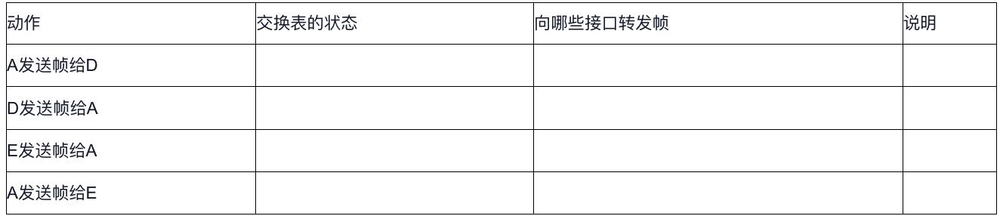
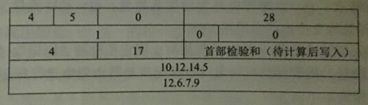
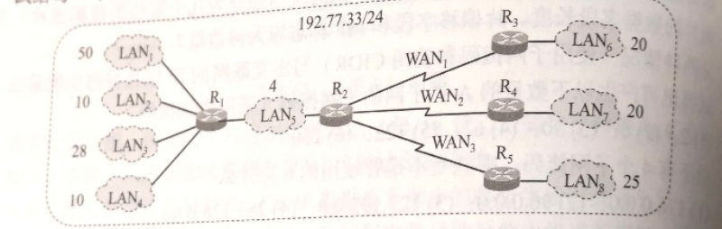

## 第一章：概述

1. (单选题, 2分)通信子网（网络的核心部分）的主要组成是（）。

- A. 主机和局域网
- B. 网络节点和通信链路
- C. 网络体系结构和网络协议
- D. 通信链路和终端

2. (单选题, 2分)在链路上产生的时延是（）。

- A. 发送时延
- B. 排队时延
- C. 传播时延
- D. 处理时延

3. (单选题, 2分)按数据交换方式分类，计算机网络可划分为（）。

- A. ＷＡＮ、ＭＡＮ、ＬＡＮ
- B. 电路交换网络、报文交换网络、分组交换网络
- C. 星型网、环型网、总线型网
- D. 公用网、专用网

4. (单选题, 2分)市话网在数据传输期间，在源点和目的点之间有一条利用中间节点构成的物理连接线路。这种市话网采用（）技术。

- A. 报文交换
- B. 电路交换
- C. 分组交换
- D. 数据交换

5. (单选题, 2分)关于网络分层结构，下列说法正确的是（）。

- A. 某一层可以使用其上一层提供的服务而不需要知道服务是如何实现的
- B. 当某一层发生变化时，只要接口关系不变，以上或以下的各层均不受影响
- C. 由于结构彼此分离，实现和维护更加困难
- D. 层次划分越多，灵活性越好，提高了协议效率

6. (单选题, 2分)下面关于协议和服务的说法正确的是（）。

- A. 协议是垂直的
- B. 服务是水平的
- C. 在协议的控制下，上层对下层进行调用，下层向上层提供服务
- D. 同层两个实体间必须保持连接

7. (单选题, 2分)协议数据单元PDU包括（）两部分。

- A. 控制信息和用户数据
- B. 接口信息和用户数据
- C. 接口信息和控制信息
- D. 控制信息和检验信息

8. (单选题, 2分)在OSI/RM参考模型中，物理层的功能是（）。

- A. 建立和释放连接
- B. 在物理实体间传送数据帧
- C. 发送和接受用户数据
- D. 透明地传输比特流

9. (单选题, 2分)完成路径选择功能是在OSI/RM模型的（）。

- A. 物理层
- B. 数据链路层
- C. 网络层
- D. 运输层

10. (单选题, 2分)在OSI/RM层次体系结构中，实际通信是在（）实体间进行的。

- A. 物理层
- B. 会话层
- C. 网络层
- D. 运输层

11. (简答题, 5分)试简述分组交换的要点。

12. (简答题, 5分)互联网的两大组成部分的特点是什么？它们的工作方式各有什么特点？

13. (简答题, 5分)协议和服务有什么区别？有何关系？

14. (简答题, 5分)网络协议的三个要素是什么？各有什么含义？

15. (简答题, 5分)有一个点对点链路,长度为20000km。数据的发送速率是1kbit/s,要发送的数据有100bit。数据在此链路上的传播速度为2×10^8m/s。假定我们可以看见在线路上传输的比特,试画出我们看到的线路上的比特(画两个图,一个在100bit刚刚发送完时,另一个是再经过0.05s后)。

16. (简答题, 5分)有一个点对点链路,长度为20000km。数据的发送速率是1Mbit/s,要发送的数据有100bit。数据在此链路上的传播速度为2×10^8m/s。假定我们可以看见在线路上传输的比特,试画出我们看到的线路上的比特(画两个图,一个在100bit刚刚发送完时,另一个是再经过0.05s后)。

17. (简答题, 5分)以1 Gbit/s的速率发送数据。试问在以距离或时间为横坐标时,一个比特的宽度分别是多少?

18. (简答题, 5分)在OSI/RM模型中，各层都有差错控制过程，指出以下每种差错发生在OSI/RM的哪些层中？（１）噪声使传输链路上的一个０变成１或一个１变成０。（２）一个分组被传输到错误的目的站。（３）收到一个序号错误的帧。（４）一台打印机正在打印，突然收到一个错误指令要打印头回到本行的开始位置。

 19. (计算题, 8分)收发两端之间的传输距离为1000KM，信息在媒体上的传播速率为2×10^8m/s。试计算以下两种情况的发送时延和传播时延：（1）数据长度为10^7bit,数据发送速率为100kb/s。（2）数据长度为10^3bit,数据发送速率为1Gb/s。从上面的计算中可以得到什么样的结论?

 20. (计算题, 8分)长度为100字节的应用层数据交给传输层传送，需加上20字节的TCP首部。再交给网络层传送，需加上20字节的IP首部。最后交给数据链路层的以太网传送，加上首部和尾部共18字节。试求数据的传输效率。数据的传输效率是指发送的应用层数据除以所发送的总数据(即应用数据加上各种首部和尾部的额外开销)。若应用层数据长度为1000字节，数据的传输效率是多少？

 21. (计算题, 8分)有一个点对点链路，长度为50km。若数据在此链路上的传播速度为2×10^8m/s，试问链路的带宽为多少才能使传播时延和发送100字节的分组的发送时延一样大？如果发送的是512字节长度的分组，结果又应如何？

 22. (计算题, 8分)假定网络的利用率达到了90%，试估算一下现在的网络时延是它的最小值的多少倍？

 23. (计算题, 8分)假定要在网络上传送1.5MB的文件。设分组长度为1KB，往返时间RTT=80ms。传送数据之前还需要有建立TCP连接的时间，这时间是2×RTT=160ms。试计算在以下几种情况下接收方收完该文件的最后一个比特所需的时间。（1）数据发送速率为10Mb/s，数据分组可以连续发送。（2）数据发送速率为10Mb/s，但每发送完一个分组后要等待一个RTT时间才能再发送一个分组。（3）数据发送速率极快，可以不考虑发送数据所需的时间。但规定在每一个RTT往返时间内只能发送20个分组。（4）数据发送速率极快，可以不考虑发送数据所需的时间。但在第一个RTT往返时间内只能发送一个分组，在第二个RTT内可发送两个分组，在第三个RTT内可发送四个分组（即2^(3-1)=2^2=4个分组）。


## 第二章：物理层

 1. (简答题, 8分)物理层要解决哪些问题？物理层的主要特点是什么？

 2. (简答题, 8分)物理层的接口有哪几个方面的特性？各包含哪些内容？

 3. (简答题, 8分)数据在信道中的传输速率受哪些因素的限制？信噪比能否任意提高？香农公式在数据通信中的意义是什么？“比特/秒”和“码元/秒”有什么区别？

 4. (简答题, 8分)假定有一种双绞线的衰减是0.7dB/km（在1kHz），若容许有20dB的衰减，试问使用这种双绞线的链路的工作距离有多长？如果要使这种双绞线的工作距离增大到100公里，问应该使衰减降低到多少？

 5. (简答题, 8分)为什么要使用信道复用技术？常用的信道复用技术有哪些？

 6. (简答题, 10分)试写出下列英文缩写的全文，并做简单的解释。FDM，TDM，STDM，WDM，DWDM，CDMA，SONET，SDH，STM-1，OC-48。

 7. (简答题, 10分)共有4个站进行码分多址CDMA通信。4个站的码片序列为：A：（－1－1－1＋1＋1－1＋1＋1） B：（－1－1＋1－1＋1＋1＋1－1）C：（－1＋1－1＋1＋1＋1－1－1） D：（－1＋1－1－1－1－1＋1－1）现收到这样的码片序列S：（－1＋1－3＋1－1－3＋1＋1）。问哪个站发送数据了？发送数据的站发送的是0还是1？

 8. (计算题, 10分)假定某信道受奈氏准则限制的最高码元速率为20000码元/秒。如果采用振幅调制，把码元的振幅划分为16个不同等级来传送，那么可以获得多高的数据率（bit/s）？

 9. (计算题, 10分)假定要用3kHz带宽的电话信道传送64kbit/s的数据（无差错传输），试问这个信道应该具有多高的信噪比（分别用比值和分贝来表示）？这个结果说明什么问题？

 10. (计算题, 10分)用香农公式计算一下，假定信道带宽为3100Hz，最大信息传输速率为35kbit/s，那么若想使得最大信息传输速率增加60%，问信噪比S/Ny应增大到多少倍？如果在刚才计算出的基础上将信噪比S/N再增大10倍，问最大信息传输速率能否再增加20%？

 11. (计算题, 10分)试计算工作在1200nm到1400nm之间经及工作在1400nm到1600nm之间的光波的频带宽度。假设光在光纤中的传播速率为2×10^8m/s。

## 第三章：数据链路层

 1. (单选题, 2分)在CSMA/CD协议中，下列指标与碰撞时间没有关系的是（）。

- A. 检测一次碰撞所需要的最长时间
- B. 最短帧长度
- C. 最大帧长度
- D. 帧碎片长度

 2. (单选题, 2分)以太网交换机根据（）转发数据包。

- A. ＩＰ地址
- B. ＭＡＣ地址
- C. ＬＬＣ地址
- D. ＰＯＲＴ地址

 3. (单选题, 2分)通过交换机连接的一组工作站（）。

- A. 组成一个碰撞域，但不是一个广播域
- B. 组成一个广播域，但不是一个碰撞域
- C. 既是一个广播域，又是一个碰撞域
- D. 既不是一个广播域，又不是一个碰撞域

 4. (单选题, 2分)100Mb/s交换式以太网的全双工端口带宽为（）Ｍb/s。

- A. 200
- B. 100
- C. 150
- D. 400

 5. (简答题, 5分)数据链路层中的链路控制包括哪些功能?试讨论数据链路层做成可靠的链路层有哪些优点和缺点。

 6. (简答题, 5分)网络适配器的作用是什么?网络适配器工作在哪一层?

 7. (简答题, 5分)如果在数据链路层不进行封装成帧，会发生什么问题？

 8. (简答题, 5分)PPP协议使用同步传输技术传送比特串0110111111111100。试问经过零比特填充后变成怎样的比特串？若接收端收到的PPP帧的数据部分是0001110111110111110110，问删除发送端加入的零比特后变成怎样的比特串？

 9. (简答题, 5分)数据链路层的三个基本问题（封装成帧、透明传输和差错检测）为什么都必须加以解决？

 10. (简答题, 5分)一个PPP帧的数据部分（用十六进制写出）是7D 5E FE 27 7D 5D 7D 5D 65 7D 5E。试问真正的数据是什么（用十六进制写出）？

 11. (简答题, 5分)局域网的主要特点是什么？为什么局域网采用广播通信方式而广域网不采用呢？

 12. (简答题, 5分)数据率为10Mb/s的以太网在物理媒体上的码元传输速率是多少码元/秒？

 13. (简答题, 5分)试说明10BASE－T中的“10”、“BASE”和“T”所代表的意思。

 14. (简答题, 5分)以太网使用CSMA/CD 协议是以争用方式接入到共享信道。这与传统的时分复用TDM相比优缺点如何？

 15. (简答题, 5分)10Mbit/s以太网升级到100Mbit/s、1Gbit/s和10Gbit/s时，都需要解决哪些技术问题？为什么以太网能够在发展过程中淘汰掉自己的竞争对手，并使自己的应用范围从局域网一直扩展到城域网和广域网？

 16. (简答题, 5分)某学院的以太网交换机有三个接口分别和A、B、C学院三个系的以太网相连，另外三个接口分别和电子邮件服务器、万维网服务器以及一个连接互联网的路由器相连。A、B、C都是100Mbit/s以太网交换机。假定所有的链路的速率都是100Mbit/s，并且A、B、C中的9台主机（每个3台主机）中的任何一个都可以和任何一个服务器或主机通信。试计算这9台主机和两个服务器产生的总的吞吐量的最大值。为什么？（说明：A、B、C是以太网交换机接入。）

 17. (简答题, 5分)某学院的以太网交换机有三个接口分别和A、B、C学院三个系的以太网相连，另外三个接口分别和电子邮件服务器、万维网服务器以及一个连接互联网的路由器相连。A、B、C都是100Mbit/s以太网集线器。假定所有的链路的速率都是100Mbit/s，并且A、B、C中的9台主机（每个3台主机）中的任何一个都可以和任何一个服务器或主机通信。试计算这9台主机和两个服务器产生的总的吞吐量的最大值。为什么？（说明：A、B、C是以太网集线器接入。）

 18. (简答题, 5分)以太网交换机有6个接口，分别接到5台主机和一个路由器（其中A接到1号接口，D接到4号接口，E接到5号接口）。在下面表中的“动作”栏中，表示先后发送了4个帧。假定在开始时，以太网交换机的交换表是空的。试把该表中其他的栏目都填写完。



 19. (简答题, 5分)假定在使用CSMA/CD协议的10Mb/s以太网中，某个站点在发送数据时检测到碰撞，执行退避算法时选择了随机数r=100。试问这个站点需要等待多长时间才能再次发送数据？如果是100Mb/s的以太网呢？

 20. (计算题, 6分)假定1km长的CSMA/CD网络的数据率为1Gb/s。设信号在网络上的传播速率为200000km/s。求能够使用此协议的最短帧长。

 21. (计算题, 5分)要发送的数据为101110。采用CRC的生成多项式为P（X）＝X^3+1。试求应添加在数据后面的余数。

 22. (计算题, 6分)有10个站连接到以太网上。试计算以下三种情况下每一个站所能得到的带宽。（1）10个站都连接到一个10Mbit/s以太网集线器；（2）10个站都连接到一个100Mbit/s以太网集线器；（3）10个站都连接到一个10Mbit/s以太网交换机。

## 第四章：网络层

 1. (单选题, 1分)在路由器互联的多个网络中，每个网络的（）。

- A. 数据链层协议和物理层协议都必须相同
- B. 物理层协议必须相同，数据链层协议可以不同
- C. 物理层协议可以不同，数据链层协议必须相同
- D. 数据链层协议和物理层协议都可以不相同。

 2. (单选题, 1分)IP分组中的校验字段的检查范围是（）。

- A. 整个IP分组
- B. 仅检查IP分组首部
- C. 仅检查静载荷数据
- D. 以上都是

 3. (单选题, 1分)下列哪个设备能够隔离ARP广播帧（）。

- A. 路由器
- B. 网桥
- C. 以太网交换机
- D. 以太网集线器

 4. (单选题, 1分)IP数据报的最大长度为（）。

- A. 64KB
- B. 32KB
- C. 1500B
- D. 512B

 5. (单选题, 1分)以下IP地址中，不属于专用地址的是（）。

- A. 10.10.10.2
- B. 192.168.10.3
- C. 172.168.0.4
- D. 10.10.10.1

 6. (单选题, 1分)路由表中“0.0.0.0/0”所代表的是（）。

- A. 动态路由
- B. 通过RIP协议获得的路由
- C. 缺省路由（默认路由）
- D. 无法识别的路由

 7. (单选题, 1分)当一个IP分组经过某路由器转发时会产生时延，其原因可能是（）。

- A. 排队等待时延
- B. 路由选择处理时延
- C. 协议转换时延
- D. 以上都是

 8. (单选题, 1分)下列各种网络互联设备中，不能隔离碰撞域的是（）。

- A. IP路由器
- B. 以太网交换机
- C. 以太网集线器
- D. 透明网桥

 9. (单选题, 1分)CIDER路由技术的意义在于（）。

- A. IP地址利用率高
- B. 子网划分更加灵活
- C. 不仅可以划分子网，还能合并超网
- D. 以上都是

 10. (单选题, 1分)采用数据报服务，（）。

- A. 传输数据之前需要建立连接
- B. 能够保证分组的顺序到达
- C. 流量控制容易
- D. 不同的分组可以通过不同的路径传输

 11. (简答题, 5分)试说明IP地址与硬件地址的区别，为什么要使用这两种不同的地址？

 12. (简答题, 5分)以下地址中的哪一个和86.32/12匹配？请说明理由。（1）86.33.224.123；（2）86.79.65.216；（2）86.58.119.74；（4）86.68.206.154

 13. (简答题, 5分)一个数据报长度为4000字节（固定首部长度）。现在经过一个网关传送，但此网络能够传送的最大数据长度为1500字节。试问应当划分为几个短些的数据报片？各数据报片的数据字段长度、片偏移字段和MF标志应为何数值？

 14. (简答题, 5分)分两种情况（使用子网掩码和使用CIDR）写出互联网的IP层查找路由的算法。

 15. (简答题, 5分)下面的前缀中的哪一个和地址152.7.77.159及152.31.47.252都匹配？请说明理由。 （1）152.40/13；（2）153.40/9；（3）152.64/12；（4）152.0/11。

 16. (简答题, 5分)网络互连有何实际意义？进行网络互连时，有哪些共同的问题需要解决？

 17. (简答题, 5分) 已知地址块中的一个地址是190.87.140.202/29。试求这个地址块中的最小地址和最大地址。地址掩码是什么？地址块中共有多少个地址？相当于多少个C类地址？

 18. (简答题, 5分)设IP数据报使用固定首部，其各字段的具体数值如下表所示（除IP地址外，均用十进制表示）。试用二进制运算方法计算应当写入到首部检验和字段的数值（用二进制表示）。



 19. (简答题, 5分)从IPV4过渡到IPV6的方法有哪些？

 20. (简答题, 5分)网络层向上提供的服务有哪两种？试比较其优缺点。

 21. (简答题, 5分)有如下的4个/24地址块，试进行最大可能性的聚合。212.56.132.0/24212.56.133.0/24212.56.134.0/24212.56.135.0/24

 22. (简答题, 5分)（1）子网掩码为255.255.255.0代表什么意思？（2）一个网络的现在掩码为255.255.255.248，问该网络能够连接多少个主机？ （3）一个A类网络和一个B类网络的子网号subnet-id分别为16个1和8个1，问这两个子网掩码有何不同？ （4）一个B类地址的子网掩码是255.255.240.0。试问在其中每一个子网上的主机数最多是多少？ （5）一个A类网络的子网掩码为255.255.0.255；它是否为一个有效的子网掩码？ （6）某个IP地址的十六进制表示C2.2F.14.81，试将其转化为点分十进制的形式。这个地址是哪一类IP地址？ （7）C类网络使用子网掩码有无实际意义？为什么？

 23. (论述题, 5分)假定网络中的路由器B的路由表有如下的项目（这三列分别表示“目的网络”、“距离”和“下一跳路由器”）         

N1    7    A        

N2    2    C        

N6    8    F         

N8    4    E         

N9    4    F

现在B收到从C发来的路由信息（这两列分别表示“目的网络”和“距离”）：         

N2    4         

N3    8         

N6    4         

N8    3         

N9    5

试求出路由器B更新后的路由表（详细说明每一个步骤）。


 24. (论述题, 5分)假定网络中的路由器A的路由表有如下的项目（这三列分别表示“目的网络”、“距离”和“下一跳路由器”）：      

N1     4     B      

N2     2     C      

N3     1     F      

N4     5     G  

现将A收到从C发来的路由信息（这两列分别表示“目的网络”和“距离”）：      

N1     2      

N2     1      

N3     3      

N4     7

试求出路由器A更新后的路由表（详细说明每一个步骤）。


 25. (论述题, 5分)某单位分配到一个B类IP地址，其net-id为129.250.0.0。该单位有4000台机器，平均分布在16个不同的地点。如选用子网掩码为255.255.255.0，试给每一个地点分配一个子网号，并算出每个地点主机号码的最小值和最大值。

 26. (论述题, 5分)某单位分配到一个地址块136.23.12.64/26。现在需要进一步划分为4个一样大的子网。试问: （1）每一个子网的网络前缀有多长？ （2）每一个子网中有多少个地址？ （3）每一个子网的地址是什么？ （4）每一个子网可分配给主机使用的最小地址和最大地址是什么？

 27. (论述题, 5分)一个大公司有一个总部和三个下属部门。公司分配到的网络前缀是192.77.33/24。公司的网络布局如下图。总部共有五个局域网，其中的LAN1~LAN4都连接到路由器R1上，R1再通过LAN5与路由器R2相连。R2和远地的三个部门的局域网LAN6~LAN8通过广域网相连。每一个局域网旁边标明的数字是局域网上的主机数。试给每一个局域网分配一个合适的网络前缀。



 28. (论述题, 5分)某单位分配到一个起始地址为14.24.74.0/24的地址块。该单位需要用到三个子网，它们的三个子地址块的具体要求是：子网N1需要120个地址，N2需要60个地址，N3需要10个地址。请给出地址块的分配方案。

## 第五章：运输层

 1. (单选题, 2分)运输层的作用是向源主机和目的主机进程之间提供（）数据传输。

- A. 点到点
- B. 点到多点
- C. 端到端
- D. 多端口之间

 2. (单选题, 2分)TCP协议是一种网络协议，其特点是（）。

- A. 可靠的，面向连接的
- B. 可靠的，无连接的
- C. 不可靠的，面向连接的
- D. 不可靠的，无连接的

 3. (单选题, 2分)网络中唯一标识一个进程需要用一个（）。

- A. 一元组（服务器端口号）
- B. 二元组（主机IP地址，服务器端口号）
- C. 三元组（主机IP地址，服务器端口号，协议）
- D. 五元组（本机IP地址，本机服务器端口号，协议，远程主机IP地址，远程服务器端口号）

 4. (单选题, 2分)以下网络协议中，实现进程到进程通信的是（）。

- A. ARP
- B. IP
- C. TCP
- D. HDLC

 5. (单选题, 2分)在什么条件下可以打开一条TCP连接（）。

- A. 在两个套接字之间当前不存在连接
- B. 两个应用进程达成一致，并有足够的资源支持连接
- C. MTU和缓冲区大小相等
- D. 序列号匹配

 6. (单选题, 2分)TCP/IP在多个层次引入了安全机制，其中TLS协议位于（）。

- A. 数据链路层
- B. 网络层
- C. 运输层
- D. 应用层

 7. (单选题, 2分)在TCP协议中，采用（）来区分不同的应用进程。

- A. 端口号
- B. IP地址
- C. 协议类型
- D. MAC地址

 8. (单选题, 2分)TCP协议使用慢启动算法，最大数据段的长度为1KB，当前TCP的拥塞窗口被设置为60KB，并且出现了一个超时，如果接下来的4次突发传输全部成功的话，则拥塞窗口的尺寸是（）。

- A. 1KB
- B. 4KB
- C. 16KB
- D. 64KB

 9. (单选题, 2分)主机A和主机B之间建立了一个TCP连接，主机A向主机B发送了两个连续的TCP报文段，分别包含300B和500B的有效载荷，第一个报文段的序列号为200，主机B正确接收两个报文段后，发送给主机A的确认序列号是（）。

- A. 500
- B. 700
- C. 800
- D. 1000

 10. (单选题, 2分)一个TCP连接总是以1KB的最大段长发送TCP段，发送方有足够多数据要发送。当拥塞窗口为16KB时发生了超时，如果接下来的4个RTT时间内的TCP段的传输都是成功的，那么当第4个RTT时间内发送的所有TCP段都得到肯定确认时，拥塞窗口大小是（）。

- A. 7KB
- B. 8KB
- C. 9KB
- D. 16KB

 11. (简答题, 6分)为什么说UDP是面向报文的，而TCP是面向字节流的？

 12. (简答题, 6分)某个应用进程使用运输层的用户数据报UDP，然而继续向下交给IP层后，又封装成IP数据报。既然都是数据报，可否跳过UDP而直接交给IP层？哪些功能UDP提供了但IP没有提供？

 13. (简答题, 6分)一个应用程序用UDP，到了IP层把数据报再划分为4个数据片并发送出去。结果前两个数据报片丢失，后两个到达目的站。过了一段时间应用程序重传UDP，而IP层仍然划分为4个数据报片来传送。结果这次前两个到达目的站而后两个丢失。试问：在目的站能否将这两次传输的4个数据报片组装成为完整的数据报？假定目的站第一次收到的后两个数据报片仍然保存在目的站的缓存中。

 14. (简答题, 6分)一个UDP用户数据的数据字段为8192字节。在数据链路层要使用以太网来传送。试问应当划分为几个IP数据报片？说明每一个IP数据报片的数据字段长度和片偏移字段的值。

 15. (简答题, 6分)一个UDP用户数据报的首部的十六进制表示是：06 32 00 45 00 1C E2 17。试求源端口、目的端口、用户数据报的总长度、数据部分长度。这个用户数据报是从客户发送给服务器还是从服务器发送给客户？使用UDP的这个服务器程序是什么？

 16. (简答题, 6分)假设使用连续ARQ协议中，发送窗口大小是3，而序列范围是[0,15]，而传输媒体保证在接收方能够按序接收到分组。在某一时刻，在接收方，下一个期望收到的序号是5。试问：（1）在发送方的发送窗口中可能出现的序号组合有哪些？ （2） 接收方已经发送出去的，但在网络中（即还未到达发送方）的确认分组可能有那些？说明这些确认分组是用来确认哪些序号的分组。

 17. (简答题, 6分)主机A向主机B连续发送了两个TCP报文段，其序号是70和100，问：（1） 第一个报文段携带了多少个字节？ （2）主机B收到第一个报文段后发回的确认中确认序号应当是多少？ （3）如果主机B收到第二个报文段后发挥确认中的确认序号是180，试问A发送的第二个报文段中的数据有多少字节？ （4） 如果A发送的第一个报文段丢失了，但第二个报文段到达了B，B在第二个报文段到达后向A发送确认，试问这个确认号应该是多少？

 18. (简答题, 6分)设TCP的ssthresh的初始值为8，当拥塞窗口上升到12时网络发送了超时，TCP使用慢开始和拥塞避免，试求出第一次到第15此的拥塞窗口大小。你能说明拥塞窗口每一次变化的原因吗？

 19. (简答题, 6分)TCP 连接处于 ESTABLISHED 状态。以下的事件相继发生：（1）收到一个 FIN 报文段（2）应用程序发送 “关闭” 报文在每一个事件之后，连接的状态是什么？在每一个事件之后发生的动作是什么？

 20. (简答题, 6分)主机 A 通过 TCP 连接向 B 发送一个很长的文件，因此这需要分成很多个报文段来发送。假定某一个 TCP 报文段的序号是 x，那么下一个报文段的序号是否就是 x + 1 呢？

 21.简答题 见习题5-39

 22. (论述题, 10分)假定用 TCP 协议在 40 Gbit/s 的线路上传送数据。（1）如果 TCP 充分利用了线路的带宽，那么需要多长的时间 TCP 会发生序号绕回？（2）假定现在 TCP 的首部中采用了时间戳选项。时间戳占用了 4 字节，共 32 位。每隔一定的时间（这段时间叫做一个滴答）时间戳的数值加 1。假定设计的时间戳是每隔 859 微秒，时间戳的数值加 1。试问要经过多长时间才发生时间戳数值的绕回。


## 第六章：应用层

 1. (单选题, 2分)DNS是基于（）模式的分布式系统。

- A. C/S
- B. B/S
- C. P2P
- D. 以上都不正确

 2. (单选题, 2分)FTP Client发起对于FTP Server的连接建立的第一阶段建立（）。

- A. 传输连接
- B. 数据连接
- C. 文件名
- D. 控制连接

 3. (单选题, 2分)从协议分析的角度，WWW服务的第一步操作是WWW浏览器对WWW服务器（）。

- A. 请求地址解析
- B. 传输连接建立
- C. 请求域名解析
- D. 会话连接建立

 4. (单选题, 2分)一个万维网网点有１千万个页面，平均每个页面有１０个超链接。读取一个页面平均要１００ms。问要检索整个网点所需的最少时间为（）。

- A. 10^3s
- B. 10^4s
- C. 10^5s
- D. 10^6s

 5. (单选题, 2分)当使用鼠标点取一个万维网文档时，若该文档除了有文本外，还有３个.gif图像，在HTTP1.0中需要建立（）次UDP连接和（）次TCP连接。

- A. 0，４
- B. １，３
- C. ０，２
- D. １，２

 6. (单选题, 2分)WWW上的每个网页都有一个独立的地址，这些地址是（）。

- A. 域名
- B. IP地址
- C. URL
- D. MAC地址

 7. (单选题, 2分)某客户端采用ping命令检测网络连接故障时，发现可以ping通127.0.0.1及本机的IP地址，但无法ping通同一网段内其他工作正常的IP地址。该客户端的故障可能是（）。

- A. TCP/IP协议不能正常工作
- B. 本机网卡不能正常工作
- C. 本机网络接口故障
- D. DNS服务器地址设置错误

 8. (单选题, 2分)某银行为用户提供网上服务，允许用户通过浏览器管理自己的银行帐户信息。为保障通信的安全，该Web服务器可选的协议是（）。

- A. POP
- B. SNMP
- C. HTTP
- D. HTTPS

 9. (单选题, 2分)网络管理的基本功能不包括（）。

- A. 故障管理
- B. 性能管理
- C. 配置管理
- D. 资产管理

 10. (单选题, 2分)POP3协议，当客户机需要服务时，客户端软件与POP3服务器建立（）连接。

- A. TCP
- B. UDP
- C. PHP
- D. IP

 11. (简答题, 10分)设想有一天整个互联网的DNS系统都瘫痪了（这种情况不大会出现），试问还可以给朋友发送电子邮件吗？

 12. (简答题, 10分)当使用鼠标点取一个WWW文档时，若该文档除了有文本外，还有一个本地.gif图和两个远地.gif图像。试问：需要使用哪个应用程序，以及需要建立几次UDP连接和几次TCP连接？

 13. (简答题, 10分)DHCP协议用在什么情况下？当一台计算机第一次运行引导程序时，其ROM中有没有该主机的IP地址、子网掩码或某个域名服务器的IP地址？

 14. (简答题, 10分)什么是网络管理？为什么说网络管理是当今网络领域中的热门课题？

 15. (简答题, 10分)假定你在浏览器上点击一个URL,但是这个URL 的IP 地址以前并没有缓存在本地主机上。因此需要用DNS 自动查找和解析。假定要解析到所有要找到的URLd IP 地址公斤过n个DNS 服务器，所经过的时间分别为RTT1,RTT2,…,RTTn。假定从要找的网页上只需读取一个很小的图片(即忽略这个小图片的传输时间)。从本地主机到这个网页的往返时间是RTTw。试问从点击这个URL 开始，一直到本地主机的屏幕上出现所读取的小图片，一共要经过多少时间？

 16. (论述题, 15分)某同学Ａ希望访问网站www.hnust.edu.cn。Ａ在其浏览器中输入http://www.hnust.edu.cn并按下回车键，直到hnust网站首页显示在其浏览器中，请分析：（１）在此过程中，按照TCP/IP参考模型，从应用层到网络接口层都用到了哪些协议？每个协议所起的作用是什么？（２）简要描述该过程的流程（可用流程图描述）。


 17. (论述题, 15分)某时刻，一台PC机开始抓取数据报文，其中一个报文展开如下所示：

```
/**************************************************************************/
IP  ------ IP Header --------
IP
IP Version = 4, header length = 20 bytes
IP Type of service = 00
IP     000.--------- = routine
IP           0-------- = normal delay
IP             0------- = normal throughput
IP               0-----  = normal rekiability
IP                  0 --  = ECT bit - transport protocol
IP                     0   = CE hit - no congestion
IP Total length     = 166 bytes
IP Identificayion   = 32897
IP Flags                = 0X
IP          0--------  = may fragment
IP             0------  = last fragment
IP Fragment offset = 0 bytes
IP Time to live        = 64 seconds/hops
IP Protocol             = 17 (UDP)
IP Header checksum = 7A58 (correct)
IP Source address          = [172.16.19.1]
IP Destination address  = [172.16.20.70]
IP No options
IP
/***************************************************************************/
（1）这个报文运输层采用了什么协议？
（2）该IP数据报的头部是否有选项？
（3）这个报文最多经过多少个路由器就会被丢弃？
（4）该IP报文的源和目的地址是什么？
（5）该报文总长度是多少？是否被分段？
```

