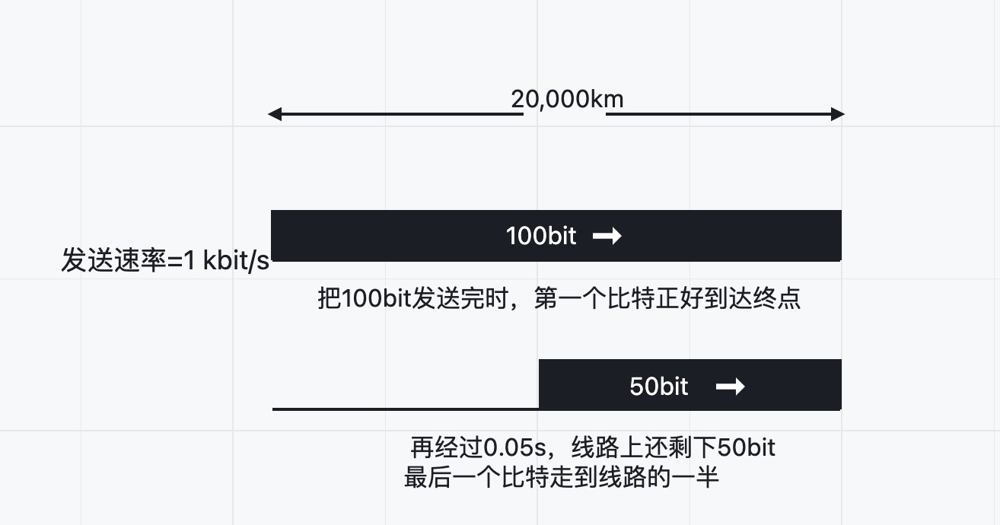
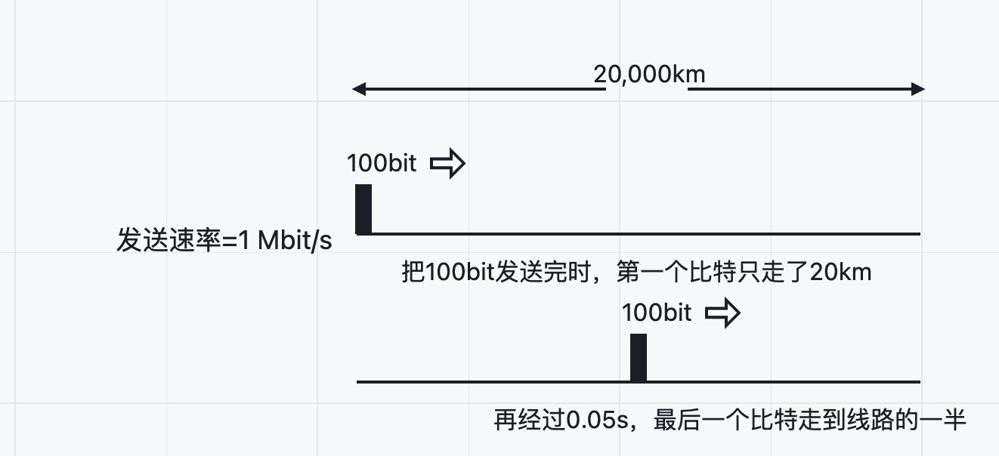
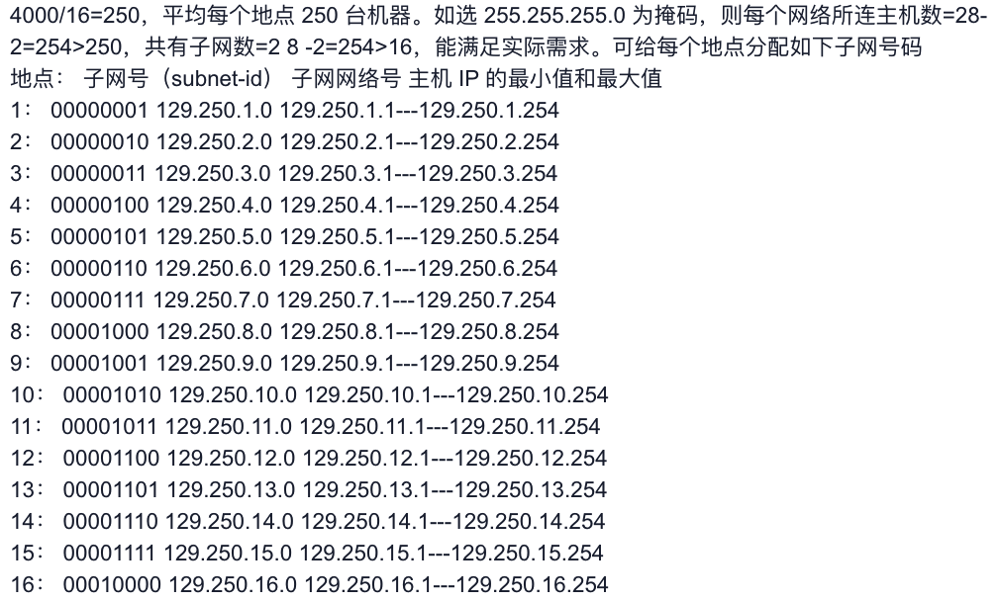

### 第一章：概述

1-5：BCBBB

6-10：CADCA

11.分组交换的要点包括：存储转发、分段重组和独立选路。分组交换最主要的特点就是采用存储转发技术；将要发送的整块数据称为一个报文。在发送报文之前，先把较长的报文划分成为一个个更小的等长数据段，在每一个数据段前面加上一些必要的控制信息组成的首部后，就构成了一个分组。分组又称为“包”，是在互联网中传送的数据单元。正是由于分组的首部包含了目的地址、源地址等重要控制信息，每一个分组才能在互联网中独立的选择传输路径；路由器是用来转发分组的，每收到一个分组，先临时存储下来，再检查其首部，查找转发表，按照首部中的目的地址，找到合适的接口转发出去，把这个分组转交给下一个路由器。这样一步步的经过若干个或几十个不同的路由器，以存储转发的方式，把分组交付最终的目的主机，最后在目的主机完成分组重组，还原为原始报文。

12.（1）边缘部分：由所有连接在互联网上的主机组成。这部分是用户直接使用的，用来进行通信和资源共享。

（2）核心部分：由大量网络和连接这些网络的路由器组成。这部分是为边缘部分提供服务的。

（3）在网络边缘的端系统之间的通信方式通常可划分为两大类：客户—服务器方式（C/S方式）和队等方式（p2p方式）。核心部分的工作方式也有两种：一种是路由器转发分组，另一种是路由器之间不断地交换路由信息。

13.（1）协议是控制对等实体之间通信的规则，是水平的。服务是下层通过层间接口向上层提供的功能，是垂直的。 
（2）协议的实现保证了能够向上一层提供服务，要实现本层协议还需使用下层提供的服务。

14.网络协议：为进行网络中的数据交换而建立的规则、标准或约定。由以下三个要素组成：

（1）语法：即数据与控制信息的结构或格式。

（2）语义：即需要发出何种控制信息，完成何种动作以及做出何种响应。

（3）同步：即事件实现顺序的详细说明。

15.（1）发送时延：100bit/1kbit/s=0.1s    传播时延：20000km/2×10^8m/s =0.1s，于是可得到结论：将100bit发送完毕，则第一个比特刚好到达终点。

（2）再经过0.05s时，由于传播时延为0.1s，于是正好过了一半传播时延，即有50bit到达终点。

16.（1）发送时延：100bit/1Mbit/s=10^(-4)s    传播时延：20000km/2×10^8m/s =0.1s，(10^(-4)/0.1s=1/1000，20000km×1/1000=20km，于是可得到结论：将100bit发送完毕时，则第一个比特只传输了20km。

（2）再经过0.05s时，由于传播时延为0.1s，正好过了一半传播时延，于是最后一个比特正好直到链路中间，即10000km处。

17.距离：1 bit × 2 × 10^8 m/s(在光纤中的速率)/ 1 Gbit/s = 0.2 m＝20cm

时间：1 bit / 1 Gbit/s = 10^(- 9) s＝1ns

18.(1）物理层。物理层负责正确地、透明地传输比特流。
(2)网络层。网络层的PDU称为分组，分组转发是网络层的功能。
(3)数据链路层。数据链路层的PDU称为帧，帧的差错检测是数据链路层的功能。
(4)应用层。打印机是向用户提供服务的，运行的是应用层的程序。

19.（1）发送时延：ts=10^7bit /（100kb/s）=100s

​     传播时延：tp=1000KM /（2×10^8m/s）=0.005s

​     发送时延远大于传播时延。

（2）发送时延：ts=10^3bit /（1Gb/s）=1µs

​     传播时延：tp=1000KM /（2×10^8m/s）=0.005s

​     发送时延远小于传播时延。

​     结论：若数据长度大而发送速率低，则在总的时延中，发送时延往往大于传播时延。但若数据长度短而发送速率高，则传播时延又可能是总时延中的主要成分。

20.(1)100/(100+20+20+18)=63.3%

(2)1000/(1000+20+20+18)=94.5%

21.分析：传播时延=信道长度/传播速率=50*10^3/(2x10^8)=0.00025=2.5x10^(-4)s

发送时延=数据长度/发送速率

带宽（某信道能通过的最高数据率）bit/s

解答：

传播时延 = 50 × 10^3 m / (2 × 10^8) m/s = 2.5 × 10^(-4) s

100字节时带宽 = 100 字节/ 2.5 × 10^(-4) s = 字节/s = 3.2 Mbit/s

512字节时带宽 =512 字节/ 2.5 × 10^(-4) s = 2.048 字节/s = 16.384 Mbit/s

22.利用率有信道利用率和网络利用率两种。信道利用率指出某信道有百分之几百的时间是被利用的（有数据通过）。完全空闲的信道的利用率是零。网络利用率则是全网络的信道利用率的加权平均值。信道利用率并非越高越好。这是因为，根据排队的理论，当某信道的利用率增大时，该信道引起的时延也就迅速增加。当网络的通信量很少时，网络产生的时延并不大。但在网络通信量不断增大的情况下，由于分组在网络结点（路由器或结点交换机）进行处理时需要排队等候，因此网络引起的时延就会增大。如果令D0表示网络空闲时的时延，D表示网络当前的时延，那么适当的假定条件下，可以用下面的简单公式来表示D，D0和利用率U之间的关系:

​                          D=D0/(1-U)

于是：D＝D0/(1-U)=D0/(1-90%)=10D0

23.题目的已知条件中的M=2^20=1048576，K=2^10=1024。

（1）发送这些比特所需时间=1.5×2^20 ×8bit/（10×10^6bit/s）=1.258s。

最后一个分组的传播时间还需要0.5×RTT=40ms。

总共需要的时间=2×RTT+1.258+0.5×RTT=0.16+1.258+0.04=1.458s。

（2）需要划分的分组数=1.5MB/1KB=1536。

从第一个分组到达直到最后一个分组到达要经历1535×RTT=1535×0.08=122.8s。

总共需要的时间=1.458+122.8=124.258s。

（3）在每一个RTT往返时间内只能发送20个分组。1536个分组，需要76个RTT，76个RTT可以发送76×20=1520个分组，最后剩下16个分组，一次发送完。但最后一次发送的分组到达接收方也需要0.5×RTT。

因此，总共需要的时间=76.5×RTT+2×RTT=6.12+0.16=6.28s。

（4）在两个RTT后就开始传送数据。

经过n个RTT后就发送了1+2+4+…+2n=2^n-1个分组。

若n=10，那么只发送了2^10-1=1023个分组。可见10个RTT不够。

若n=11，那么只发送了2^11-1=2047个分组。可见11个RTT足够了。

这样，考虑到建立TCP连接的时间和最后的分组传送到终点需要的时间，现在总共需要的时间=（2+10+0.5）×RTT=12.5×0.08=1s。

### 第二章：物理层

1.（1）物理层要解决的问题是如何能在连接各种计算机的传输媒体上传输数据比特流，尽可能地屏蔽掉传输媒体和通信手段的差异，使物理层上面的数据链路层感觉不到这些差异

（2）物理层的主要特点包括：机械特性、电气特性、功能特性、过程特性。

2.物理接口协议中的物理接口有4个特性，分别是机械特性、电气特性、功能特性与过程特性。

（1）机械特性： 指明接口所用接线器的形状和尺寸、引线数目和排列、固定和锁定装置等。

（2）电气特性： 指明在接口电缆的各条线上出现的电压的范围。

（3）功能特性，指明某条线上出现的某一电平的电压的意义。

（4）过程特性：指明对于不同功能的各种可能事件的出现顺序。

3.（1）码元传输速率受奈氏准则的限制，信息传输速率受香农公式的限制；

（2）信噪比不能任意提高 ；   

（3）香农公式在数据通信中的意义是：只要信息传输速率低于信道的极限传信率，就可实现无差传输；

（4）比特/s是信息传输速率的单位码元传输速率也称为调制速率、波形速率或符号速率。一个码元不一定对应于一个比特。

4.（1）使用这种双绞线的链路的工作距离为=20/0.7=28.6km；

（2）衰减应降低到20/100=0.2db。

5.（1）为了通过共享信道、最大限度提高信道利用率。

（2）频分多路复用、时分多路复用、统计时分多路复用、码分多路复用、波分多路复用。

6.（1）FDM（frequency division multiplexing）频分复用：给每个信号分配唯一的载波频率并通过单一媒体来传输多个独立信号的方法。组合多个信号的硬件称为复用器；分离这些信号的硬件称为分用器。

（2）TDM（Time Division Multiplexing）时分复用：把多个信号复用到单个硬件传输信道，它允许每个信号在一个很短的时间使用信道，接着再让下一个信号使用。

（3）STDM（Statistic Time Division Multiplexing）统计时分复用：是一种改进的时分复用，它能明显提高信道的利用率。STDM帧不是固定分配时隙，而是按需动态地分配时隙。

（4）WDM（Wave Division Multiplexing）波分复用：就是光的频分复用。

（5）DWDM（Dense Wave Division Multiplexing）密集波分复用：可以把几十路甚至一百多路的光载波信号复用到一根光纤中来传输。

（6）CDMA（Code Wave Division Multiplexing）码分多址：即码分复用。每一个用户可以在同样的时间使用同样的频带进行通信。

（7）SONET（ynchronous Optical NetworkS）同步光纤网：一种数字传输标准。整个同步网络的各级时钟都来自一个非常精确的主时钟。

（8）SDH（Synchronous Digital Hierarchy）同步数字系列：以美国标准SONET为基础制定出的国际标准。

（9）STM-1（Synchronous Transfer Module）第1级同步传递模块：通过光纤传输数据的一系列标准。

（10）OC-48（Optical Carrier）第48级光载波：OC就是光载波，48就是48倍的OC-1速率。

7.S·A=（＋1－1＋3＋1－1＋3＋1＋1）／8=1，    A发送1

S·B=（＋1－1－3－1－1－3＋1－1）／8=－1，  B发送0

S·C=（＋1＋1＋3＋1－1－3－1－1）／8=0，    C无发送

S·D=（＋1＋1＋3－1＋1＋3＋1－1）／8=1，    D发送1

8.（1）根据香农公式C=Wlog2（1+S/N），由于W＝3kHz，C为64kbit/s，即3kHzlog2（1+S/N）＝64kbit/s，于是得S/N＝2^(64/3)－1＝2642199，再由信噪比＝10*log10（S/N）＝64.219得出dB，所以信噪比为64.2dB。

（2）这个结果说明此信道的信噪比很高。

9.（1）根据香农公式C=Wlog2（1+S/N），由于W＝3kHz，C为64kbit/s，即3kHzlog2（1+S/N）＝64kbit/s，于是得S/N＝2^(64/3)－1＝2642199，再由信噪比＝10*log10（S/N）＝64.219得出dB，所以信噪比为64.2dB。

（2）这个结果说明此信道的信噪比很高。

10.（1）根据香农公式C = W log2(1+S/N) b/s可得：SN1=2* （C1/W）-1=2*（35000/3100）-1

​     SN2=2* （C2/W）-1=2*（1.6*C1/W）-1=2*（1.6*35000/3100）-1

​     SN2/SN1=100 ，于是有信噪比应增大到约100倍。

（2）C3=Wlong2 （1+SN3）=Wlog2（1+10*SN2）

​    C3/C2=18.5%

​    如果在此基础上将信噪比S/N再增大到10倍，最大信息通率只能再增加18.5%左右。

11.（1）1200nm到1400nm:

​     1/(1200nm/2*10^8)=166.67THz

​     1/(1400nm/2*10^8)=142.86THz

​     带宽：166.67-142.86=23.81THz

（2）1400nm到1600nm:

​    1/(1400nm/2*10^8)=142.86THz

​    1/(1600nm/2*10^8)=125THz

​    带宽：142.86-125=17.86THz

### 第三章：数据链路层

1-4：C

*答案解析：*

检测一次碰撞所需要的最长时间大约为信号的往返传播时延，所以Ａ相关；帧需要有一个最短帧长度以保证帧在发送时间内能够检测到碰撞，所以Ｂ相关；帧碎片由于碰撞产生，碎片长度与碰撞发生的时间相关。

BBA

5.（1）链路控制的主要功能有：链路管理、封装成帧；透明传输；流量控制、差错检测、寻址等。

（2）可靠的链路层的优点：可以使网络中的某个结点及早发现传输中出了差错，因而可以通过数据链路层的重传来纠正这个差错。对于干扰严重的信道，可靠的链路层可以将重传范围约束在局部链路，防止全网络的传输效率受损。缺点：有时高层协议使用的是不可靠的传输协议UDP。UDP并不要求重传有差错的数据，在这种情况下，如果做成可靠地数据链路层，那么并不会带来更多的好处。反而会增大资源开销，影响传输效率。

6.（1）网络适配器（即网卡）用来实现数据链路层和物理层这两层的协议的硬件和软件。能进行数据的串并转换，有存储芯片，能实现以太网协议。

（2）网络适配器工作在OSI/RM体系结构的数据链路层和物理层，TCP/IP体系结构的网络接口层。

7.如果在数据链路层不进行封装成帧，那么数据链路层在收到一些数据时，就无法知道对方传送的数据中哪些是数据，哪些是信息，甚至数据中有没有差错也不清楚（因为无法进行差错检测）。数据链路层也无法知道数据传送结束了没有，因此不知道应当什么时候把收到的数据交给上一层。

8.（1）011011111<u>0</u>11111<u>0</u>00（其中带下划线的0为填充的）；

（2）000111011111－11111－110（其中连字符表示删除了0）。

9.封装成帧是分组交换的必然要求；透明传输是避免二进制比特流中出现与帧定界符相同的模式，使得节点错误识别帧；差错检测是为了避免接收到错误的信息和防止信道中出现的无效数据帧浪费后续路由上的传输和处理资源。

10.分析：PPP协议的帧定界符为01111110（十六进制为7E），转换原则：（1）当信息中出现每一个7E字节转变为2字节序列（7D，5E）；（2）当信息中出现每一个7D字节转变为2字节序列（7D，5D）。所以本题中的真正数据为去掉转义字符后的数据。题目中的转义字符有：（7D 5E）＝7E FE 27 （7D 5D）＝7D （7D 5D）＝7D 65 （7D 5E）＝7E

​    所以结果为：7E FE 27 7D 7D 65 7E

11.（1）局域网的主要特点有：局域网共享传输信道，通常网络为一个单位所拥有，且地理范围和站点数目均有限。

（2）在局域网中各站点通常进行一对多访问，随机使用信道，共享通信媒体，采用广播通信方式是最合适的，且局域网中站点较少，带宽相对较大，也适宜于广播信道方式通信。而广域网中用户数量较多，若采用广播通信，会造成广播风暴，降低网络性能，甚至使得整个网络无法使用。

12.码元传输速率就是波特率，以太网使用曼彻斯特编码，这意味着发送的每一位都有两个信号周期。所以数据率为10Mb/s的以太网在物理媒体上的码元传输速率是20M码元/秒。

13.“10”：10Mbps；

“BASE”：电缆上的信号是基带信号；

“T”：代表双绞线星形网。

14.传统的时分复用TDM是静态时隙分配，均匀高负荷时信道利用率高，低负荷或负荷不均匀时资源浪费较大。CSMA/CD协议采用“先听后说，边说边听”机制，在网络负荷较轻时，协议灵活，利用率高；在网络负荷很重时，冲突加剧，效率下降。

15.（1）升级时要解决的技术问题有：使参数α（α＝τ/T0，其中τ是以太网单程端到端时延，T0是帧的发送时延）保持较小的数值，可以通过减小最大电缆长度或增大帧的最小长度来实现。

（2）在100Mbit/s的以太网中采用最短帧长64字节不变，将一个网段的最大电缆长度减小到100m，帧间间隔从9.6微秒改为0.96微秒；1Gbit/s以太网保持网段最大长度为100m，但采用“载波延伸”的方法，使最短帧长仍为64字节，同时将争用时间增大为512字节，并降低“分组突发”开销；10Gbit/s以太网的帧格式与前面几种完全相同，并保留了标准规定的以太网最小帧长和最大帧长，但采用光纤作为传输媒体。通过技术创新，采用专用的交换集线器，缩小冲突域，发送、接收和冲突检测传输线路独立，降低对媒体带宽的要求，采用新的信号编码技术等，以便能够工作在城域网和广域网。

16.因为每台主机独占100Mbit/s的带宽，9台共900Mbit/s，又两台服务器各自独占100Mbit/s，共200Mbit/s，所发这里的9台主机和两个服务器都工作时的总吞吐量是900+200=1100Mbit/s。因为三个系各有一台主机分别访问两个服务器和通过路由器上网。其他主机在系内通信。

17.500Mbit/s。因为两台服务器各自独占100Mbit/s，共200Mbit/s，每个系是一个碰撞域，共享100Mbit/s，三个系共300Mbit/s。

18.

| 动作       | 交换表的状态 | 向哪些接口转发帧 | 说明                                                   |
| ---------- | ------------ | ---------------- | ------------------------------------------------------ |
| A发送帧给D | 写入(A,1)    | 所有的接口       | 开始时交换表是空的， 交换机不知道应向何接口转发帧 |
| D发送帧给A | 写入(D,4)    | A                | 交换机已知道A连接在接口1                               |
| E发送帧给A | 写入(E,5)    | A                | 交换机已知道A连接在接口1                               |
| A发送帧给E | 不变         | E                | 交换机已知道E连接在接口5                               |

19.（1）对于10Mb/s的以太网，其争用期定义为51.2μs，要退避100个争用期，等待时间为51.2μs×100=5210μs=5.12ms。

（2）对于100Mb/s的以太网，其争用期定义为5.12μs，要退避100个争用期，等待时间为5.12μs×100=512μs。

20.1km长的CSMA/CD网络的端到端传播时延τ=1/200000=5µs，2τ=10µs。在此时间内要发送（1Gbit/s）×10µs=10000bit。

只有经过这样一段时间后，发送端才能收到碰撞的信息，也才能检测到碰撞的发生。因此，最短帧是10000 bit位或1250字节。

21.作二进制除法101110000÷1001得到余数011，于是添加在数据后面的余数为011。

22.（1）10个站共享10Mbit/s的带宽，每个站得到的带宽为1Mbit/s；

（2）10个站共享100Mbit/s的带宽，每个站得到的带宽为10Mbit/s；

（3）每个站独占10Mbit/s的带宽，每个站得到的带宽为10Mbit/s。

### 第四章：网络层

1-5：DBAA

*答案解析：*

IP分组的“总长度”字段占16位，2^16=64KB。

C

*答案解析：*

A类专用地址：10.0.0.0 到 10.255.255.255（或记为10.0.0.0/8，24位地址块）

B类专用地址：172.16.0.0 到 172.31.255.255（或记为172.16.0.0/12，20位地址块）

C类专用地址：192.168.0.0 到 192.168.255.255（或记为192.168.0.0/16，16位地址块）

6-10：CDCDD

11.（1）从层次的角度来看，物理地址是数据链路层和物理层使用的地址，而IP地址是网络层和以上各层使用的地址，是一种逻辑地址。（2）IP地址是不能直接用来进行通信的，在实际网络的链路传输数据帧时最终还是必须使用硬件地址，但全世界存在着各式各样的网络，它们使用不同的硬件地址。要使这些异构的网络能够互相通信就必须进行非常复杂的硬件地址转换工作，因此由用户或用户主机来完成这项工作几乎是不可能的事。但统一的IP地址把这个复杂的问题解决了，连接到互联网的主机只需要拥有统一的IP地址，它们之间的通信就像连接在同一个网络上那样方便。因此需要使用这两种不同的地址。

12.观察地址的第二个字节0x32=00100000，前缀12位，说明第二字节的前4位在前缀中。给出的四个地址的第二字节的前4为分别为：0010,0100,0011和0100。因此只有（1）是匹配的。

13.4000字节的IP数据报，减去20字节的固定首部，所含数据长度是3980字节。而网络能够传送的最长数据长度为1500字节，即数据链路层的数据帧中包含的数据最大是1500字节，该数据长度是数据帧中封装的IP数据报的最大长度（包括首部和数据，即总长度），于是每个分片数据字段的长度只能为1500－20（IP数据报固定首部长度）＝1480bit。所以：分为3个数据报片。每片数据字段长度分别为1480，1480和1020字节。片偏移字段的值分别为0，185和370。MF字段的值分别为1，1和0。

14.第一种情况：使用子网掩码。

（1）  从收到的数据报的首部提取目的IP地址D。

（2）  先判断是否直接交付。对路由器直接相连的网络逐个进行检查：用各网络的子网掩码和D逐位相与，看结果是否和相应的网络地址匹配。若匹配，则把分组进行直接交付，转发任务结束。否则就是间接交付，执行（3）。

（3）  若路由表中有目的地址为D的特定主机路由，则把数据报传送给路由表中所指明的下一跳路由器；否则，执行（4）。

（4）  对路由表中的每一行（目的网络地址，子网掩码，下一条地址），用其中的子网掩码和D逐位相与，其结果为N。若N与改行的目的网络地址匹配，则把数据报传送给改行指明的下一跳路由器；否则，执行（5）。

（5）  若路由表中有一个默认路由，则把数据报传送给路由表中所指明的默认路由器；否则，执行（6）。

（6）  报告转发分组出错。

第二种情况：使用CIDR。

​    使用CIDR时，互联网的IP层查找路由算法和上面的算法并无什么不同。但应注意的是，在使用CIDR时，我们使用地址掩码。它的前一部分是一连串的1，对应于CIDR中的网络前缀。而掩码中的后一部分是一连串的0，对应于CIDR中的网络后缀（即对应于主机号部分）。路由表中由“网络前缀”和“下一条地址”组成。但是在查找路由表时可能会得到不止一个匹配结果，这是应当从匹配结果中选择具有最长网络前缀的路由。如果在路由表中的各项目是按网络前缀的长度排序的，把最长的网络前缀放在最前面，那么当查找路由表找到匹配时，就是找到了正确的路由，因而结束了查找。但如果在路由表中的各项目不是按网络前缀的长度排序，那么就应当从匹配结果中选择具有最长网络前缀的路由。

15.给出的四个地址的前缀是9位到12位，因此我们就观察这两个地址的第二字节。

这两个地址的前两个字节的二进制是：

10011000 0000 0111和10011000 00011111。

152.40/13的前缀是13位：10011000 00101000，与这两个地址不匹配；

153.40/9 的前缀是9位：10011001 00101000，与这两个地址不匹配；

152.64/12的前缀是12位：10011000 01000000，与这两个地址不匹配；

152.0/11的前缀是11位：10011000 00000000，与这两个地址都匹配。

16.（1）单一的网络无法满足各种用户的多种需求，因此，将许多不同类型的物理网络互相连接在一起，可以实现更大范围内的通信。实际中，使用TCP/IP协议，定义了一种抽象的网络，隐藏了互连的各种不同物理网络细节，使得互连后的网络像一个单一的大网络。

（2）需要解决的问题：不同的寻址方案；不同的最大分组长度；不同的网络接入机制；不同的超时控制；不同的差错恢复方法；不同的状态报告方法；不同的路由选择技术；不同的用户接入控制；不同的服务（面向连接的服务和无连接的服务）、不同的网络管理和管制方式等。

17.15. (简答题, 5分)下面的前缀中的哪一个和地址152.7.77.159及152.31.47.252都匹配？请说明理由。 （1）152.40/13；（2）153.40/9；（3）152.64/12；（4）152.0/11。

18.（1）将所有数据转成2进制，例如：

01000101 00000000  //4500

00000000 00111000  //28

（2）全部相加，得到校验位数据；

   0100 0101 0000 0000

   0000 0000 0001 1100

   0000 0000 0000 0001

   0000 0100 0001 0001

   0000 1010 0000 1100

   0000 1110 0000 0101

   0000 1100 0000 0110

\+ 0000 0111 0000 1001

  0111 0100 0100 1110

（3）取反码，得出首部检验和字段的值

   1000 1011 1011 0001

19.由于现在整个互联网上使用IPV4的路由器数量太大，向IPV6过渡只能采用逐步演进的办法，同时，还必须使新安装的IPV6系统能够向后兼容。下面介绍两种向IPV6过渡的策略，即使用双协议栈和隧道技术。

（1）双协议栈：是指在完全过渡到IPV6之前，使一部分主机装有两个协议栈，因此双协议栈主机既能够和IPV6的系统通信，又能够和IPV4的系统通信。

（2）隧道技术：要点是在IPV6数据报要进入IPV4网络时，把IPV6数据报封装成为IPV4数据报。然后，IPV6数据报就在IPV4网络的隧道中传输。当IPV4数据报离开IPV4网络中的隧道时再把数据部分交给主机的IPV6协议栈。

20.（1）数据报服务和虚电路服务。

21.这几个地址的前面2个字节都一样，因此只需要比较第3个字节。

212=（11010100）2，56=（00111000）2

132=（10000100）2，

133=（10000101）2

134=（10000110）2，

135=（10000111）2

所以共同的前缀有22位，即11010100 00111000100001，聚合的CIDR地址块是：212.56.132.0/22

22.（1）有三种含义： 其一是一个A类网的子网掩码，对于A类网络的IP地址，前8位表示网络号，后24位表示主机号，使用子网掩码255.255.255.0表示前8位为网络号，中间16位用于子网段的划分，最后8位为主机号。第二种情况为一个B类网，对于B类网络的IP地址，前16位表示网络号，后16位表示主机号，使用子网掩码255.255.255.0表示前16位为网络号，中间8位用于子网段的划分，最后8位为主机号。第三种情况为一个C类网，这个子网掩码为C类网的默认子网掩码。

 （2）255.255.255.248即11111111.11111111.11111111.11111000。 掩码位数29，每一个子网上的主机为(2^3)=8台

​     理论上该网络能够连接8个主机，但是扣除全1和全0的情况后，该网络实际上能够连接6个主机。

 （3）A类网络：11111111 11111111  11111111  00000000

​     给定子网号（16位“1”）则子网掩码为255.255.255.0

​     B类网络：11111111  11111111 11111111  00000000

​     给定子网号（8位“1”）则子网掩码为255.255.255.0

​     可见这两个网络的子网掩码一样，但它们的子网数目不同。

 （4）IP地址的第3个字节是（240）10=（128+64+32+16）10=（11110000）2

​     B类地址的子网掩码是：11111111.11111111.11110000.00000000  

​     主机号的位数为4+8=12，因此，最大主机数为：2^12-2=4096-2=4094个。

 （5）A类网络的子网掩码为10111111 11111111 00000000 11111111

​     它是一个有效的子网掩码，但不推荐这样使用，因为子网中的1不是连续的。

（6）C2  2F 14 81=(12*16+2).(2*16+15).(16+4).(8*16+1)=194.47.20.129

​     C2 2F 14 81=11000010.00101111.00010100.10000001

​     前3位是110，所以这个地址是C类地址。

 （7）有实际意义。C类子网IP地址的32位中，前24位用于确定网络号，后8位用于确定主机号。如果划分子网，可以选择后8位中的高位，这样做可以进一步划分网络，并且不增加路由表的内容，但是代价是主机数量减少。

23.先把收到的路由信息中的“距离”加1：

​         N2    5

​         N3    9

​         N6    5

​         N8    4

​         N9    6

 路由器B更新后的路由表如下：

N1   7  A　　　　无新信息，不改变

N2   5  C　　　　相同的下一跳，更新

N3   9  C　　　　新的项目，添加进来

N6   5  C　　　　不同的下一跳，距离更短，更新

N8   4  E　　　　不同的下一跳，距离一样，不改变

N9   4  F　　　　不同的下一跳，距离更大，不改变

24.先把收到的路由信息中的“距离”加1：

N1     3

​      N2     2

​      N3     4

​      N4     8

路由器A更新后的路由表如下：

N1  3  C　　　　不同的下一跳，距离更短，改变

N2  2  C　　　　不同的下一跳，距离一样，不变

N3  1  F　　　　不同的下一跳，距离更大，不改变

N4  5  G　　　　不同的下一跳，距离更大，不改变

25.

26.（1）原来网络前缀是26位，需要再增加2位，才能划分4个一样大的子网，每个子网前缀28位。

（2）每个子网的地址中有4位留给主机用，因此共有16个地址。（可用的有14个地址）

（3）四个子网的地址块是：

第一个地址块136.23.12.64/28，可分配给主机使用的：

  最小地址：136.23.12.0100 0001＝136.23.12.65/28

  最大地址：136.23.12.0100 1110＝136.23.12.78/28

第二个地址块136.23.12.80/28，可分配给主机使用的：

  最小地址：136.23.12.0101 0001＝136.23.12.81/28

  最大地址：136.23.12.0101 1110＝136.23.12.94/28

第三个地址块136.23.12.96/28，可分配给主机使用的：

  最小地址：136.23.12.0110 0001＝136.23.12.97/28

  最大地址：136.23.12.0110 1110＝136.23.12.110/28

第四个地址块136.23.12.112/28，可分配给主机使用的：

  最小地址：136.23.12.0111 0001＝136.23.12.113/28

  最大地址：136.23.12.0111 1110＝136.23.12.126/28

27.本题的解答有很多种，下面给出其中的一种答案（先选择需要较大的网络前缀）：

 LAN1：192.77.33.0/26

LAN3：192.77.33.64/27；LAN6:192.77.33.96/27；LAN7:192.77.33.128/27；LAN8:192.77.33.160/27 

LNA2：192.77.33.192/28；LAN4:192.77.33.208/28

LAN5；192.77.33.224/29（考虑到以太网上可能还要再接几个主机，故留有余地） 

WAN1：192.77.33.232/30； WAN2：192.77.33.236/30； WAN3：192.77.33.240/30

28.这个单位的地址块的网络前缀是24位，因此主机号有8位，即一共有256个地址。可以拿总地址的一半（128个）分配给子网N1。这个地址块的网络前缀是25位。

再将剩下的一半（64个）分配给子网N2。这个地址块的网络前缀是26位。

还剩下的64个地址，可以拿出1/4（即16个地址）分配给子网N3。这个地址块的网络前缀是28位。

最后剩下的48个地址留给以后再用。

这样，分配给子网N1的首地址是14.24.74.0/25，末地址是14.24.74.127/25。

分配给子网N2的首地址是14.24.74.128/26，末地址是14.24.74.191/26。

分配给子网N3的首地址是14.24.74.192/28，末地址是14.24.74.207/28。

### 第五章：运输层

1-5：CABCB

6-10：CAC

*答案解析：*

超时后，拥塞窗口变为1KB，门限值减半，变为30KB：慢启动时拥塞窗口值是指数增大，题目中４次突发传输都成功，则拥塞窗口值为2^4＝16KB。

DC

*答案解析：*

根据题意，超时后，门限值减半（16/2=）8KB，拥塞窗口重置为1KB，开始慢启动算法。接下来３个RTT时间内TCP段成功传输，则拥塞窗口大小依次为2KB，4KＢ，8KB。第3次传输成功时拥塞窗口达到门限值的8KB，下面采用拥塞避免，线性增加，所以第4次传输时，拥塞窗口加１KB，故此时拥塞窗口大小为８+１＝９ＫＢ。

11.（1）发送方 UDP对应用程序交下来的报文，在添加首部后就向下交付 IP层。UDP 对应用层交下来的报文，既不合并，也不拆分，而是保留这些报文的边界，即一次发送一个报文。接收方 UDP对 IP 层交上来的 UDP用户数据报，在去除首部后就原封不动地交付上层的应用进程，即一次交付一个完整的报文。

（2）发送方TCP对应用程序交下来的报文数据块，视为无结构的字节流（无边界约束，可分拆/合并），但维持各字节。

12.不可跳过UDP而直接交给IP层。因为：（1） IP数据报只能找到目的主机而无法找到目的进程。如果应用进程直接把数据交给下面的IP层，那么在传送到对方IP层后，就只能交付目的主机，但不知道应当交付哪一个应用进程。（2）UDP提供对应用进程的复用和分用功能，以及提供对数据的差错检验。这些功能IP层没有提供。

13.不行。因为：重传时IP数据报的标识字段有另外一个标识符。标识符相同的IP数据报片才能组装成一个IP数据报。前两个IP数据报片的标识符与后两个IP数据报片的标识符不同，所以不能组装成一个IP数据报。

14.UDP用户数据报的长度=8192+8=8200B（UDP首部为8字节）

以太网数据字段最大长度是1500B。若IP固定首部为20B，则IP数据报的数据部分最多只能有1480B。8200=1480*5+800，因此划分的数据报片共6个。

​    数据字段的长度：前5个是1480字节，最后一个是800字节。

​    片偏移字节分别是：0，1480B，2960B，4440B，5920B和7400B。

把片偏移字节数除以8，就得出片偏移字段中应当写入的数值：0，185，370，555，740，925。

15.在UDP首部中，源端口占2个字节，即06 32 ，化为十进制是1586.

目的端口占2字节，即00 45 ，化为十进制是69.

用户数据报总长度也占2个字节，即00 1C ,十进制为：28。

数据部分为数据报总长度减去首部长度8字节，28-8=20。

因为目的端口=69<1023，所以是从客户发送给服务器的，服务器程序是TFTP。

16.（1）此时，序号到4为止的分组都已经收到。若这些确认都已经到达发送方，则发送窗口的范围是[5，7]。假定所有的确认都丢失了，发送方没有收到这些确认，这时，发送窗口应为[2，4]。因此，发送窗口可以是：[2,4],[3,5],[4,6],[5,7]中的任何一个。

（2） 接收方下一个期望收到的序号是5，说明序号为2，3，4的分组都已收到，并且发送了确认。对序号为1的分组的确认肯定被发送方收到了，否则发送方不可能发送4号分组。可见，对序号为2，3，4的分组的确认有可能仍旧滞留在网络中，这些确认是用来确认序号为2，3，4的分组。

17.（1）TCP报文段的序号：发送数据段的首字节编号70~99有30个字节，所以第一个报文段携带了30个字节。

（2）因为TCP报文段的确认号：期望下一次收到的字节的序号，所以该确认序号是100。

（3）确认序号是180，说明它期望下次收到180编号的字节，那么180以前的就已经收到了，即100~179，80个字节。

（4）因为第一个报文段的丢失，需要重传，所以确认号是70。

18.

19.（1）处于 ESTABLISHED 状态又能够收到一个 FIN 报文段，只有 TCP 的服务器端而不会是客户端。当这个服务器端收到 FIN 时，服务器就向客户端发送 ACK 报文段，并进入到 CLOSE-WAIT 状态。这是被动关闭。请注意，这时客户端不会再发送数据了，但服务器端如还有数据要发送给客户端，那么还是可以继续发送的。

（2）应用程序发送 “关闭” 报文给服务器，表明没有数据要发送了。这时服务器就应当发送 FIN 报文段给客户，然后转换到 LAST-ACK 状态，并等待来自客户端的最后的确认。

20.假定某一个 TCP 报文段的序号是 x，那么下一个报文段的序号应当是 x+n，这里的 n 是这个报文段中的数据长度的字节数。如 n = 400，那么下一个报文段的序号应当是 x + 400。若此报文段中仅有一个字节的数据，则下一个报文段的序号才是 x + 1。

22.（1）40 Gbit/s 的线路上传送数据，每秒可传送 5∗10^9 字节的数据。

​    TCP 的序号字段有32 位，共有 2^32个不同序号，可以发送的时间是

​    2^32/5000000000=0.859s=859ms

（2）时间戳数据绕回的时间是：

​    2^32∗859∗10^(−6)s=3.69∗10^6s=42.72天，比原来的绕回时间大大增加了。

（3）现在每一个 TCP 的数据报文段在其首部有两个字段用来标志这个报文段。一个是序号，另一个是时间戳。但发送方发送了 2^32个字节的数据后，序号又绕回到初始的数值了，但这时时间戳还没有绕回（因为在本例中，这需要 42.7 天才绕回），而是指在某个数值，这和一开始的时间戳初始值肯定是不一样的。这样，即使是序号一样，接收方也能够根据时间戳判断这是一个新的数据报文段，而不是以前发送过得旧的数据报文段。

### 第六章：应用层

1-5：ADCD

*答案解析：*

每个页面需要100ms，得到所有的页面需要10^6s的时间，与每个页面上的链接数目是无关的。

A

*答案解析：*

无需建立UDP连接，３个.gif图像加上一个网页，共４个对象，每个对象的传输需要建立１次TCP连接。

6-10：CD

*答案解析：*

能ping通127.0.0.1，表明TCP/IP协议正常，能ping通本机，说明，表明网卡和网络接口正常。

DDA

11.DNS是互联网上使用的命名系统，用来便于人们使用域名转换为IP地址，通常人们发送电子邮件时是通过邮箱服务器别名来进行识别的，如果DNS系统瘫痪时，虽然无法通过邮箱服务器别名查找邮件地址，但可以通过IP地址直接进行通信，前提是你必须记住自己邮箱服务器的IP地址和朋友邮箱服务器的IP地址。

12.使用支持HTTP协议的应用程序。不需要建立UDP连接。需要建立4次TCP连接，一次读取整个WWW文档，然后读取三个.gif图像文件。由于HTTP是一种分布式协议，对本地.gif图像文件和远地.gif图像文件同样看待。 

13.（1）动态主机配置协议DHCP提供了即插即用连网的机制。这种机制允许一台计算机加入新的网络和获取IP 地址而不用手工参与。所以非常适合应用于经常移动位置的计算机，例如笔记本在办公室和家中移动应用时。 

（2）当一台计算机第一次运行引导程序时，其ROM中没有该主机的IP地址、子网掩码或某个域名服务器的IP地址。 

14.（1）网络管理简称网管，包括对硬件、软件和人力的使用、综合与协调，以便对网络资源进行监视、测试、配置、分析、评估和控制，以合理的价格满足网络使用需求，如实时运行性能、服务质量等。 

（2）网络是当今不可或缺的信息基础设施，尤其是进入互联网时代，网络变得越来越庞大，也越来越复杂。网络是一个由许多运行着多种协议的结点组成的分布式系统，这些结点需要相互通信和交换信息，网络的状态也总是不断变化着。为了上面提到的网络管理目标，必须依靠网络自身来对网络实现智能的高效管理，因此网络管理业成为网络技术必不可少的一个分支，也是网络领域中最热门的话题之一。

15.解析IP地址需要时间是：RTT1+RTT2+…+RTTn。建立TCP 连接和请求万维网文档需要2RTTw。所以总共需要的时间是：RTT1+RTT2+…+RTTn+2RTTw 。

16.（1）动态主机配置协议DHCP提供了即插即用连网的机制。这种机制允许一台计算机加入新的网络和获取IP 地址而不用手工参与。所以非常适合应用于经常移动位置的计算机，例如笔记本在办公室和家中移动应用时。 

（2）当一台计算机第一次运行引导程序时，其ROM中没有该主机的IP地址、子网掩码或某个域名服务器的IP地址。 

17.（1）由于protocol = 17 (UDP)，所以传输层采用了UDP协议。

（2）由于header length = 20 bytes，而IP不包括选项的固定首部长度为20B，所以该IP数据报的头部没有选项。

（3）由于Time to live = 64 seconds/hops，所以这个报文最多经过64个路由器就会被丢弃。

（4）由于题中数据显然有该IP报文的源地址为172.16.19.1，目的地址为172.16.20.70。

（5）由于Total length = 166 bytes，所以该报文总长度为166字节。又由于 last fragment = 0，且Fragment offset = 0 bytes，所以该报文没有被分段。