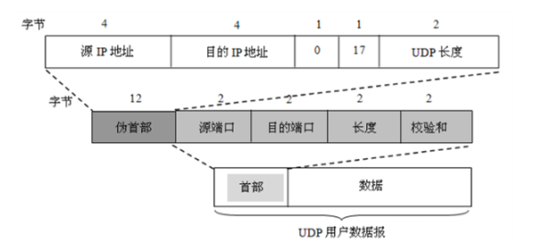

### 第一章：概述

1. 试简述分组交换的要点。

   ```
   分组交换的特点主要有：
   1. 节点暂时存储的是一个个分组，而不是整个数据文件。
   2. 分组暂时保存在节点的内存中，保证了较高的交换速率。
   3. 动态分配信道，极大的提高了通信线路的利用率。
   不足主要有：
   1. 分组在节点转发因排队而造成一定的延时
   2. 分组必须携带一些控制信息（首部）而产生额外开销，管理控制比较困难。
   ```

2. 互联网的两大组成部分（边缘部分与核心部分）的特点是什么？它们的工作方式各有什么特点？

   ```
   1. 边缘部分：由所有连接在互联网上的主机组成。这部分是用户直接使用的，用来进行通信和资源共享。
   2. 核心部分：由大量网络和连接这些网络的路由器组成。这部分是为边缘部分提供服务的。
   3. 在网络边缘的端系统之间的通信方式通常可划分为两大类：
   客户—服务器方式（C/S方式）和对等方式（p2p方式）。
   核心部分的工作方式也有两种：一种是路由器转发分组，另一种是路由器之间不断地交换路由信息。
   ```

3. 计算机网络的发展经历了哪几个阶段？

   ```
   – 面向终端的计算机通信网络：一台主机连多个终端；
   – 以共享资源为目标的计算机网络：分组交换技术，ARPANET是代表；
   – 开放式标准化网络：形成计算机网络体系结构，OSI标准；
   – 高速计算机网络：Internet就是这一代网络的典型代表。
   ```

4. 试述具有五层协议的网络体系结构各层的主要功能。
   ```
   1. 应用层：通过应用进程间的交互来完成特定网络应用。
   2. 运输层：负责向两台主机中进程之间的通信提供通用的数据传输服务。
   3. 网络层：负责为分组交换网上的不同主机提供通信服务。
   4. 数据链路层：将网络层交下来的IP数据报组装成帧，在两个相邻节点间的链路上传送帧。
   5. 物理层：考虑用多大的电压代表”1“或”0“，以及接收方如何识别出发送方所发送的比特。
   ```
   
5. 协议与服务的区别和联系

   ```
   协议与服务的联系：
   协议是控制两个对等实体在“水平方向”进行“逻辑通信”的规则的集合。
   在协议的控制下，两个对等实体间的通信使得本层能够向上一层提供服务。
   要实现本层协议，还需要使用下面一层所提供的服务。
   协议的三要素
      - 语法：定义所交换信息的格式
      - 语义：定义通信双方所要完成的操作
      - 同步：定义通信双方的时序关系
   协议与服务的区别：
      ①协议是“水平”的，即控制对等实体之间通信的规则；服务是“垂直”的，即服务是由下层向上层通过间接口提供的。
      ②实体看得见下层提供的服务，但并不知道实现该服务的具体协议。下层的协议对上层的实体是“透明”的。
   ```

6. 收发两端之间的传输距离为$1000KM$，信息在媒体上的传播速率为$2×10^{8}m/s$。试计算以下两种情况的发送时延和传播时延：（1）数据长度为$10^7bit$,数据发送速率为$100kb/s$。（2）数据长度为$10^3bit$,数据发送速率为$1Gb/s$。从上面的计算中可以得到什么样的结论?
   (1)$发送时延=数据长度/数据发送速率=\frac{10^7bit}{100kb/s}=100s$
   $传播时延=传输距离/传播速率=\frac{1000KM}{2\times10^8m/s}=5ms$
   (2)$发送时延=数据长度/数据发送速率=\frac{10^3bit}{1Gb/s}=1\mu s$
   $传播时延=传输距离/传播速率=\frac{1000KM}{2\times10^8m/s}=5ms$

   ```
   结论：若数据长度大而发送速率低，则在总的时延中，发送时延往往大于传播时延。
   但若数据长度短而发送速率高，则传播时延又可能是总时延中的主要成分。
   ```


### 第二章：物理层

1. 物理层的接口有哪几个方面的特性？各包含些什么内容？
   ```
   - 机械特性：指明接口所用接线器的形状和尺寸、引脚数目和排列、固定和锁定装置等。
   - 电气特性：指明在接口电缆的各条线上出现的电压的范围。
   - 功能特性：指明某条线上出现的某一电平的电压的意义。
   - 过程特性：指明对于不同功能的各种可能事件的出现顺序。
   ```

2. 共有4个站进行码分多址CDMA通信。
   ```
   4个站的码片序列为：
   A：（－1－1－1＋1＋1－1＋1＋1） 
   B：（－1－1＋1－1＋1＋1＋1－1）
   C：（－1＋1－1＋1＋1＋1－1－1） 
   D：（－1＋1－1－1－1－1＋1－1）
   现收到这样的码片序列S：（－1＋1－3＋1－1－3＋1＋1）。
   问哪个站发送数据了？发送数据的站发送的是0还是1？
   ```

   ```
   S·A=(＋1－1＋3＋1－1＋3＋1＋1)／8=1，    A发送1
   S·B=(＋1－1－3－1－1－3＋1－1)／8=－1，  B发送0
   S·C=(＋1＋1＋3＋1－1－3－1－1)／8=0，    C无发送
   S·D=(＋1＋1＋3－1＋1＋3＋1－1)／8=1，    D发送1
   ```
   


### 第三章：数据链路层

1. 数据链路层的三个基本问题（封装成帧、透明传输、差错检测）为什么必须加以解决？如何解决的？
   ```
   封装成帧是分组交换的必然要求；
   透明传输是避免二进制比特流中出现与帧定界符相同的内容，使得节点错误识别帧；
   差错检测是为了避免接收到错误的信息和防止信道中出现的无效数据帧浪费后续路由上的传输和处理资源。
   解决方式：
   封装成帧就是在一段数据前后分别添加首部和尾部。接收端以便从收到的比特流中识别帧的开始与结束。
   透明传输就是当发送数据出现帧定界符SOH或EOT，则在SOH、EOT前插入一个转义字符“ESC”（0x1B），当数据出现转义字符同样在“ESC”前添加一个ESC。当接收端收到连续的两个转义字符时，就删除其中前面的一个。
   差错检测就是使用循环冗余检测CRC
   ```


### 第四章：网络层

1. IPv4向IPv6过渡的方法
   ```
   由于现在整个互联网上使用IPv4的路由器数量太大，向IPv6过渡只能采用逐步演进的办法。同时，还必须使用新安装的IPv6系统能够向后兼容。故可使用双协议栈和隧道技术。
   （1）双协议栈：是指在完全过渡到IPv6之前，使一部分主机装有两个协议栈，因此双协议栈主机既能够和IPv6的系统通信，又能够和IPv4的系统通信。
   （2）隧道技术：要点是在IPv6数据报要进入IPv4网络时，把IPv6数据报封装成为IPv4数据报。然后，IPv6数据报就在IPv4网络的隧道中传输。当IPv4数据报离开IPv4网络中的隧道时再把数据部分交给主机的IPv6协议栈。
   ```

2. 网络层向上层提供的服务有哪两种？它们有什么区别？

   数据报服务和虚电路服务

   | 对比方面       | 虚电路服务                                     | 数据报服务                                         |
   | -------------- | ---------------------------------------------- | -------------------------------------------------- |
   | 思路           | 可靠通信应当由网络来保证                       | 可靠通信应当由用户主机来保证                       |
   | 连接的建立     | 必须建立网络层连接                             | 不需要建立网络层连接                               |
   | 终点地址       | 仅在连接建立阶段使用，每个分组使用短的虚电路号 | 每个分组都有终点的完整地址                         |
   | 当结点出故障时 | 所有通过出故障的结点的虚电路均不能工作         | 出故障的结点可能会丢失分组，一些路由可能会发生变化 |
   | 分组的顺序     | 总是按发送顺序到达终点                         | 到达终点时不一定按发送顺序                         |
   | 服务质量保证   | 可以将通信资源提前分配给每一个虚电路，容易实现 | 很难实现                                           |

3. 某单位分配到一个地址块136.23.12.64/26。现在需要进一步划分为4个一样大的子网。
   (1)每个子网的网络前缀有多长？

   每个子网前缀28位。
   (2)每一个子网中有多少个地址？
   每个子网的地址中有4位留给主机用，因此共有16个地址。
   (3)每一个子网的地址块是什么？
   (4)每一个子网可分配给主机使用的最小地址和最大地址是什么？

   四个子网的地址块以及每个子网可分配给主机的最小地址和最大地址是。
   第一个地址块136.23.12.64/28，最小地址块：136.23.12.65，最大地址块：136.23.12.78
   第一个地址块136.23.12.80/28，最小地址块：136.23.12.81，最大地址块：136.23.12.94
   第一个地址块136.23.12.96/28，最小地址块：136.23.12.97，最大地址块：136.23.12.110
   第一个地址块136.23.12.112/28，最小地址块：136.23.12.113，最大地址块：136.23.12.126

4. 假定网络中的路由器A的路由表有如下的项目。

   | 目的网络 | 距离 | 下一跳路由器 |
   | -------- | ---- | ------------ |
   | N1       | 4    | B            |
   | N2       | 2    | C            |
   | N3       | 1    | F            |
   | N4       | 5    | G            |

   现将A收到从C发来的路由信息。

   | 目的网络 | 距离 |
   | -------- | ---- |
   | N1       | 2    |
   | N2       | 1    |
   | N3       | 3    |
   | N4       | 7    |

   试求出路由器A更新后的路由表。
   答：先把收到的路由信息中的”距离“加1，得到

   | 目的网络 | 距离 |
   | -------- | ---- |
   | N1       | 3    |
   | N2       | 2    |
   | N3       | 4    |
   | N4       | 8    |

   路由器A更新后的路由表如下

   | 目的网络 | 距离 | 下一跳路由器 | 原因                         |
   | -------- | ---- | ------------ | ---------------------------- |
   | N1       | 3    | C            | 不同的下一跳，距离更短，更新 |
   | N2       | 2    | C            | 相同的下一跳，距离一样，不变 |
   | N3       | 1    | F            | 不同的下一跳，距离更大，不变 |
   | N4       | 5    | G            | 不同的下一跳，距离更大，不变 |


### 第五章：运输层

1. 运输层的两个协议（UDP和TCP）的特点和区别。
   ```
   - UDP的特点
     1. UDP是无连接的，即发送数据之前不需要建立连接。
     2. UDP使用尽最大努力交付，即不保证可靠交付。
     3. UDP是面向报文的。发送方的UDP对应用程序交下来的报文，在添加首部后就向下交付IP层。
     4. UDP没有拥塞控制，因此网络出现的拥塞不会使源主机的发送速率降低。
     5. UDP支持一对一、一对多、多对一和多对多的交互通信。
     6. UDP的首部开销小，只有8个字节，比TCP的20个字节的首部要短。
   - TCP的特点
     1. TCP是面向连接的运输层协议。
     2. 每一条TCP连接只能有两个端点，每一条TCP连接只能是点对点的（一对一的）。
     3. TCP提供可靠交付的服务。通过TCP连接传送的数据，无差错、不丢失、不重复，并且按序到达。
     4. TCP提供全双工通信。TCP运行通信双方的应用进程在任何时候都能发送数据。
     5. 面向字节流。TCP中的“流”指的是流入到进程或从进程流出的字节序列。
   ```

2. 为什么需要三报文握手？为什么需要等待2MSL才释放连接？
   ```
   (1)为了防止已失效的连接请求报文段突然又传送到了服务器，因而产生错误。
   (2)第一，为了保证客户端发送的最后一个ACK报文段能够到达服务器。
   第二，防止“已失效的连接请求报文段”出现在本连接中。
   ```

3. 下面是以十六进制格式存储的一个UDP首部。
   CB84000D001C001C
   (1)源端口号是什么？
   (2)目的端口号是什么？
   (3)这个用户数据报的总长度是多少？
   (4)数据长度是多少？
   (5)这个分组是从客户到服务器方向的，还是从服务器到客户方向的？
   (6)客户进程是什么？

   
   ```
   (1)源端口号为首部前1,2字节：0xCB84=52100
   (2)目的端口号为首部的3,4字节：0x000D=13
   (3)用户数据报总长度为首部的5,6字节：0x001C=28字节
   (4)数据长度=数据报总长度-UDP首部=28-8=20字节
   (5)分组是从客户到服务器
   (6)Daytime
   熟悉端口值：0~1023，若目的端口在此范围一般为客户到服务器，否则相反
   熟识端口服务
   FTP: 21
   TELNET: 23
   SMTP: 25
   DNS: 53
   TFTP: 69
   HTTP: 80
   POP3: 110
   IMAP: 143
   ```

   

   

